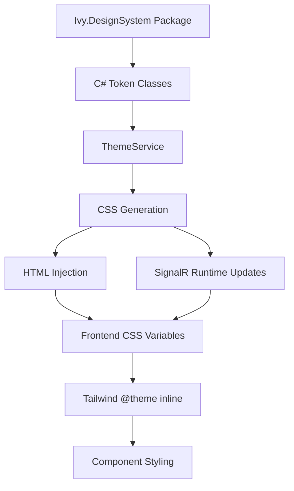

---
searchHints:
  - design system
  - theming
  - css variables
  - tokens
  - styling internals
---

# Framework Design

<Ingress>
A technical deep-dive into how Ivy's design system and theming architecture works under the hood - from token generation to CSS injection.
</Ingress>

This page is for developers who want to understand the internals of Ivy's UI framework. For basic theming usage, see [Theming](../../02_Concepts/Theming.md).

## Architecture Overview

Ivy's design system follows a token-based architecture where design decisions are centralized and distributed to the frontend via CSS custom properties:



## Ivy Design System Package

The design tokens are defined in a separate NuGet package: [`Ivy.DesignSystem`](https://github.com/Ivy-Interactive/Ivy-Design-System).

```xml
<!-- Ivy.csproj -->
<PackageReference Include="Ivy.DesignSystem" Version="1.1.11" />
```

The package provides C# static classes with all color values:

| Token Class                    | Purpose                             |
| ------------------------------ | ----------------------------------- |
| `IvyFrameworkLightThemeTokens` | Semantic colors for light mode      |
| `IvyFrameworkDarkThemeTokens`  | Semantic colors for dark mode       |
| `IvyFrameworkChromaticTokens`  | Chromatic palette (red, blue, etc.) |
| `IvyFrameworkNeutralTokens`    | Neutral palette (slate, gray, etc.) |

These tokens are consumed by `ThemeConfig.cs` to build default theme values:

```csharp
public static ThemeColors DefaultLight => new()
{
    Primary = IvyFrameworkLightThemeTokens.Color.Primary,
    PrimaryForeground = IvyFrameworkLightThemeTokens.Color.PrimaryForeground,
    // ... all semantic colors
};
```

## Theme Service

`IThemeService` is responsible for managing the current theme and generating CSS:

```csharp
public interface IThemeService
{
    Theme CurrentTheme { get; }
    void SetTheme(Theme theme);
    string GenerateThemeCss();
    string GenerateThemeMetaTag();
}
```

### CSS Generation

`GenerateThemeCss()` produces a `<style>` block with CSS custom properties for both light and dark modes:

```csharp
public string GenerateThemeCss()
{
    var sb = new StringBuilder();
    sb.AppendLine("<style id=\"ivy-custom-theme\">");

    // Light theme (default)
    sb.AppendLine(":root {");
    AppendThemeColors(sb, _currentTheme.Colors.Light);
    AppendNeutralColors(sb);    // From IvyFrameworkNeutralTokens
    AppendChromaticColors(sb);  // From IvyFrameworkChromaticTokens
    sb.AppendLine("}");

    // Dark theme
    sb.AppendLine(".dark {");
    AppendThemeColors(sb, _currentTheme.Colors.Dark);
    AppendNeutralColors(sb);
    AppendChromaticColors(sb);
    sb.AppendLine("}");

    sb.AppendLine("</style>");
    return sb.ToString();
}
```

**Generated output example:**

```css
<style id="ivy-custom-theme">
:root {
  --primary: #18181b;
  --primary-foreground: #fafafa;
  --background: #ffffff;
  --foreground: #09090b;
  /* ... 40+ variables */
}
.dark {
  --primary: #fafafa;
  --primary-foreground: #18181b;
  --background: #09090b;
  --foreground: #fafafa;
  /* ... */
}
</style>
```

## CSS Injection

Theme CSS reaches the frontend through two mechanisms:

### 1. Initial Page Load

During development, the Vite `injectMeta` plugin fetches the HTML from the backend and transfers the theme style tag:

```typescript
// vite.config.ts
const themeStyleMatch = htmlServer.match(
  /<style id="ivy-custom-theme">[\s\S]*?<\/style>/i
);

if (themeStyleMatch) {
  // Insert into local HTML <head>
  result =
    result.slice(0, headEndIndex) +
    themeStyleMatch[0] +
    result.slice(headEndIndex);
}
```

In production, the backend serves the full HTML with theme CSS already embedded in `<head>`.

### 2. Runtime Updates via SignalR

When a theme is changed at runtime, the backend sends the new CSS via SignalR:

```csharp
// Backend - applying a theme change
var themeService = UseService<IThemeService>();
var client = UseService<IClientProvider>();

themeService.SetTheme(customTheme);
client.ApplyTheme(themeService.GenerateThemeCss());
```

The frontend handles the `ApplyTheme` message:

```typescript
// use-backend.tsx
connection.on("ApplyTheme", (css: string) => {
  // Remove existing custom theme style
  const existingStyle = document.getElementById("ivy-custom-theme");
  if (existingStyle) {
    existingStyle.remove();
  }

  // Inject new style element
  const styleElement = document.createElement("style");
  styleElement.id = "ivy-custom-theme";
  styleElement.innerHTML = css
    .replace('<style id="ivy-custom-theme">', "")
    .replace("</style>", "");
  document.head.appendChild(styleElement);
});
```

## Frontend Integration

### Tailwind Theme Mapping

The frontend uses Tailwind CSS 4 with `@theme inline` to map backend-injected CSS variables to Tailwind's color system:

```css
/* index.css */
@theme inline {
  /* Semantic colors reference backend variables */
  --color-primary: var(--primary);
  --color-primary-foreground: var(--primary-foreground);
  --color-background: var(--background);
  --color-foreground: var(--foreground);
  --color-destructive: var(--destructive);
  /* ... */

  /* Chromatic colors */
  --color-red: var(--red);
  --color-blue: var(--blue);
  /* ... 16 chromatic colors */
}
```

This allows components to use Tailwind utility classes that resolve to theme values:

```tsx
// bg-primary resolves to var(--primary)
<button className="bg-primary text-primary-foreground">Click me</button>
```

### Theme Mode Switching

`ThemeProvider` manages light/dark mode by toggling the `.dark` class on `<html>`:

```typescript
// ThemeProvider.tsx
useEffect(() => {
  const root = window.document.documentElement;
  root.classList.remove("light", "dark");

  if (theme === "system") {
    const systemTheme = window.matchMedia("(prefers-color-scheme: dark)")
      .matches
      ? "dark"
      : "light";
    root.classList.add(systemTheme);
    return;
  }

  root.classList.add(theme);
}, [theme]);
```

When `.dark` is present, CSS cascade causes `.dark { --primary: ... }` to override `:root { --primary: ... }`.

## Design Token Categories

### Semantic Tokens

Purpose-driven colors that adapt to light/dark mode:

| Token         | Purpose                      |
| ------------- | ---------------------------- |
| `primary`     | Main brand/action color      |
| `secondary`   | Supporting elements          |
| `destructive` | Dangerous actions            |
| `success`     | Positive feedback            |
| `warning`     | Caution states               |
| `info`        | Informational elements       |
| `muted`       | De-emphasized content        |
| `accent`      | Highlights and selections    |
| `card`        | Card backgrounds             |
| `popover`     | Popover/dropdown backgrounds |

Each has a `-foreground` variant for text on that background.

### Chromatic Tokens

Fixed color palette for data visualization and decorative use:

`red`, `orange`, `amber`, `yellow`, `lime`, `green`, `emerald`, `teal`, `cyan`, `sky`, `blue`, `indigo`, `violet`, `purple`, `fuchsia`, `pink`, `rose`

### Neutral Tokens

Grayscale variants: `slate`, `gray`, `zinc`, `neutral`, `stone`, `black`, `white`

## Component Library

Widgets are built on [Radix UI](https://www.radix-ui.com/) primitives styled with theme-aware CSS:

```tsx
// Button component using theme variables
<button
  className={cn(
    "bg-primary text-primary-foreground",
    "hover:bg-primary/90",
    "focus-visible:ring-ring"
  )}
>
  {children}
</button>
```

## Additional Resources

- [Ivy Design System Repository](https://github.com/Ivy-Interactive/Ivy-Design-System)
- [Theming Concepts](../../02_Concepts/Theming.md) - User-facing theming guide
- [Communication](./03_Communication.md) - SignalR protocol details
