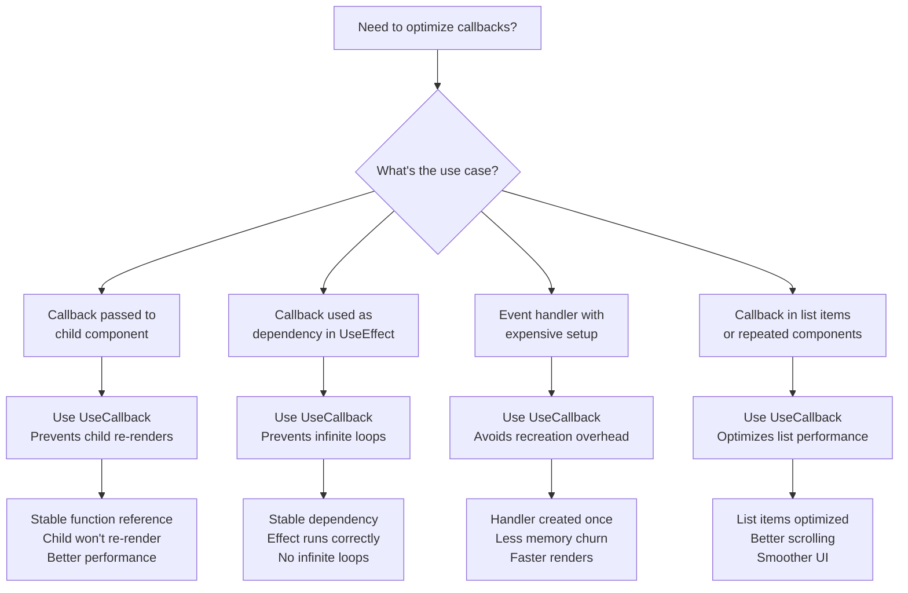
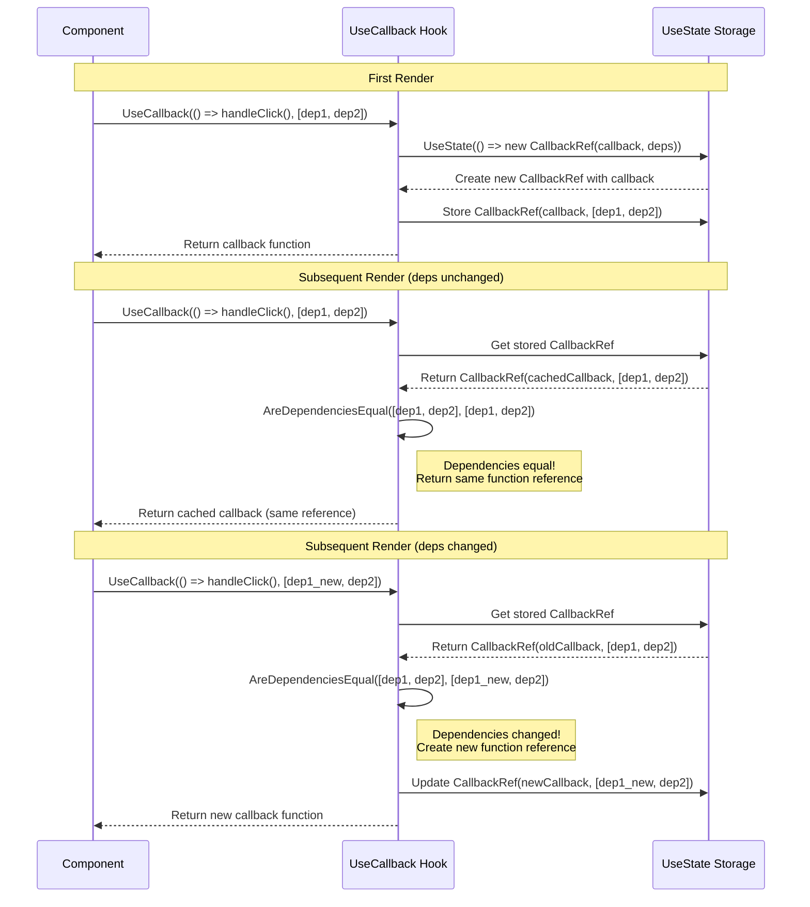
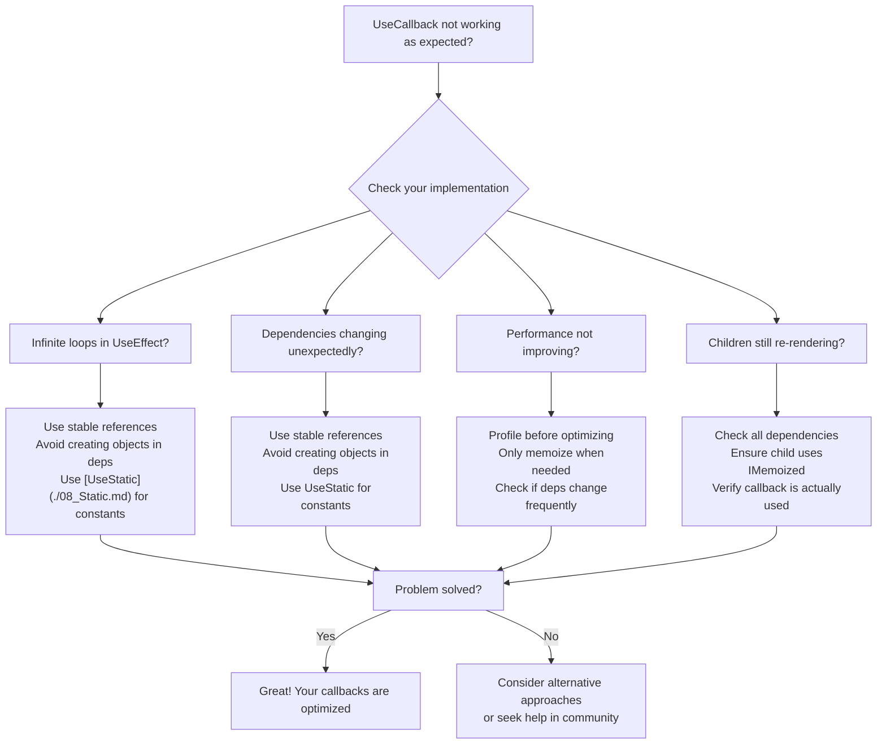

---
searchHints:
  - usecallback
  - performance
  - optimization
  - callbacks
  - usecallback
  - memoization
  - rendering
  - event handlers
---

# Callbacks

<Ingress>
The `UseCallback` [hook](../02_RulesOfHooks.md) memoizes callback functions, preventing unnecessary re-renders when callbacks are passed as props to [child components](../../../01_Onboarding/02_Concepts/03_Widgets.md) or used as dependencies in other [hooks](../02_RulesOfHooks.md).
</Ingress>

## Overview

The `UseCallback` [hook](../02_RulesOfHooks.md) provides a way to optimize callback functions in Ivy [applications](../../../01_Onboarding/02_Concepts/15_Apps.md):

- **Stable Function References** - Returns the same function reference when [state](./03_State.md) dependencies haven't changed
- **Prevents Re-renders** - [Child components](../../../01_Onboarding/02_Concepts/03_Widgets.md) won't re-render unnecessarily when receiving memoized callbacks
- **Stable Dependencies** - Ensures callbacks used in [`UseEffect`](./04_Effect.md) and other hooks have stable references

<Callout type="Tip">
`UseCallback` memoizes the function reference itself, while [`UseMemo`](./05_Memo.md) memoizes the result of calling a function. The memoized callback is only executed when you invoke it.
</Callout>

## When to Use UseCallback



## UseCallback Hook

The `UseCallback` [hook](../02_RulesOfHooks.md) memoizes callback functions and only recreates them when their [state](./03_State.md) dependencies change.

<Callout type="Tip">
`UseCallback` hook stores only the most recent dependency values for comparison; older values are discarded.
</Callout>

### How UseCallback Works



### Basic Usage

```csharp
public class ParentView : ViewBase
{
    public override object? Build()
    {
        var count = UseState(0);
        var multiplier = UseState(2);
        
        // Memoize the callback to prevent child re-renders
        var handleIncrement = UseCallback(() => 
        {
            count.Set(count.Value + 1);
        }, count); // Only recreate when count changes
        
        var handleReset = UseCallback(() => 
        {
            count.Set(0);
        }); // No dependencies - callback never changes
        
        return Layout.Vertical(
            Text.Inline($"Count: {count.Value}"),
            new ChildComponent(handleIncrement, handleReset),
            new NumberInput("Multiplier", multiplier.Value, v => multiplier.Set(v))
        );
    }
}
```

### Use Cases

Use `UseCallback` when:

- **Passing callbacks to [child components](../../../01_Onboarding/02_Concepts/03_Widgets.md)** - Prevents unnecessary re-renders when the callback reference is stable
- **Callbacks are dependencies of other [hooks](../02_RulesOfHooks.md)** - Ensures stable references for [`UseEffect`](./04_Effect.md) and other [hooks](../02_RulesOfHooks.md)
- **Event handlers with expensive setup** - Avoids recreating handlers on every render
- **Callbacks in lists** - Optimizes performance when rendering many [components](../../../01_Onboarding/02_Concepts/02_Views.md) with callbacks

### Best Practices

- **Dependency Array**: Always specify the [state](./03_State.md) dependencies that should trigger callback recreation
- **Stable References**: Only include state values that actually affect the callback's behavior
- **Avoid Over-Memoization**: Don't memoize simple callbacks that don't cause performance issues
- **Combine with IMemoized**: Use `UseCallback` together with `IMemoized` [components](../../../01_Onboarding/02_Concepts/02_Views.md) for maximum optimization

### Examples

#### Preventing Child Re-renders

```csharp
public class TodoListView : ViewBase
{
    public override object? Build()
    {
        var todos = UseState(new List<Todo>());
        var filter = UseState("");
        
        // Memoize callbacks to prevent TodoItem re-renders
        var handleToggle = UseCallback((int id) => 
        {
            todos.Set(todos.Value.Select(t => 
                t.Id == id ? t with { Completed = !t.Completed } : t
            ).ToList());
        }, todos);
        
        var handleDelete = UseCallback((int id) => 
        {
            todos.Set(todos.Value.Where(t => t.Id != id).ToList());
        }, todos);
        
        var filteredTodos = UseMemo(() => 
            todos.Value.Where(t => 
                t.Title.Contains(filter.Value, StringComparison.OrdinalIgnoreCase)
            ).ToList(),
            todos, filter
        );
        
        return Layout.Vertical(
            new TextInput("Filter", filter.Value, v => filter.Set(v)),
            Layout.Vertical(
                filteredTodos.Select(todo => 
                    new TodoItem(todo, handleToggle, handleDelete).Key(todo.Id)
                )
            )
        );
    }
}
```

#### Stable Dependencies for [Effects](./04_Effect.md)

```csharp
public class DataFetcherView : ViewBase
{
    public override object? Build()
    {
        var data = UseState<List<Item>?>(null);
        var loading = UseState(false);
        var searchTerm = UseState("");
        
        // Memoize the fetch function
        var fetchData = UseCallback(async () => 
        {
            loading.Set(true);
            try
            {
                var result = await ApiService.SearchItems(searchTerm.Value);
                data.Set(result);
            }
            finally
            {
                loading.Set(false);
            }
        }, searchTerm);
        
        // Use the memoized callback in an effect
        UseEffect(async () => 
        {
            await fetchData();
        }, fetchData); // Stable dependency prevents infinite loops
        
        return Layout.Vertical(
            new TextInput("Search", searchTerm.Value, v => searchTerm.Set(v)),
            loading.Value ? new Loading() : new ItemList(data.Value ?? new List<Item>())
        );
    }
}
```

## Performance Considerations

### Memory vs Speed Trade-offs

- **Function References**: `UseCallback` stores function references in memory. Consider the number of memoized callbacks:

```csharp
// Good: Small number of memoized callbacks
var handleClick = UseCallback(() => DoSomething(), []);
var handleSubmit = UseCallback(() => SubmitForm(), formData);

// Caution: Many memoized callbacks might consume memory
// Consider if all are necessary
```

- **[State](./03_State.md) Dependency Stability**: If state dependencies change frequently, callbacks will be recreated often, reducing the effectiveness of memoization:

```csharp
// Bad: Dependency changes on every render
var config = new { threshold: 100 };
var handleAction = UseCallback(() => DoAction(config), config);

// Good: Stable dependency
var threshold = UseState(100);
var handleAction = UseCallback(() => DoAction(threshold.Value), threshold);
```

- **Callback Complexity**: Simple callbacks may not benefit from memoization:

```csharp
// Unnecessary memoization for simple callback
var handleClick = UseCallback(() => count.Set(count.Value + 1), count);

// Consider direct inline for simple cases
// Or memoize only if passed to many child components
```

### When NOT to Use UseCallback

- **Simple callbacks**: Don't memoize trivial callbacks that don't cause performance issues
- **Frequently changing [state](./03_State.md) dependencies**: If state dependencies change often, memoization provides no benefit
- **Single-use callbacks**: If a callback is only used once and not passed to [children](../../../01_Onboarding/02_Concepts/03_Widgets.md), memoization may be unnecessary

```csharp
// Unnecessary memoization
var handleClick = UseCallback(() => Console.WriteLine("Clicked"), []);

// Just use directly
var handleClick = () => Console.WriteLine("Clicked");
```

## Common Pitfalls and Solutions

### Callback Troubleshooting Guide



### 1. Unstable Dependencies

**Problem**: Creating new objects or arrays in the dependency array

```csharp
// Bad: New object created on every render
var handleAction = UseCallback(() => 
{
    ProcessData(data.Value, new Config { threshold: 100 });
}, data.Value, new Config { threshold: 100 });
```

**Solution**: Use stable references with [UseStatic](./08_Static.md)

```csharp
// Good: Stable dependency
var config = UseStatic(new Config { threshold: 100 });
var handleAction = UseCallback(() => 
{
    ProcessData(data.Value, config);
}, data, config);
```

### 2. Missing Dependencies

**Problem**: Not including all state values used in the callback

```csharp
// Bad: Missing 'multiplier' dependency
var handleCalculate = UseCallback(() => 
{
    result.Set(items.Value.Sum(x => x.Price * multiplier.Value));
}, items);
```

**Solution**: Include all dependencies

```csharp
// Good: All dependencies included
var handleCalculate = UseCallback(() => 
{
    result.Set(items.Value.Sum(x => x.Price * multiplier.Value));
}, items, multiplier);
```

### 3. Over-Memoization

**Problem**: Memoizing everything without considering the cost

```csharp
// Bad: Unnecessary memoization of simple callbacks
var handleClick = UseCallback(() => count.Set(count.Value + 1), count);
var handleReset = UseCallback(() => count.Set(0), []);
var handleLog = UseCallback(() => Console.WriteLine("Log"), []);
```

**Solution**: Only memoize when necessary

```csharp
// Good: Memoize only when passed to children or used in effects
var handleClick = UseCallback(() => count.Set(count.Value + 1), count);
// Simple callback used directly - no memoization needed
var handleLog = () => Console.WriteLine("Log");
```

### 4. Callback Dependencies Issues

**Problem**: Callbacks that capture too many state variables

```csharp
// Bad: Callback recreated whenever any state changes
var handleAction = UseCallback(() => 
{
    DoSomething(data.Value, filter.Value, sortOrder.Value);
}, data, filter, sortOrder); // Too many dependencies
```

**Solution**: Split into smaller, focused callbacks

```csharp
// Good: Separate callbacks with minimal dependencies
var handleDataAction = UseCallback(() => DoSomethingWithData(data.Value), data);
var handleFilterAction = UseCallback(() => ApplyFilter(filter.Value), filter);
```

### 5. Forgetting Keys in Lists

**Problem**: Not providing stable keys for components receiving callbacks in lists

```csharp
// Bad: No keys, memoization won't work properly
return Layout.Vertical(
    items.Value.Select(item => new ItemComponent(item, handleClick)) // Missing .Key()
);
```

**Solution**: Always provide stable keys

```csharp
// Good: Stable keys enable proper memoization
return Layout.Vertical(
    items.Value.Select(item => new ItemComponent(item, handleClick).Key(item.Id))
);
```

### 6. Infinite Loops in [UseEffect](./04_Effect.md)

**Problem**: Callback dependency causes infinite re-renders

```csharp
// Bad: Callback recreated on every render
var fetchData = UseCallback(async () => 
{
    await ApiService.Fetch(data.Value);
}, data); // data changes frequently

UseEffect(async () => 
{
    await fetchData();
}, fetchData); // Effect runs on every data change
```

**Solution**: Use stable dependencies or split concerns

```csharp
// Good: Stable dependency or use refs for values
var searchTerm = UseState("");
var fetchData = UseCallback(async () => 
{
    await ApiService.Fetch(searchTerm.Value);
}, searchTerm); // Only recreate when searchTerm changes

UseEffect(async () => 
{
    await fetchData();
}, fetchData);
```

## See Also

- [Memoization](./05_Memo.md) - Caching computed values with UseMemo
- [UseMemo](./05_Memo.md) - Memoizing function resultss
- [Effects](./04_Effect.md) - Performing side effects with stable dependencies
- [State Management](./03_State.md) - Managing component state
- [Rules of Hooks](../02_RulesOfHooks.md) - Understanding hook rules and best practices
- [UseStatic](./08_Static.md) - Storing stable references
- [Views](../../../01_Onboarding/02_Concepts/02_Views.md) - Understanding Ivy views and components
- [Widgets](../../../01_Onboarding/02_Concepts/03_Widgets.md) - Building UI components
