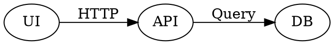

# Ivy Framework Weekly Notes - Week of 2026-04-07

> [!NOTE]
> We usually release on Fridays every week. Sign up on [https://ivy.app/](https://ivy.app/auth/sign-up) to get release notes directly to your inbox.

## New Features

### Bar Chart

Vertical bar orientation and ECharts axis pairing were fixed. `YAxis.Hide` and grid padding behave correctly with hidden axes; docs cover `YAxisIndex` on `Bar` and dual-axis setups.

```csharp
.YAxis(new YAxis("Labels").Hide());
```

### Dual-Axis Series

Bar, Line, Area, and [**Scatter**](https://docs.ivy.app/widgets/charts/scatter-chart) series support `YAxisIndex` so each series can bind to the correct Y axis in a dual-axis chart.

```csharp
new BarChart(data)
    .Bar(new Bar("Revenue", 1).YAxisIndex(0))
    .Bar(new Bar("GrowthRate", 2).YAxisIndex(1));
// Line / Area: chain .Line(new Line("Key").YAxisIndex(n)) the same way
```

### Axis Generation and Layout

`generateYAxis` skips `largeSpread` heuristics when multiple axes are active. Cartesian charts reclaim plot width when axes are hidden, and grid padding no longer reserves space for hidden axes.

Hidden axes (horizontal bar sample, `BarChartApp.cs`, `BarChart3`):

```csharp
new BarChart(data)
    .Vertical()
    .Bar(new Bar("Desktop", 1).Radius(4) /* … */)
    .YAxis(new YAxis("Month").TickLine(false).AxisLine(false).Type(AxisTypes.Category).Hide())
    .XAxis(new XAxis("Desktop").Type(AxisTypes.Number).Hide());
```

Full dual-axis bar example (`BarChartApp.cs`, `BarChart10`):

```csharp
var data = new[]
{
    new { Month = "Jan", Revenue = 4500, GrowthRate = 5 },
    new { Month = "Feb", Revenue = 5200, GrowthRate = 15 },
    // ...
};

return new Card().Title("Dual Axis (Revenue vs Growth Rate)")
    | new BarChart(data)
        .ColorScheme(ColorScheme.Default)
        .Bar(new Bar("Revenue", 1).YAxisIndex(0).Radius(8).LegendType(LegendTypes.Square))
        .Bar(new Bar("GrowthRate", 2).YAxisIndex(1).Radius(8).LegendType(LegendTypes.Square))
        .CartesianGrid(new CartesianGrid().Horizontal())
        .Tooltip()
        .XAxis(new XAxis("Month").TickLine(false).AxisLine(false))
        .YAxis(new YAxis("Revenue")
            .Orientation(YAxis.Orientations.Left)
            .TickFormatter("C0"))
        .YAxis(new YAxis("GrowthRate")
            .Orientation(YAxis.Orientations.Right)
            .TickFormatter("P0")
            .Domain(-0.1, 0.2))
        .Legend();
```

### Scatter Chart

Scatter rejects a category axis where a value axis is required. [**ScatterChartApp**](https://docs.ivy.app/widgets/charts/scatter-chart) includes a dual-axis example with a numeric X axis for continuous data.

Numeric value axes (`ScatterChartApp.cs`, `ScatterChart1View`):

```csharp
new ScatterChart(data)
    .Scatter(new Scatter("Value").Name("People"))
    .XAxis(new XAxis("Height").Type(AxisTypes.Number))
    .YAxis(new YAxis("Weight").Type(AxisTypes.Number));
```

### Scatter Tests and Validation

Widget tests cover ScatterChart; the implementation blocks invalid category-axis use for scatter series.

Dual-axis scatter (`ScatterChartApp.cs`, `ScatterChart12View`):

```csharp
var data = new[]
{
    new { Month = 1, Revenue = 150, MarketShare = 12 },
    new { Month = 2, Revenue = 280, MarketShare = 18 },
    // ...
};

return new Card().Title("Dual Axis (Revenue vs Market Share)")
    | new ScatterChart(data)
        .ColorScheme(ColorScheme.Default)
        .Scatter(new Scatter("Revenue").Name("Revenue ($K)").YAxisIndex(0).Shape(ScatterShape.Circle))
        .Scatter(new Scatter("MarketShare").Name("Market Share (%)").YAxisIndex(1).Shape(ScatterShape.Diamond))
        .XAxis(new XAxis("Month").Type(AxisTypes.Number).TickLine(false).AxisLine(false))
        .YAxis(new YAxis("Revenue")
            .Orientation(YAxis.Orientations.Left)
            .TickFormatter("C0"))
        .YAxis(new YAxis("MarketShare")
            .Orientation(YAxis.Orientations.Right)
            .TickFormatter("P0")
            .Domain(0, 0.5))
        .CartesianGrid(new CartesianGrid().Horizontal())
        .Tooltip(new ChartTooltip().Animated(true))
        .Legend();
```

### Line and Area Series

Line and Area use the same `YAxisIndex` extension as `Bar`.

```csharp
new LineChart(data)
    .Line(new Line("SeriesA").YAxisIndex(0))
    .Line(new Line("SeriesB").YAxisIndex(1))
    .XAxis(new XAxis("Month"))
    .YAxis(new YAxis("Left"))
    .YAxis(new YAxis("Right").Orientation(YAxis.Orientations.Right));
```

### Pie Chart

The [**PieChart**](https://docs.ivy.app/widgets/charts/pie-chart) tooltip uses a formatter with marker styling for clearer series labels and values.

```csharp
data.ToPieChart(
    e => e.Category,
    e => e.Sum(f => f.Value),
    PieChartStyles.Default);
```

## DataTable and Querying

### Decimal and Footer Formatting

The [**DataTable**](https://docs.ivy.app/widgets/advanced/data-table) decimal path now handles `valueOf` with a safer string fallback. Footer aggregates also follow the same currency and number formatting rules as the column.

```csharp
.Builder(e => e.Amount, f => f.Decimal().Format("C2"))
.Footer(e => e.Amount, f => f.Sum().Format("C2"));
```

### Column Scaling

Optional auto-exclusion of navigation collection columns from scaling avoids distorted layouts.

```csharp
entities.AsQueryable().ToDataTable(idSelector: e => e.Id)
    .Width(e => e.Customer, Size.Px(220))
    .Width(e => e.CustomerOrders, Size.Px(180));
```

### ToDetails and Navigation Properties

`ToDetails()` no longer shows raw CLR type names for navigation properties.

```csharp
var details = order.ToDetails().RemoveEmpty();
new Card(details);
```

### Virtual Columns

You can define multiple virtual columns from the same root property.

```csharp
orders.AsQueryable()
    .Select(o => new
    {
        o.Id,
        CustomerName = o.Customer.Name,
        CustomerEmail = o.Customer.Email
    })
    .ToDataTable(idSelector: e => e.Id);
```

### Sorting and Stable Order

When `AllowSorting` is false, `ToDataTable` keeps the query’s order. For paging, the query processor adds a default `OrderBy` when a stable sort is required.

```csharp
.Sortable(e => e.Email, sortable: false);
```

### UseDataTable Config

`UseDataTable` takes an optional `DataTableConfig` (same shapes on `ViewBase` and `IViewContext`) so options such as sorting and search ride with the connection:

```csharp
var connection = UseDataTable(
    db.Orders.AsQueryable(),
    idSelector: o => o.Id,
    columns: null,
    refreshToken: refresh,
    config: new DataTableConfig
    {
        AllowSorting = false,
        ShowSearch = true,
        BatchSize = 50,
    });
```

### Search

Search includes match navigation, highlights, and a progress indicator for large tables.

```csharp
.Config(c => { c.ShowSearch = true; });
```

### Badge and Link Cells

Badge cells can use per-value colors. Link cells cooperate with `OnCellClick` without double navigation.

```csharp
.Badges(e => e.Skills, Colors.Sky);
```

### Tooltips on Cells

Cells use the shared `withTooltip` wrapper instead of the native `title` attribute.

```csharp
// DataTable uses design-system tooltip rendering for cell text.
new LinkDisplayRenderer { Type = LinkDisplayType.Url };
```

### Virtual Scrolling and Height

Virtual scrolling renders rows reliably. Height in unconstrained parents was fixed, with follow-up coverage for a zero-height regression.

### Fluent `ToDataTable` Configuration

For the fluent API, use `.Config(...)` on the table builder (`DataTableApp.cs`, `DataTableMainSample`):

```csharp
mockService.GetEmployees().AsQueryable().ToDataTable(idSelector: e => e.Id)
    .RefreshToken(refreshToken)
    .Header(e => e.Name, "Name")
    // ...
    .Config(config =>
    {
        config.FreezeColumns = 2;
        config.AllowSorting = true;
        config.AllowFiltering = true;
        config.ShowSearch = true;
        config.BatchSize = 50;
        config.LoadAllRows = false;
    });
```

### Diagrams and Fenced Code

The [**Markdown**](https://docs.ivy.app/widgets/primitives/markdown) widget renders Graphviz from ` ```dot ` or ` ```graphviz ` fences (`MarkdownApp.cs`, Diagrams tab). Fences without a language render reliably.



### Image

The [**Image**](https://docs.ivy.app/widgets/primitives/image) widget supports `Overlay` for lightbox viewing, and arrow keys move between sibling overlays.

```csharp
new Image("https://example.com/photo.jpg")
{
    Alt = "Product shot",
    Caption = "Click to enlarge",
    Overlay = true,
};
```

### Sheet

The [**Sheet**](https://docs.ivy.app/widgets/advanced/sheet) widget adds a resizable drag handle and more predictable width behavior with explicit sizes and Tailwind-related edge cases.

Opening a sheet from a button (`SheetApp.cs`):

```csharp
new Button("Right (Default)").WithSheet(
    () => new SheetView(),
    title: "Right Sheet",
    description: "This sheet slides in from the right side.",
    width: Size.Rem(24),
    side: SheetSide.Right);
```

### Dialog and AutoFocus

Dialog and Sheet no longer swallow AutoFocus on child inputs (the client may cast to `HTMLElement` where needed). See DialogApp for AutoFocus.

```csharp
searchQuery.ToSearchInput()
    .Placeholder("Type your search query...")
    .AutoFocus();
```

### Close Others and Tab Order

The [**TabsLayout**](https://docs.ivy.app/widgets/layouts/tabs-layout) widget adds `OnCloseOthers` and refreshes tab order without flicker.

### Tab Badges

The Content tab variant supports secondary, smaller badges on tabs.

```csharp
new TabsLayout(OnTabSelect, OnTabClose, null, null, selectedIndex.Value, tabs.Value.ToArray())
    .Variant(TabsVariant.Tabs)
    .Width(Size.Fraction((float)width.Value))
    .AddButton("+", OnAddButtonClick)
    with
{
    OnCloseOthers = ((Action<Event<TabsLayout, int>>)OnTabCloseOthers).ToEventHandler(),
};
```

Tab badges in the same sample:

```csharp
new Tab("Customers", "Customers").Icon(Icons.User).Badge("10");
```

### Layout.Grid

Layout.Grid defaults to top-left alignment; use `AlignContent` if you depended on centered grid content.

```csharp
Layout.Grid().Columns(3)
    | widget1
    | widget2;
```

### Header, Footer, and Scroll Shadow

The [**HeaderLayout**](https://docs.ivy.app/widgets/layouts/header-layout) and [**FooterLayout**](https://docs.ivy.app/widgets/layouts/footer-layout) widgets add scroll-triggered drop shadows.

```csharp
new HeaderLayout(
    left: Text.H3("Dashboard"),
    right: new Button("Refresh"))
    .Height(Size.Units(500));
```

### StackedProgress

[StackedProgress](https://docs.ivy.app/widgets/common/progress) is a segmented bar with `OnSelect` / `Selected`. Labels show automatically when any segment has a label.

```csharp
var segments = new[]
{
    new ProgressSegment(30, Colors.Red, "Failed"),
    new ProgressSegment(70, Colors.Green, "Passed"),
};

new StackedProgress(segments)
    .ShowLabels()
    .OnSelect(e => ValueTask.CompletedTask)
    .Selected(1);
```

### Terminal

The Terminal widget exposes `Background` and `Foreground` for surface and text colors. Basic usage (`TerminalApp.cs`):

```csharp
new Terminal()
    .Title("Installation")
    .AddCommand("dotnet tool install -g Ivy.Console")
    .AddOutput("You can use the following command to install Ivy globally.")
    .ShowCopyButton(true);
```

### Detail Helper

`Multiline` defaults to `false`. Opt in per field with `ToDetails().Multiline(...)` (`DetailsApp.cs`):

```csharp
record.ToDetails()
    .Multiline(x => x.Description, x => x.Notes);
```

## Buttons and Badges

### Badges on Controls

[**Button**](https://docs.ivy.app/widgets/common/button) badges use the outline chip style. [**Tab**](https://docs.ivy.app/widgets/layouts/tabs-layout) (Content) and [**DropDownMenu**](https://docs.ivy.app/widgets/common/drop-down-menu) items also support badges.

```csharp
new Button("Inbox", onClick: _ => { }).Badge("3");
new Tab("Customers", "Customers").Icon(Icons.User).Badge("10");
```

### Badge Widget

The [**Badge**](https://docs.ivy.app/widgets/common/badge) widget renders nothing when text is empty.

```csharp
new Badge("");
```

### Menu and Theme

Menu items accept more color options. ThemeCustomizer empty placeholders are clearer.

```csharp
MenuItem.Default(Icons.Download).Label("Export").Color(Colors.Cyan);
```

### Hover Rename

`CardHoverVariant` is now `HoverEffect` on Card, Box, and Image.

```csharp
new Button("Updates", eventHandler, variant: ButtonVariant.Outline).Badge("New");
```

### ContentInput

[ContentInput](https://docs.ivy.app/widgets/inputs/content-input) adds attachments, optional `ShortcutKey`, density variants, and invalid states.

### Upload Helpers and Samples

Upload helpers include `FileAttachmentList`, `validateFileWithToast`, and `useUploadWithProgress` (XMLHttpRequest progress).

```csharp
var upload = UseUpload(MemoryStreamUploadHandler.Create(files));
return text.ToContentInput(upload).Files(files.Value);
```

### FolderInput and FileInput

[FolderInput](https://docs.ivy.app/widgets/inputs/folder-input) supports `FolderInputMode` (including full path), full-row activation, and browse `aria-label`. FileInput browse controls expose `aria-label`.

```csharp
folder.ToFolderInput(mode: FolderInputMode.FullPath);
```

### Dictation and Select

`useDictation` was trimmed; redundant `dictationLanguage` on TextInput was removed. [Select](https://docs.ivy.app/widgets/inputs/select-input) fixes placement when both placeholder and items are set.

```csharp
status.ToSelectInput()
    .Placeholder("Select status")
    .Options(["Open", "Closed"]);
```

Content input with uploads (`ContentInputApp.cs`):

```csharp
var text = UseState("");
var files = UseState(ImmutableArray<FileUpload<byte[]>>.Empty);
var upload = UseUpload(MemoryStreamUploadHandler.Create(files));

return text.ToContentInput(upload)
    .Files(files.Value)
    .Placeholder("Describe the issue... (paste screenshots or drag files)")
    .Accept("image/*,.pdf")
    .MaxFiles(5)
    .Rows(4);
```

Folder input, full path mode (`FolderInputApp.cs`):

```csharp
folder.ToFolderInput(mode: FolderInputMode.FullPath);
```

### Code Blocks and Languages

The Languages enum uses `Description` for display labels. CodeBlock and samples add PowerShell, Bash/Shell, and FileApp mappings; some samples use a three-column language grid.

```csharp
public enum Languages
{
    [Description("PowerShell")]
    Powershell,
    [Description("Bash")]
    Bash,
}
```

### Chrome and Tabs

`?chrome=false` stays compatible with newer shell flags. Apps may set `allowDuplicateTabs`.

```csharp
[App(allowDuplicateTabs: true)]
public class FileApp : ViewBase { }
```

### Analyzers and Style

`IVYSERVICE001` requires `UseService` at the start of `Build()` ([AGENTS.md](https://github.com/Ivy-Interactive/Ivy-Framework/blob/main/AGENTS.md)). IDE0005 and unused-`using` cleanup ran repo-wide.

## Breaking Changes

### `CardHoverVariant` → `HoverEffect`

Rename hover usage to `HoverEffect` on Card, Box, and Image (shared enum location).

```csharp
new Card(Text.Block("Hello")).Hover(HoverEffect.Shadow);
new Box(Text.Block("Click me")).Hover(HoverEffect.PointerAndTranslate);
new Image("photo.jpg").Hover(HoverEffect.Pointer);
```

### `IBladeService` → `IBladeContext`

`IBladeService` is renamed to `IBladeContext`—update DI and `UseService` usages.

```csharp
var bladeController = UseContext<IBladeContext>();
var index = bladeController.GetIndex(this);
bladeController.Push(this, new OtherView(), "Next blade");
```

## Bug Fixes

- DataTable: decimal `valueOf` fallback; footer aggregates; navigation/ternary expressions; link cells with `OnCellClick`; source order when sorting is off; default `OrderBy` for paging; virtual columns from one root; virtual row rendering and height in unconstrained layouts.
- ToDetails(): no raw type names for navigation properties.
- Arrow serialization for widget payloads via safer `ToString` paths.
- Markdown converter cache invalidation by file content.
- OAuth: `LocalRedirect` on callback.
- CI / build: NuGet globbing with native targets; Docker rustserver on clean builds; CS1566 EmbeddedResource/Vite; embedded names cross-platform; App ID `assets` collision; duplicate middleware registration.
- C# / tests: compilation and project reference fixes for API moves and packages.
