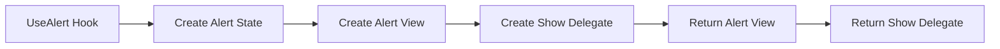

---
searchHints:
  - dialog
  - toast
  - notification
  - modal
  - confirm
  - message
  - alert
  - usealert
  - show-alert
---

# Alerts & Notifications

<Ingress>
Communicate with users effectively using modal dialog alerts for important confirmations and toast notifications for feedback messages.
</Ingress>

## Types of Alerts

Ivy provides two main types of alerts:

1. **Dialog Alerts** - Modal dialogs for important confirmations and decisions
2. **Toast Notifications** - Non-blocking notifications for [feedback](../../02_Widgets/04_Inputs/13_FeedbackInput.md) and status updates

## Dialog Alerts

Dialog alerts are modal windows that require [user interaction](./05_EventHandlers.md). They're perfect for confirmations, important messages, or collecting user decisions.

### Basic Dialog Alert

```csharp demo-below
public class BasicDialogAlertDemo : ViewBase
{
    public override object? Build()
    {
        var (alertView, showAlert) = UseAlert();
        var client = UseService<IClientProvider>();

        return Layout.Vertical(
            new Button("Show Alert", _ => 
                showAlert("Are you sure you want to continue?", result => {
                    client.Toast($"You selected: {result}");
                }, "Alert title")
            ),
            alertView
        );
    }
}
```

### Alert Button Sets

Dialog alerts support different button combinations:

```csharp demo-below
public class AlertButtonSetsDemo : ViewBase
{
    public override object? Build()
    {
        var (alertView, showAlert) = UseAlert();
        var client = UseService<IClientProvider>();

        return Layout.Horizontal(
            new Button("Ok Only", _ => 
                showAlert("This is an info message", _ => {}, "Information", AlertButtonSet.Ok)
            ),
            new Button("Ok/Cancel", _ => 
                showAlert("Do you want to save changes?", result => {
                    client.Toast($"Result: {result}");
                }, "Confirm Save", AlertButtonSet.OkCancel)
            ),
            new Button("Yes/No", _ => 
                showAlert("Do you like Ivy?", result => {
                    client.Toast($"Answer: {result}");
                }, "Quick Poll", AlertButtonSet.YesNo)
            ),
            new Button("Yes/No/Cancel", _ => 
                showAlert("Save changes before closing?", result => {
                    client.Toast($"Choice: {result}");
                }, "Unsaved Changes", AlertButtonSet.YesNoCancel)
            ),
            alertView
        );
    }
}
```

## Toast Notifications

Toast notifications are lightweight, non-blocking messages that appear temporarily and then disappear automatically. They're perfect for providing quick feedback about user actions.

### Basic Toast Notifications

```csharp demo-below
public class BasicToastDemo : ViewBase
{
    public override object? Build()
    {
        var client = UseService<IClientProvider>();

        return Layout.Horizontal(
            new Button("Success Toast", _ => 
                client.Toast("Operation completed successfully!", "Success").Success()
            ),
            new Button("Error Toast", _ => 
                client.Toast("Something went wrong!", "Error").Destructive()
            ),
            new Button("Info Toast", _ => 
                client.Toast("Here's some helpful information", "Info").Info()
            ),
            new Button("Simple Toast", _ => 
                client.Toast("Just a simple message")
            )
        );
    }
}
```

### Toast with Exception Handling

```csharp demo-below
public class ToastExceptionDemo : ViewBase
{
    public override object? Build()
    {
        var client = UseService<IClientProvider>();

        return Layout.Horizontal(
            new Button("Simulate Error", _ => {
                try {
                    throw new InvalidOperationException("Something went wrong!");
                } catch (Exception ex) {
                    client.Toast(ex); // Automatically formats exception
                }
            }),
            new Button("Custom Error Toast", _ => 
                client.Toast("Custom error message", "Error")
            )
        );
    }
}
```

## Faq

### When should I use Toast vs UseAlert dialog?

Use **Toast** (`IClientProvider`) for simple, non-blocking feedback messages — success confirmations, error notifications, validation messages. Toasts auto-dismiss and don't require user interaction.

```csharp
var client = UseService<IClientProvider>();
client.Toast("Saved successfully!");  // neutral
client.Error("Invalid input");        // error styling
client.Success("Upload complete");    // success styling
```

Use **UseAlert** (`ShowAlertDelegate`) only when you need a **modal dialog** that blocks and waits for user input — confirmations, yes/no decisions, destructive action warnings.

```csharp
var (alertView, showAlert) = UseAlert();
showAlert("Are you sure?", result => {
    if (result == AlertResult.Yes) Delete();
}, buttons: AlertButtonSet.YesNo);
```

**Rule of thumb:** If you don't need a user response, use Toast. If you need a Yes/No/Ok answer, use UseAlert.

### Form Submission with Feedback

```csharp demo-below
public class FormSubmissionDemo : ViewBase
{
    public override object? Build()
    {
        var (alertView, showAlert) = UseAlert();
        var client = UseService<IClientProvider>();
        var isSubmitting = UseState(false);

        return Layout.Vertical(
            new Button(
                isSubmitting.Value ? "Submitting..." : "Submit Form", 
                _ => {
                    showAlert("Are you ready to submit this form?", async result => {
                        if (result == AlertResult.Ok) {
                            isSubmitting.Set(true);
                            
                            // Simulate API call
                            await Task.Delay(2000);
                            
                            isSubmitting.Set(false);
                            client.Toast("Form submitted successfully!", "Success");
                        }
                    }, "Confirm Submission", AlertButtonSet.OkCancel);
                }
            ).Disabled(isSubmitting.Value),
            alertView
        );
    }
}
```

## UseAlert

The [UseAlert](./17_Alerts.md) hook returns a tuple containing an alert view and a show alert delegate. It manages alert state and provides a programmatic way to trigger modal dialog alerts with customizable button sets and callbacks.



<Callout Type="info">
The `UseAlert` hook returns an alert view that should be included in your component's render output, and a delegate function that can be called to show alerts programmatically.
</Callout>

### Basic Usage

Use `UseAlert` to create modal dialog alerts for confirmations and user feedback.

```csharp demo-tabs
public class AlertExample : ViewBase
{
    public override object? Build()
    {
        var (alertView, showAlert) = UseAlert();
        var client = UseService<IClientProvider>();

        return Layout.Vertical()
            | new Button("Show Alert", onClick: _ =>
                showAlert("Are you sure you want to continue?", result =>
                {
                    client.Toast($"You selected: {result}");
                }, "Alert Title"))
            | alertView;
    }
}
```

<Details>
<Summary>
How do I show an alert dialog to the user?
</Summary>
<Body>

Use the `UseAlert` hook, which returns a tuple of `(alertView, showAlert)`:

```csharp
var (alertView, showAlert) = UseAlert();

return Layout.Vertical()
    | new Button("Show Alert", _ =>
        showAlert("Are you sure?", result =>
        {
            // result is the AlertResult (Ok, Cancel, Yes, No)
        }, "Confirmation", AlertButtonSet.OkCancel))
    | alertView; // IMPORTANT: alertView must be included in the view tree
```

**Key points:**
- `UseAlert()` returns a **tuple**, not an object — always destructure it
- `showAlert` is a delegate: `showAlert(message, callback, title?, buttonSet?)`
- `alertView` must be rendered somewhere in your view tree for the dialog to appear
- Available button sets: `AlertButtonSet.Ok`, `AlertButtonSet.OkCancel`, `AlertButtonSet.YesNo`, `AlertButtonSet.YesNoCancel`
- For simple toast notifications, use `client.Toast("message")` or `client.Error("message")` via `IClientProvider`

</Body>
</Details>

<Details>
<Summary>
How do I show a delete confirmation before deleting an entity?
</Summary>
<Body>

Use `UseAlert()` for confirmation dialogs:

```csharp
var (alertView, showAlert) = UseAlert();
var client = UseService<IClientProvider>();

void DeleteItem(int id)
{
    showAlert("Are you sure you want to delete this item?", async result =>
    {
        if (result == AlertResult.Ok)
        {
            await using var db = dbFactory.CreateDbContext();
            var item = await db.Items.FindAsync(id);
            if (item != null)
            {
                db.Items.Remove(item);
                await db.SaveChangesAsync();
                client.Toast("Item deleted");
                refreshToken.Refresh();
            }
        }
    }, "Confirm Delete", AlertButtonSet.OkCancel);
}

return Layout.Vertical()
    | new Button("Delete", _ => DeleteItem(itemId)).Destructive()
    | alertView; // IMPORTANT: must include alertView in the view tree
```

</Body>
</Details>
