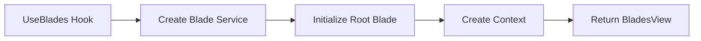

---
searchHints:
  - navigation
  - panels
  - sidebar
  - drawer
  - stack
  - master-detail
  - blades
  - useblades
  - side-panel
  - slide-out
  - panel
---

# Blades

<Ingress>
Create stacked [navigation](../../01_Onboarding/02_Concepts/09_Navigation.md) experiences where new [views](../../01_Onboarding/02_Concepts/02_Views.md) slide in from the right, managed through a blade controller for intuitive drill-down interfaces.
</Ingress>

`Blade`s provide a stacked navigation pattern where new views slide in from the right. Use the `UseBlades` extension to create a root blade and manage a stack of blades through `IBladeService`. Perfect for master-detail [interfaces](../../01_Onboarding/02_Concepts/02_Views.md), wizards, and hierarchical navigation.

## Usage

Create a blade container with a root view and use `IBladeService` to push and pop blades. Use [Size](../../04_ApiReference/IvyShared/Size.md) for blade `width` (e.g. `Size.Units(100)`).

```csharp demo-tabs
public class BladeNavigationDemo : ViewBase
{
    public override object? Build()
    {
        return UseBlades(() => new NavigationRootView(), "Home");
    }
}

public class NavigationRootView : ViewBase
{
    public override object? Build()
    {
        var blades = UseContext<IBladeService>();
        var index = blades.GetIndex(this);

        return Layout.Horizontal().Height(Size.Units(50))
        | (Layout.Vertical()
            | Text.Block($"This is blade level {index}")
            | new Button($"Push Blade {index + 1}", onClick: _ =>
                blades.Push(this, new NavigationRootView(), $"Level {index + 1}"))
            | new Button($"Push Wide Blade", onClick: _ =>
                blades.Push(this, new NavigationRootView(), $"Wide Level {index + 1}", width: Size.Units(100)))
            | (index > 0 ? new Button("Go Back", onClick: _ => blades.Pop()) : null));
    }
}
```

### Blade Headers

Use `BladeHeader` to add custom toolbars or headers to your blades.

```csharp demo-tabs
public class BladeHeaderDemo : ViewBase
{
    public override object? Build()
    {
        return UseBlades(() => new SearchableListView(), "Search Products");
    }
}

public class SearchableListView : ViewBase
{
    public override object? Build()
    {
        var blades = UseContext<IBladeService>();
        var searchTerm = UseState("");
        var products = new[] { "iPhone 15", "MacBook Pro", "iPad Air", "Apple Watch", "AirPods Pro" };

        var filteredProducts = products
            .Where(p => p.Contains(searchTerm.Value, StringComparison.OrdinalIgnoreCase))
            .ToArray();

        var items = filteredProducts.Select(product =>
            new ListItem(product, onClick: _ =>
                // Push a new blade with the product details
                blades.Push(this, new ProductDetailView(product), product))
        );

        var header = Layout.Horizontal(
            searchTerm.ToTextInput().Placeholder("Search products..."),
            new Button(icon: Icons.Search, variant: ButtonVariant.Outline)
        ).Gap(1);

        object content = filteredProducts.Any()
            ? new List(items)
            : Text.Block("No products found");

        return new Fragment()
               | new BladeHeader(header)
               | content;
    }
}

public class ProductDetailView(string productName) : ViewBase
{
    public override object? Build()
    {
        return Layout.Horizontal().Height(Size.Units(66))
        | (Layout.Vertical()
        | new Card($"Details for {productName}")
            | Text.Block($"This is the detail view for {productName}")
            | Text.Block("Price: $999")
            | Text.Block("In Stock: Yes"));
    }
}
```

## Refresh Tokens

You can use [Refresh Tokens](../../../03_Hooks/02_Core/16_UseRefreshToken.md) to trigger updates in parent blades when returning from a child blade. This is common for "save and close" workflows.

```csharp demo-tabs
public class BladeRefreshDemo : ViewBase
{
    public override object? Build()
    {
        return Layout.Horizontal().Height(Size.Units(100))
            | UseBlades(() => new RefreshRootView(), "Items List");
    }
}

public class RefreshRootView : ViewBase
{
    public override object? Build()
    {
        var blades = UseContext<IBladeService>();
        var items = UseState(new List<string> { "Item 1", "Item 2" });
        var refreshToken = UseRefreshToken();

        // React to the refresh token
        UseEffect(() =>
        {
            if (refreshToken.IsRefreshed && refreshToken.ReturnValue is string newItem)
            {
                var list = items.Value.ToList();
                list.Add(newItem);
                items.Value = list;
            }
        }, [refreshToken]);

        var header = new Button("Add New Item", onClick: _ =>
            blades.Push(this, new AddItemView(refreshToken), "Add Item"));

        return new Fragment()
               | new BladeHeader(header)
               | new List(items.Value.Select(x => new ListItem(x)));
    }
}

public class AddItemView(RefreshToken token) : ViewBase
{
    public override object? Build()
    {
        var blades = UseContext<IBladeService>();
        var name = UseState("New Item");

        return Layout.Vertical().Gap(2)
            | new Field(name.ToTextInput(), "Item Name")
            | new Button("Save & Close", onClick: _ =>
            {
                token.Refresh(returnValue: name.Value);
                blades.Pop();
            });
    }
}
```

## Error Handling

Blades handle errors gracefully, displaying the error message within the blade context without crashing the entire [application](../../01_Onboarding/02_Concepts/15_Apps.md).

```csharp demo-tabs
public class BladeErrorDemo : ViewBase
{
    public override object? Build()
    {
        return Layout.Horizontal().Height(Size.Units(100))
        | (UseBlades(() => new ErrorRootView(), "Error Demo"));
    }
}

public class ErrorRootView : ViewBase
{
    public override object? Build()
    {
        var blades = UseContext<IBladeService>();

        return Layout.Vertical()
            | Text.Block("Click to push a blade that throws an exception")
            | new Button("Push Error Blade", onClick: _ =>
                blades.Push(this, new BladeWithError(), "Error Blade"));
    }
}

public class BladeWithError : ViewBase
{
    public override object? Build()
    {
        // Simulate a runtime error
        throw new InvalidOperationException("This blade has encountered a critical error!");
    }
}
```

## UseBlades

The `UseBlades` hook creates a blade service context and initializes a root blade. It returns a `BladesView` that manages the blade stack and provides navigation through the `IBladeService` context.



<Callout Type="info">
In most cases, you'll use `UseBlades()` directly in your views. The hook manages the blade stack and provides `IBladeService` through context for pushing and popping blades.
</Callout>


<WidgetDocs Type="Ivy.Blade" ExtensionTypes="Ivy.Views.Blades.UseBladesExtensions" SourceUrl="https://github.com/Ivy-Interactive/Ivy-Framework/blob/main/src/Ivy/Views/Blades/UseBlades.cs"/>
