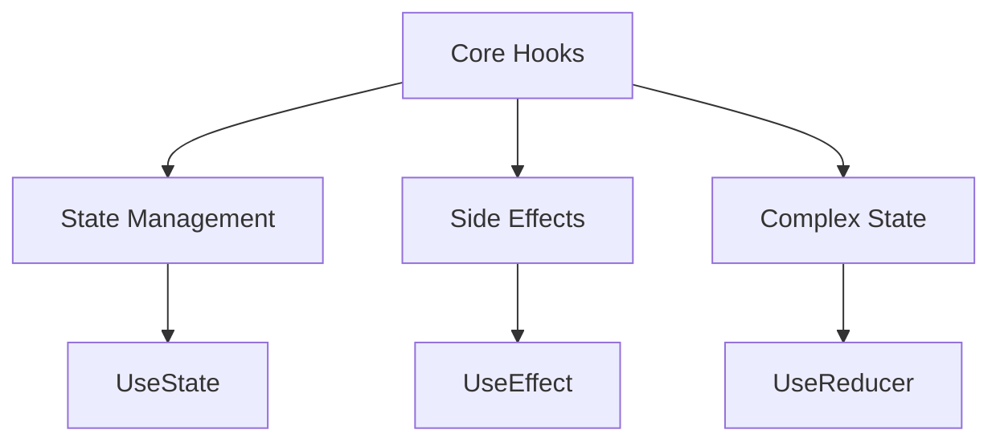
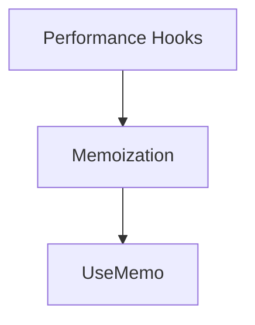
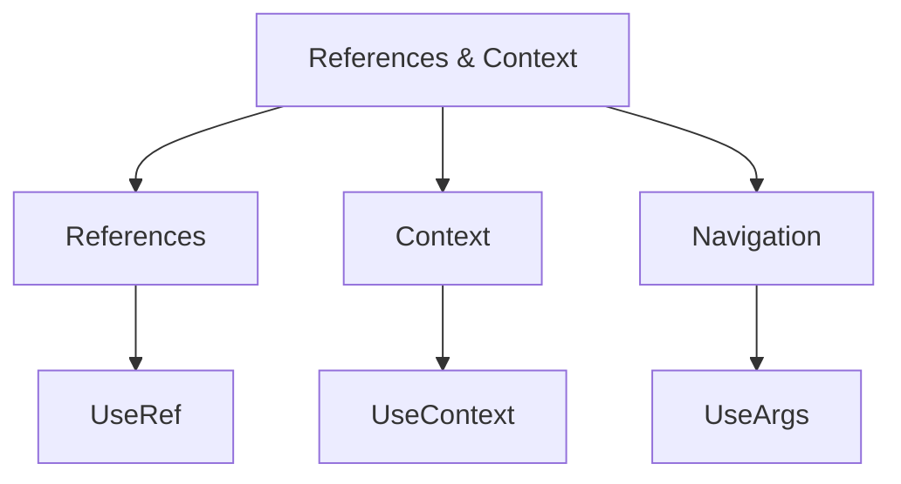
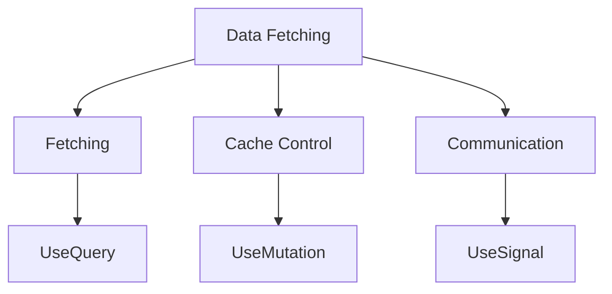
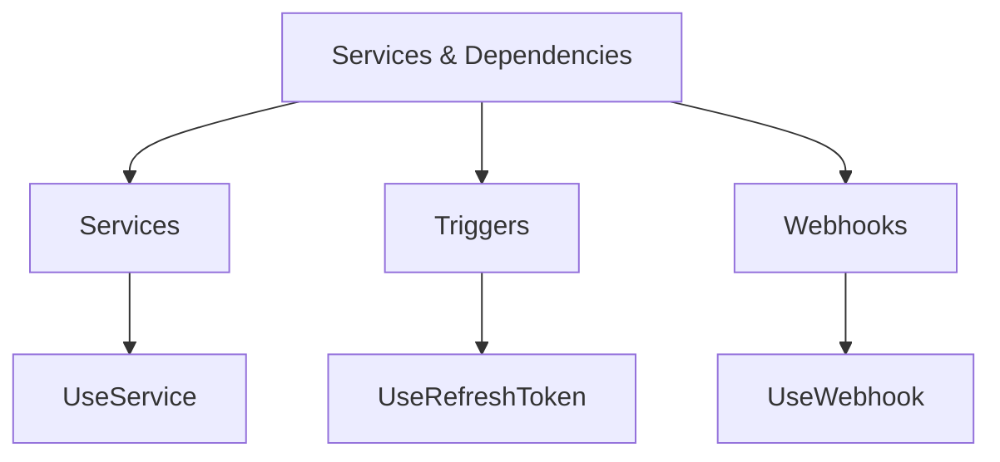
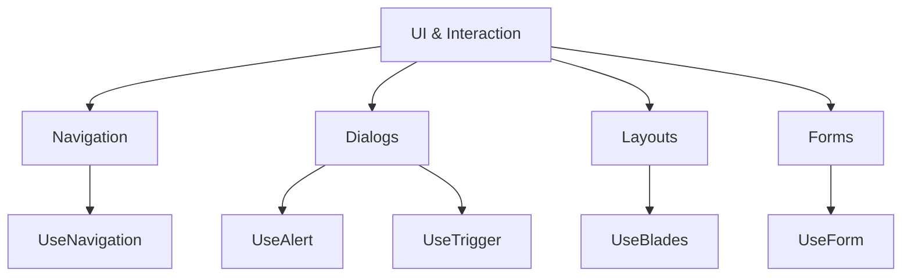

---
searchHints:
  - hooks
  - useState
  - useEffect
  - useQuery
  - state-management
  - lifecycle
  - reactivity
  - functional-components
---

# Hooks

<Ingress>
Discover the powerful functions that let you "hook into" Ivy state and lifecycle features - Hooks enable you to use state and side effects in your [views](../01_Onboarding/02_Concepts/02_Views.md) without writing class components.
</Ingress>

## Basic usage

Ivy provides a comprehensive set of hooks organized into several categories. All hooks follow the naming convention of starting with `Use` followed by an uppercase letter, and they must be called at the top level of your view's `Build` method:

```csharp demo-tabs
public class HooksDemo : ViewBase
{
    public override object? Build()
    {
        var name = UseState("World");
        
        return Layout.Vertical()
            | name.ToTextInput().Placeholder("Enter your name")
            | Text.P($"Hello, {name.Value}!").Large();
    }
}
```

### Hook Library

Ivy ships with a comprehensive set of hooks organized by purpose:

| Category                     | Hooks                                                                                                                                     |
| ---------------------------- | ----------------------------------------------------------------------------------------------------------------------------------------- |
| **Core**                     | [UseState](./02_Core/03_UseState.md), [UseEffect](./02_Core/04_UseEffect.md), [UseReducer](./02_Core/07_UseReducer.md)                            |
| **Performance**              | [UseMemo](./02_Core/05_UseMemo.md)                                                                                                             |
| **References & Context**     | [UseRef](./02_Core/08_UseRef.md), [UseContext](./02_Core/12_UseContext.md), [UseArgs](./02_Core/13_UseArgs.md)                                     |
| **Data Fetching**            | [UseQuery](./02_Core/09_UseQuery.md), [UseMutation](./02_Core/14_UseMutation.md), [UseSignal](./02_Core/10_UseSignal.md)                           |
| **Services & Dependencies**  | [UseService](./02_Core/11_UseService.md), [UseRefreshToken](./02_Core/16_UseRefreshToken.md), [UseWebhook](./02_Core/19_UseWebhook.md)            |
| **UI & Interaction**         | [UseNavigation](../01_Onboarding/02_Concepts/09_Navigation.md), [UseAlert](../01_Onboarding/02_Concepts/17_Alerts.md), [UseBlades](../02_Widgets/03_Common/12_Blades.md), [UseTrigger](./02_Core/17_UseTrigger.md)  |
| **Forms**                    | [UseForm](../01_Onboarding/02_Concepts/08_Forms.md)                                                                                                             |
| **Files**                    | [UseUpload](../02_Widgets/04_Inputs/10_FileInput.md), [UseDownload](./02_Core/15_UseDownload.md)                                                              |

## Core Hooks

Core hooks provide the fundamental building blocks for state management and side effects in your views.



### UseState

Type-safe state management with `IState<T>`. Automatically triggers re-renders on state changes. Supports any type including primitives, objects, and collections. Supports lazy initialization with factory functions.

```csharp demo-tabs
public class StateDemo : ViewBase
{
    public override object? Build()
    {
        var count = UseState(0);
        var text = UseState("Hello");
        var items = UseState(() => new List<string> { "Item 1", "Item 2" });

        return Layout.Vertical(
            Text.P("State Management Demo").Large(),

            // Number state updates
            Layout.Horizontal(
                new Button($"Count: {count.Value}", _ => count.Set(count.Value + 1)),
                new Button("Reset", _ => count.Set(0))
            ),

            // String state updates
            Layout.Horizontal(
                text.ToTextInput("Enter text"),
                new Button("Clear", _ => text.Set("")),
                new Button("Uppercase", _ => text.Set(text.Value.ToUpper()))
            ),

            // Collection state updates
            Layout.Horizontal(
                new Button("Add Item", _ => {
                    var newItems = new List<string>(items.Value) { $"Item {items.Value.Count + 1}" };
                    items.Set(newItems);
                }),
                new Button("Clear", _ => items.Set(new List<string>()))
            ),

            Text.Literal($"Text: {text.Value}"),
            Text.Literal($"Items: {string.Join(", ", items.Value)}")
        );
    }
}
```

See [UseState](./02_Core/03_UseState.md) for detailed documentation.

### UseEffect

Runs effects on mount, state changes, or every render. Supports cleanup functions for resource management. Async effect support with `Task.Delay` and dependency tracking for optimal performance.

```csharp demo-tabs
public class EffectDemo : ViewBase
{
    public override object? Build()
    {
        var message = UseState("Initialized");
        var trigger = UseState(0);

        // Effect runs when trigger changes
        UseEffect(async () =>
        {
            message.Set("Loading...");
            await Task.Delay(2000); // Simulate API call
            message.Set("Data loaded!");
        }, trigger);

        return Layout.Vertical()
            | new Button("Reload Data", _ => trigger.Set(trigger.Value + 1))
            | Text.P(message.Value).Large();
    }
}
```

See [UseEffect](./02_Core/04_UseEffect.md) for detailed documentation.

### UseReducer

Centralized state update logic in a single reducer function. Predictable state transitions with type-safe action dispatching. Ideal for complex state machines and applications with many state transitions.

```csharp demo-tabs
public class BasicReducerDemo : ViewBase
{
    // Reducer function
    private int CounterReducer(int state, string action) => action switch
    {
        "increment" => state + 1,
        "decrement" => state - 1,
        "reset" => 0,
        _ => state
    };

    public override object? Build()
    {
        var (count, dispatch) = UseReducer(CounterReducer, 0);

        return Layout.Vertical(
            Text.P($"Count: {count}").Large(),
            Layout.Horizontal(
                new Button("-", _ => dispatch("decrement")),
                new Button("Reset", _ => dispatch("reset")),
                new Button("+", _ => dispatch("increment"))
            )
        );
    }
}
```

See [UseReducer](./02_Core/07_UseReducer.md) for detailed documentation.

## Performance Hooks

Optimize rendering performance with memoization hooks:



### UseMemo

Recomputes only when dependencies change, reducing unnecessary calculations and improving render performance. Type-safe dependency tracking ensures optimal memoization behavior.

```csharp demo-tabs
public class MemoDemo : ViewBase
{
    public override object? Build()
    {
        var number = UseState(0);
        var renderCount = UseRef(0);
        
        // Increment render counter on every build (UseRef doesn't trigger re-renders)
        renderCount.Value++;
        
        // Memoized expensive calculation - only recomputes when number changes
        var squared = UseMemo(() => 
        {
            // Simulate expensive computation
            var result = number.Value * number.Value;
            return result;
        }, number.Value);
        
        return Layout.Vertical()
            | Text.P("Move the slider - the square only recomputes when the number changes")
            | number.ToNumberInput()
                .Min(0)
                .Max(20)
                .Variant(NumberInputVariant.Slider)
                .WithField()
                .Label($"Number: {number.Value}")
            | Text.P($"{number.Value}² = {squared}")
            | Text.P($"Component rendered {renderCount.Value} times");
    }
}
```

See [UseMemo](./02_Core/05_UseMemo.md) for detailed documentation.

## References & Context



### UseRef

Store mutable values that persist across re-renders without triggering updates. Perfect for storing component instance values, accessing previous values, and imperative API access.

```csharp demo-tabs
public class RefDemo : ViewBase
{
    public override object? Build()
    {
        var count = UseState(0);
        var previousCount = UseRef(() => (int?)null);
        
        // Store previous value before it changes
        var previous = previousCount.Value;
        var delta = previous.HasValue ? count.Value - previous.Value : 0;
        
        // Update ref for next render (doesn't trigger re-render)
        previousCount.Value = count.Value;
        
        return Layout.Vertical()
            | Text.P($"Current: {count.Value}")
            | Text.P($"Previous: {previous?.ToString() ?? "None"}")
            | Text.P($"Change: {delta:+0;-0;+0}")
            | (Layout.Horizontal()
                | new Button("-1", _ => count.Set(count.Value - 1))
                | new Button("Reset", _ => {
                    count.Set(0);
                    previousCount.Value = null;
                })
                | new Button("+1", _ => count.Set(count.Value +1)));
    }
}
```

See [UseRef](./02_Core/08_UseRef.md) for detailed documentation.

### UseContext

Share values across component trees without prop drilling. Type-safe context access follows a provider/consumer pattern where parent components create context and child components consume it.

```csharp demo-below
public record AppSettings(string Theme, int FontSize);

public class ContextProvider : ViewBase
{
    public override object? Build()
    {
        // Create context for child components - shared without prop drilling
        CreateContext(() => new AppSettings("dark", 14));
        
        return Layout.Vertical()
            | Text.P("Parent Component").Bold()
            | Text.P("Settings configured in context")
            | new Separator()
            | Text.P("Child Component").Bold()
            | new ChildView();
    }
}

public class ChildView : ViewBase
{
    public override object? Build()
    {
        // Access context from parent - no props needed!
        var settings = UseContext<AppSettings>();
        return Layout.Vertical()
            | Text.P($"Theme: {settings.Theme}")
            | Text.P($"Font Size: {settings.FontSize}px");
    }
}
```

See [UseContext](./02_Core/12_UseContext.md) for detailed documentation.

### UseArgs

Access view arguments passed during navigation with type-safe argument reading. Arguments are automatically serialized and deserialized as JSON. Supports tuple arguments and optional argument handling.

```csharp demo-below
public record UserProfileArgs(int UserId, string Tab = "overview");

// Example: Component receives arguments from navigation
public class UserProfileView : ViewBase
{
    public override object? Build()
    {
        // Retrieve arguments passed during navigation
        // Returns null if no arguments were provided
        var args = UseArgs<UserProfileArgs>();
        
        if (args == null)
        {
            return Layout.Vertical()
                | Text.P("No arguments received")
                | Text.P("This component expects navigation arguments.").Small()
                | Text.P("Example: navigation.Navigate(typeof(UserProfileView), new UserProfileArgs(123, \"details\"))").Small();
        }
        
        return Layout.Vertical()
            | Text.P($"User Profile: {args.UserId}").Large()
            | Text.P($"Active Tab: {args.Tab}")
            | Text.P($"Received: UserId={args.UserId}, Tab={args.Tab}").Small();
    }
}
```

See [UseArgs](./02_Core/13_UseArgs.md) for detailed documentation.

## Data Fetching



### UseQuery

Automatic caching and revalidation with loading and error states. Background data synchronization keeps your data fresh. Supports optimistic updates and follows an SWR-inspired API pattern.

```csharp demo-below
public class BasicQueryView : ViewBase
{
    public override object? Build()
    {
        var query = UseQuery(
            key: "user-profile",
            fetcher: async ct =>
            {
                await Task.Delay(1000, ct);
                return new { Name = "Alice", Email = "alice@example.com" };
            });

        if (query.Loading) return "Loading...";

        return Layout.Vertical()
            | query //query has a Build extension that produces a debug view
            | query.Value?.Name
            | query.Value?.Email
            | (Layout.Horizontal()
                | new Button("Revalidate", _ => query.Mutator.Revalidate()).Variant(ButtonVariant.Primary)
                | new Button("Invalidate", _ => query.Mutator.Invalidate()).Variant(ButtonVariant.Primary));
    }
}
```

See [UseQuery](./02_Core/09_UseQuery.md) for detailed documentation.

### UseMutation

Control query caches from any component with `Revalidate()` to refresh data and `Invalidate()` to clear cache. Supports optimistic updates and automatic query invalidation with type-safe mutations.

```csharp demo-below
public class MutationDemo : ViewBase
{
    public override object? Build()
    {
        // Display query data
        var query = UseQuery(
            key: "counter",
            fetcher: async ct =>
            {
                await Task.Delay(500, ct);
                return Random.Shared.Next(1, 100);
            });
        
        // Control the query cache from this component
        var mutator = UseMutation("counter");
        
        if (query.Loading) return Text.P("Loading...");
        
        return Layout.Vertical()
            | Text.P($"Value: {query.Value}").Large()
            | (query.Validating ? Text.P("Updating...").Small() : null)
            | (Layout.Horizontal()
                | new Button("Revalidate", _ => mutator.Revalidate()).Variant(ButtonVariant.Primary)
                | new Button("Invalidate", _ => mutator.Invalidate()).Variant(ButtonVariant.Outline));
    }
}
```

See [UseMutation](./02_Core/14_UseMutation.md) for detailed documentation.

### UseSignal

Cross-component communication with event-like behavior. Type-safe signal emission and subscription management enable one-to-many and request-response patterns across your application.

```csharp demo-tabs
public class BroadcastSignal : AbstractSignal<string, Unit> { }

public class OneToManyDemo : ViewBase
{
    public override object? Build()
    {
        var signal = UseSignal<BroadcastSignal, string, Unit>();
        var message = UseState("");
        var receiver1Message = UseState("");
        var receiver2Message = UseState("");
        var receiver3Message = UseState("");

        async ValueTask BroadcastMessage(Event<Button> _)
        {
            if (!string.IsNullOrWhiteSpace(message.Value))
            {
                await signal.Send(message.Value);
                message.Set("");
            }
        }

        // Process incoming messages
        UseEffect(() => signal.Receive(msg =>
        {
            // Each receiver processes the same message differently
            receiver1Message.Set($"Logged: {msg}");
            receiver2Message.Set($"Analyzed: {msg.Length} characters");
            receiver3Message.Set($"Stats: {msg.Split(' ').Length} words");
            return new Unit();
        }));

        return Layout.Vertical(
            Layout.Horizontal(
                message.ToTextInput("Broadcast Message"),
                new Button("Send", BroadcastMessage)
            ),
            Layout.Horizontal(
                new Card(Text.Block(receiver1Message.Value)),
                new Card(Text.Block(receiver2Message.Value)),
                new Card(Text.Block(receiver3Message.Value))
            )
        );
    }
}
```

See [UseSignal](./02_Core/10_UseSignal.md) for detailed documentation.

## Services & Dependencies



### UseService

Access any registered service from the dependency injection container with type-safe service resolution. Services have scoped lifetime within the component tree and integrate seamlessly with your DI container.

```csharp demo-below
public class ServiceDemo : ViewBase
{
    public override object? Build()
    {
        var client = UseService<IClientProvider>();
        
        return new Button("Show Toast", _ => client.Toast("Hello from UseService!"));
    }
}
```

See [UseService](./02_Core/11_UseService.md) for detailed documentation.

### UseRefreshToken

Manually trigger UI updates and effect executions. The refresh token changes on each refresh, triggering dependent effects to run again. Perfect for refresh buttons, manual data reloading, and triggering reactive updates on demand.

```csharp demo-tabs
public class RefreshTokenDemo : ViewBase
{
    public override object? Build()
    {
        var refreshToken = UseRefreshToken();
        var timestamp = UseState(DateTime.Now);
        
        UseEffect(() => {
            timestamp.Set(DateTime.Now);
        }, refreshToken);
        
        return Layout.Vertical()
            | Text.P($"Last refreshed: {timestamp.Value:HH:mm:ss}")
            | new Button("Refresh", _ => refreshToken.Refresh());
    }
}
```

See [UseRefreshToken](./02_Core/16_UseRefreshToken.md) for detailed documentation.

### UseWebhook

Create HTTP endpoints that external systems can call. The webhook handler receives HTTP requests and can update component state, making it ideal for integrating with third-party services, payment processors, and webhook providers.

```csharp demo-tabs
public class WebhookDemo : ViewBase
{
    public override object? Build()
    {
        var callCount = UseState(0);
        var lastCalled = UseState(() => (DateTime?)null);
        
        var webhook = UseWebhook(_ =>
        {
            callCount.Set(callCount.Value + 1);
            lastCalled.Set(DateTime.Now);
        });
        
        return Layout.Vertical()
            | Text.P("Webhook Endpoint").Bold()
            | Text.Code(webhook.GetUri().ToString())
            | Text.P("Call this URL from external systems to trigger the handler").Small()
            | new Separator()
            | Text.P($"Called: {callCount.Value} times").Large()
            | (lastCalled.Value.HasValue 
                ? Text.P($"Last called: {lastCalled.Value.Value:HH:mm:ss}").Small()
                : Text.P("No calls yet").Small());
    }
}
```

See [UseWebhook](./02_Core/19_UseWebhook.md) for detailed documentation.

## UI & Interaction



### UseNavigation

Programmatic navigation between apps using type-safe navigation with app classes or URI-based navigation for dynamic scenarios. Supports navigation arguments and external URL navigation.

```csharp demo-below
public class NavigationDemo : ViewBase
{
    public override object? Build()
    {
        var navigation = UseNavigation();
        return new Button("Open External URL", _ => navigation.Navigate("https://docs.ivy.app"));
    }
}
```

See [Navigation](../01_Onboarding/02_Concepts/09_Navigation.md) for detailed documentation.

### UseAlert

Display modal alert dialogs for confirmations and user feedback. Supports alert dialogs, confirmation dialogs, and input prompts with async dialog handling for user interactions.

```csharp demo-below
public class AlertDemo : ViewBase
{
    public override object? Build()
    {
        var (alertView, showAlert) = UseAlert();
        var client = UseService<IClientProvider>();
        
        return Layout.Vertical().Gap(2)
            | new Button("Show Alert", _ => 
                showAlert("Are you sure you want to continue?", result => {
                    client.Toast($"User selected: {result}");
                }, "Alert Title"))
            | alertView;
    }
}
```

See [Alerts](../01_Onboarding/02_Concepts/17_Alerts.md) for detailed documentation.

### UseBlades

Create side panel interfaces with blade navigation. Manage blade stacks with push and pop operations. Context-aware blades share state through the blade service context.

```csharp demo-tabs
public class BladeNavigationDemo : ViewBase
{
    public override object? Build()
    {
        return UseBlades(() => new NavigationRootView(), "Home");
    }
}

public class NavigationRootView : ViewBase
{
    public override object? Build()
    {
        var blades = UseContext<IBladeContext>();
        var index = blades.GetIndex(this);

        return Layout.Horizontal().Height(Size.Units(50))
        | (Layout.Vertical()
            | Text.Block($"This is blade level {index}")
            | new Button($"Push Blade {index + 1}", onClick: _ =>
                blades.Push(this, new NavigationRootView(), $"Level {index + 1}"))
            | new Button($"Push Wide Blade", onClick: _ =>
                blades.Push(this, new NavigationRootView(), $"Wide Level {index + 1}", width: Size.Units(100)))
            | (index > 0 ? new Button("Go Back", onClick: _ => blades.Pop()) : null));
    }
}
```

See [Blades](../02_Widgets/03_Common/12_Blades.md) for detailed documentation.

### UseTrigger

Conditionally render components based on trigger state. Perfect for modals, dialogs, and other conditional UI elements. The hook manages visibility state internally and provides a callback to show/hide components programmatically.

```csharp demo-below
public class SimpleTriggerExample : ViewBase
{
    public override object? Build()
    {
        var (triggerView, showTrigger) = UseTrigger((IState<bool> isOpen) =>
            isOpen.Value ? new ModalDialog(isOpen) : null);

        return Layout.Vertical()
            | new Button("Show Modal", onClick: _ => showTrigger())
            | triggerView;
    }
}

public class ModalDialog(IState<bool> isOpen) : ViewBase
{
    public override object? Build()
    {
        return Layout.Vertical()
            | Text.Block("This is a modal dialog")
            | new Button("Close", onClick: _ => isOpen.Set(false));
    }
}
```

See [UseTrigger](./02_Core/17_UseTrigger.md) for detailed documentation.

### UseForm

Comprehensive form state management with built-in validation. Type-safe form builders enable custom layouts and support loading and error states during form submission.

```csharp demo-tabs
public record UserModel(string Name, string Email, int Age);

public class FormDemo : ViewBase
{
    public override object? Build()
    {
        var user = UseState(() => new UserModel("", "", 25));
        var (onSubmit, formView, validationView, loading) = UseForm(() => user.ToForm()
            .Required(m => m.Name, m => m.Email));
        
        async ValueTask HandleSubmit()
        {
            if (await onSubmit())
            {
                Console.WriteLine($"Submitted: {user.Value.Name}, {user.Value.Email}, {user.Value.Age}");
            }
        }
        return Layout.Vertical().Gap(4)
            | formView
            | validationView
            | new Button("Submit", _ => HandleSubmit())
                .Primary()
                .Disabled(loading)
                .Loading(loading);
    }
}
```

See [Forms](../01_Onboarding/02_Concepts/08_Forms.md) for detailed documentation.

### UseUpload

File selection and upload with progress tracking. Supports multiple files and provides type-safe upload handlers for processing file streams. Automatically updates state as files are uploaded.

```csharp demo-tabs
public class UploadDemo : ViewBase
{
    public override object? Build()
    {
        var fileState = UseState<FileUpload<byte[]>?>();
        var upload = UseUpload(MemoryStreamUploadHandler.Create(fileState));
        
        return Layout.Vertical()
            | fileState.ToFileInput(upload).Placeholder("Choose file...")
            | (fileState.Value != null ? Text.P($"File: {fileState.Value.FileName}") : null);
    }
}
```

See [FileInput](../02_Widgets/04_Inputs/10_FileInput.md) for detailed documentation.

### UseDownload

Generate file downloads on-demand with custom file names and MIME types. Support for various content types with browser download integration. Files are generated dynamically when the download link is accessed.

```csharp demo-tabs
public class DownloadDemo : ViewBase
{
    public override object? Build()
    {
        var content = UseState("Hello, World!");
        var downloadUrl = UseDownload(
            factory: () => System.Text.Encoding.UTF8.GetBytes(content.Value),
            mimeType: "text/plain",
            fileName: "hello.txt"
        );
        
        return Layout.Vertical()
            | (downloadUrl.Value != null 
                ? new Button("Download File").Url(downloadUrl.Value) 
                : Text.P("Preparing download..."));
    }
}
```

See [UseDownload](./02_Core/15_UseDownload.md) for detailed documentation.

## Creating Custom Hooks

You can build your own hooks to reuse stateful logic between components. A custom hook is a function whose name starts with "Use" and that may call other hooks:

```csharp
public static IState<string> UseLocalStorage(string key, string defaultValue)
{
    var state = UseState(defaultValue);
    
    UseEffect(() => {
        var stored = localStorage.GetItem(key);
        if (stored != null) state.Set(stored);
    }, EffectTrigger.OnMount());
    
    UseEffect(() => {
        localStorage.SetItem(key, state.Value);
    }, state);
    
    return state;
}
```

## See Also

- [Rules of Hooks](./02_RulesOfHooks.md) - Essential rules for using hooks correctly
- [Views](../01_Onboarding/02_Concepts/02_Views.md) - Understanding Ivy views
- [Forms](../01_Onboarding/02_Concepts/08_Forms.md) - Working with forms in Ivy
- [Layout](../01_Onboarding/02_Concepts/04_Layout.md) - Structuring UI with layouts
- [UseService](./02_Core/11_UseService.md) - Dependency injection and services
