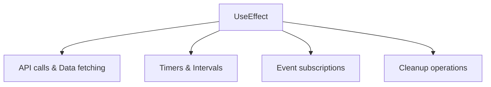
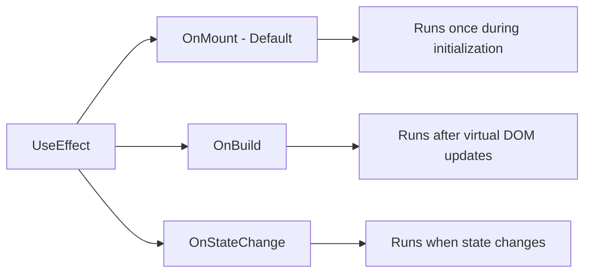

---
searchHints:
  - useeffect
  - lifecycle
  - hooks
  - side-effects
  - async
  - cleanup
---

# UseEffect

<Ingress>
Perform side effects in your Ivy [views](../../../01_Onboarding/02_Concepts/02_Views.md) with the UseEffect [hook](../02_RulesOfHooks.md), similar to React's useEffect but optimized for server-side architecture.
</Ingress>

The `UseEffect` [hook](../02_RulesOfHooks.md) is a powerful feature in Ivy that allows you to perform side effects in your [views](../../../01_Onboarding/02_Concepts/02_Views.md). It's similar to React's useEffect hook but adapted for Ivy's architecture and patterns.

Effects are essential for handling operations that don't directly relate to rendering, such as working with [state](./03_UseState.md) updates, [async operations](../../../01_Onboarding/02_Concepts/06_TasksAndObservables.md), and external services:



## Basic Usage

The simplest form of `UseEffect` runs after the component initializes:

```csharp demo-below
public class BasicEffectView : ViewBase
{
    public override object? Build()
    {
        var message = UseState("Click the button to load data");
        var loadTrigger = UseState(0);
        
        // Effect runs when loadTrigger state changes
        UseEffect(async () =>
        {
            if (loadTrigger.Value == 0) return; // Skip initial render
            
            message.Set("Loading...");
            await Task.Delay(2000); // Simulate API call
            message.Set("Data loaded!");
        }, loadTrigger);
        
        return Layout.Vertical()
            | new Button("Load Data", () => loadTrigger.Set(loadTrigger.Value + 1))
            | Text.P(message.Value);
    }
}
```

## Effect Overloads

Ivy provides four different overloads of `UseEffect` to handle various scenarios:

### Action Handler

For simple synchronous operations:

```csharp
UseEffect(() =>
{
    Console.WriteLine("Component initialized");
});
```

### Async Task Handler

For asynchronous operations:

```csharp
UseEffect(async () =>
{
    var data = await ApiService.GetData();
    // Handle data...
});
```

### Disposable Handler

For operations that need cleanup:

```csharp
UseEffect(() =>
{
    var timer = new Timer(callback, null, 0, 1000);
    return timer; // Timer will be disposed when component unmounts
});
```

### Async Disposable Handler

For async operations with cleanup:

```csharp
UseEffect(async () =>
{
    var connection = await ConnectToService();
    return connection; // Connection will be disposed automatically
});
```

## Effect Triggers

Effects can be triggered by different events using trigger parameters:



```csharp
// OnMount (default) - runs once during initialization
UseEffect(() => { /* ... */ });
UseEffect(() => { /* ... */ }, EffectTrigger.OnMount());

// OnBuild - runs after virtual DOM updates
UseEffect(() => { /* ... */ }, EffectTrigger.OnBuild());

// OnStateChange - runs when state changes
UseEffect(() => { /* ... */ }, EffectTrigger.OnStateChange(myState));
```

### State Dependencies

Effects can depend on [state](./03_UseState.md) changes:

```csharp demo-tabs
public class DependentEffectView : ViewBase
{
    public override object? Build()
    {
        var count = UseState(0);
        var message = UseState("Count: 0");
        
        UseEffect(() =>
        {
            message.Set($"Count changed to: {count.Value}");
        }, count);
        
        return Layout.Vertical()
            | new Button($"Count: {count.Value}", 
                () => count.Set(count.Value + 1))
            | Text.P(message.Value);
    }
}
```

### Multiple Dependencies

Effects can depend on multiple state variables:

```csharp demo-tabs
public class MultipleDepsView : ViewBase
{
    public override object? Build()
    {
        var firstName = UseState("John");
        var lastName = UseState("Doe");
        var fullName = UseState("");
        
        UseEffect(() =>
        {
            fullName.Set($"{firstName.Value} {lastName.Value}");
        }, firstName, lastName);
        
        return Layout.Vertical()
            | (Layout.Horizontal()
                | new Button($"First: {firstName.Value}", 
                    () => firstName.Set(firstName.Value == "John" ? "Jane" : "John"))
                | new Button($"Last: {lastName.Value}", 
                    () => lastName.Set(lastName.Value == "Doe" ? "Smith" : "Doe")))
            | Text.P($"Full name: {fullName.Value}");
    }
}
```

## Common Patterns

### Data Fetching

Use `UseEffect` to fetch data from APIs or external services. The effect can be triggered by user interactions, state changes, or component initialization. Manage loading states to provide feedback during async operations.

```csharp demo-tabs
public class DataFetchView : ViewBase
{
    public override object? Build()
    {
        var data = UseState<List<Item>?>();
        var loading = UseState(false);
        var loadTrigger = UseState(0);
        
        UseEffect(async () =>
        {
            if (loadTrigger.Value == 0) return; // Skip initial render
            
            loading.Set(true);
            
            // Simulate API call - exceptions automatically handled by Ivy
            await Task.Delay(1500);
            var items = new List<Item>
            {
                new("Item 1", "Description 1"),
                new("Item 2", "Description 2"),
                new("Item 3", "Description 3")
            };
            
            data.Set(items);
            loading.Set(false);
        }, loadTrigger);
        
        return Layout.Vertical()
            | new Button("Fetch Data", () => loadTrigger.Set(loadTrigger.Value + 1))
            | (loading.Value 
                ? Text.P("Loading data...") 
                : Layout.Horizontal(
                    data.Value?.Select(item => 
                        new Button($"{item.Name}: {item.Description}")
                    ) ?? Enumerable.Empty<Button>()
                ));
    }
}

public record Item(string Name, string Description);
```

<Callout type="Info">
You do not need to manually catch exceptions in UseEffect. Ivy has a built-in exception handling pipeline that automatically catches exceptions from effects and displays them to users via error notifications and console logging. The system wraps effect exceptions in `EffectException` and routes them through registered exception handlers.
</Callout>

### Cleanup Operations

Return an `IDisposable` from `UseEffect` to perform cleanup when dependencies change or the component unmounts. This is essential for releasing resources like timers, subscriptions, or connections to prevent memory leaks. Store disposables in [UseRef](./08_UseRef.md) when you need to reference them across renders.

```csharp demo-tabs
public class SubscriptionView : ViewBase
{
    public override object? Build()
    {
        var message = UseState("Stopped");
        var isActive = UseState(false);
        var previousResource = UseRef<IDisposable?>(() => null);
        
        UseEffect(() =>
        {
            if (!isActive.Value)
            {
                var hadResource = previousResource.Value != null;
                previousResource.Value?.Dispose();
                previousResource.Value = null;
                if (!hadResource) message.Set("Stopped");
                return System.Reactive.Disposables.Disposable.Empty;
            }
            
            previousResource.Value?.Dispose();
            message.Set("Running");
            
            var resource = new SafeDisposable(() => message.Set("Cleaned up"));
            previousResource.Value = resource;
            return resource;
        }, isActive);
        
        return Layout.Vertical()
            | new Button(isActive.Value ? "Stop" : "Start", 
                () => isActive.Set(!isActive.Value))
            | Text.P($"Status: {message.Value}");
    }
    
    private class SafeDisposable : IDisposable
    {
        private readonly Action _onDispose;
        private bool _isDisposed;
        
        public SafeDisposable(Action onDispose) => _onDispose = onDispose;
        
        public void Dispose()
        {
            if (_isDisposed) return;
            _isDisposed = true;
            _onDispose();
        }
    }
}
```

### Conditional Effects

Effects can be conditionally executed based on state values. Check conditions inside the effect and return early or conditionally create resources.

```csharp demo-tabs
public class ConditionalEffectView : ViewBase
{
    public override object? Build()
    {
        var isEnabled = UseState(false);
        var data = UseState<string?>();
        
        UseEffect(async () =>
        {
            if (!isEnabled.Value)
            {
                data.Set((string)null);
                return;
            }
            
            // Only fetch when enabled
            var result = await FetchData();
            data.Set(result);
        }, isEnabled);
        
        return Layout.Vertical()
            | new Button($"Fetching: {(isEnabled.Value ? "ON" : "OFF")}", 
                onClick: _ => isEnabled.Set(!isEnabled.Value))
            | (data.Value != null ? Text.P(data.Value) : Text.Muted("No data"));
    }
    
    private async Task<string> FetchData()
    {
        await Task.Delay(1000);
        return $"Data fetched at {DateTime.Now:HH:mm:ss}";
    }
}
```

## See Also

- [State Management](./03_UseState.md) - Managing component state
- [Rules of Hooks](../02_RulesOfHooks.md) - Understanding hook rules and best practices
- [Memoization](./05_UseMemo.md) - Optimizing performance with memoization
- [UseCallback](./06_UseCallback.md) - Memoizing callback functions
- [Signals](./10_UseSignal.md) - Reactive state management
- [Views](../../../01_Onboarding/02_Concepts/02_Views.md) - Understanding Ivy views and components

## Faq

<Details>
<Summary>
How do I clean up resources (timers, subscriptions) in UseEffect?
</Summary>
<Body>

Return an `IDisposable` from the UseEffect callback. For simple cases, return the resource directly. For custom cleanup logic, use `Disposable.Create()` from `System.Reactive.Disposables`:

```csharp
// Simple: return the disposable resource directly
UseEffect(() =>
{
    var timer = new System.Threading.Timer(_ =>
    {
        counter.Set(counter.Value + 1);
    }, null, 0, 1000);

    return timer; // Timer implements IDisposable — returned for cleanup
}, dependencies);
```

```csharp
// Custom cleanup: use Disposable.Create() from System.Reactive
using System.Reactive.Disposables;

UseEffect(() =>
{
    var timer = new System.Threading.Timer(_ =>
    {
        counter.Set(counter.Value + 1);
    }, null, 0, 1000);

    return Disposable.Create(() =>
    {
        timer?.Dispose();
        // additional cleanup logic here
    });
}, dependencies);
```

**Important:** `Disposable.Create()` requires `using System.Reactive.Disposables;`. System.Reactive is included as a transitive dependency of Ivy Framework — you do NOT need to add a NuGet package, just the using statement.

For cancellation-based cleanup, use a `CancellationTokenSource`:

```csharp
UseEffect(() =>
{
    var cts = new CancellationTokenSource();
    StartBackgroundWork(cts.Token);
    return cts; // CancellationTokenSource implements IDisposable
}, dependencies);
```

</Body>
</Details>

<Details>
<Summary>
Why does my UseEffect fire multiple times?
</Summary>
<Body>

`UseEffect` with `AfterChange` triggers (state dependencies) fires once per `Set()` call on the watched state. If the state is updated multiple times in quick succession (e.g., file upload status transitions), the effect runs for each update.

Use a guard pattern to prevent duplicate processing:

```csharp
var processedFile = UseRef<string?>(null);
var uploadedFile = UseState<FileUpload?>(null);

UseEffect(() =>
{
    var file = uploadedFile.Value;
    if (file == null) return;
    if (processedFile.Value == file.FileName) return; // Guard: already processed
    processedFile.Value = file.FileName;

    // Process file and show toast
    alert.Toast($"Loaded {file.FileName}");
}, uploadedFile);
```

Key points:
- Use `UseRef` to track processed state without triggering re-renders
- Always check if the meaningful value actually changed before taking action
- For file uploads, guard on the file name or a unique identifier

</Body>
</Details>
