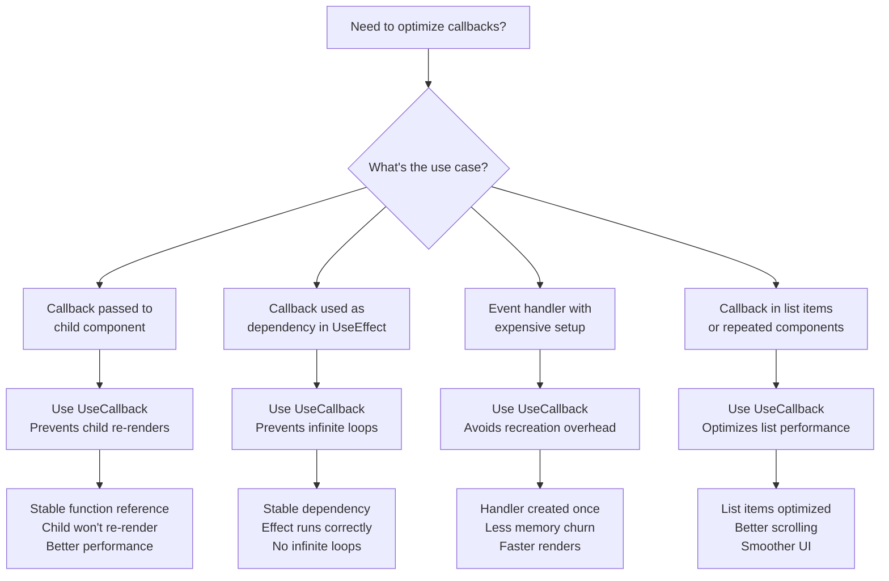
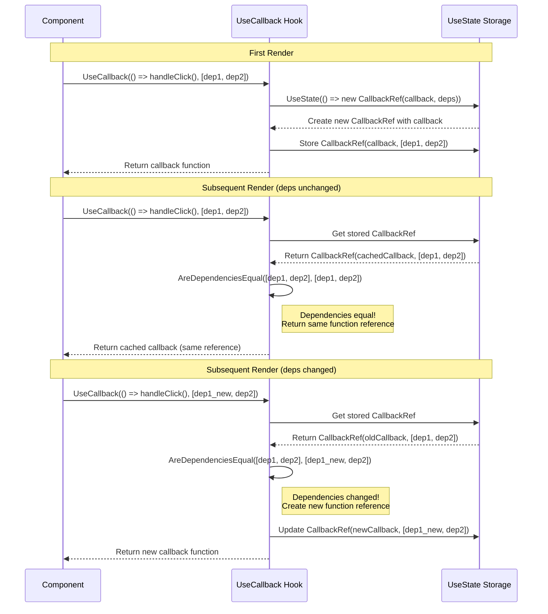

---
searchHints:
  - usecallback
  - performance
  - optimization
  - callbacks
  - usecallback
  - memoization
  - rendering
  - event handlers
---

# UseCallback

<Ingress>
The `UseCallback` [hook](../02_RulesOfHooks.md) memoizes callback functions, preventing unnecessary re-renders when callbacks are passed as props to [child components](../../../01_Onboarding/02_Concepts/03_Widgets.md) or used as dependencies in other [hooks](../02_RulesOfHooks.md).
</Ingress>

## Overview

The `UseCallback` [hook](../02_RulesOfHooks.md) provides a way to optimize callback functions in Ivy [applications](../../../01_Onboarding/02_Concepts/10_Apps.md):

- **Stable Function References** - Returns the same function reference when [state](./03_UseState.md) dependencies haven't changed
- **Prevents Re-renders** - [Child components](../../../01_Onboarding/02_Concepts/03_Widgets.md) won't re-render unnecessarily when receiving memoized callbacks
- **Stable Dependencies** - Ensures callbacks used in [`UseEffect`](./04_UseEffect.md) and other hooks have stable references

<Callout type="Tip">
`UseCallback` memoizes the function reference itself, while [`UseMemo`](./05_UseMemo.md) memoizes the result of calling a function. The memoized callback is only executed when you invoke it.
</Callout>

## Basic Usage

```csharp
public class ParentView : ViewBase
{
    public override object? Build()
    {
        var count = UseState(0);
        var multiplier = UseState(2);
        
        // Memoize the callback to prevent child re-renders
        var handleIncrement = UseCallback(() => 
        {
            count.Set(count.Value + 1);
        }, count); // Only recreate when count changes
        
        var handleReset = UseCallback(() => 
        {
            count.Set(0);
        }); // No dependencies - callback never changes
        
        return Layout.Vertical(
            Text.Inline($"Count: {count.Value}"),
            new ChildComponent(handleIncrement, handleReset),
            new NumberInput("Multiplier", multiplier.Value, v => multiplier.Set(v))
        );
    }
}
```

## When to Use UseCallback



The `UseCallback` [hook](../02_RulesOfHooks.md) memoizes callback functions and only recreates them when their [state](./03_UseState.md) dependencies change.

<Callout type="Tip">
`UseCallback` hook stores only the most recent dependency values for comparison; older values are discarded.
</Callout>

### How UseCallback Works



### Memory vs Speed Trade-offs

- **Function References**: `UseCallback` stores function references in memory. Consider the number of memoized callbacks:

```csharp
// Good: Small number of memoized callbacks
var handleClick = UseCallback(() => DoSomething(), []);
var handleSubmit = UseCallback(() => SubmitForm(), formData);

// Caution: Many memoized callbacks might consume memory
// Consider if all are necessary
```

- **[State](./03_UseState.md) Dependency Stability**: If state dependencies change frequently, callbacks will be recreated often, reducing the effectiveness of memoization:

```csharp
// Bad: Dependency changes on every render
var config = new { threshold: 100 };
var handleAction = UseCallback(() => DoAction(config), config);

// Good: Stable dependency
var threshold = UseState(100);
var handleAction = UseCallback(() => DoAction(threshold.Value), threshold);
```

- **Callback Complexity**: Simple callbacks may not benefit from memoization:

```csharp
// Unnecessary memoization for simple callback
var handleClick = UseCallback(() => count.Set(count.Value + 1), count);

// Consider direct inline for simple cases
// Or memoize only if passed to many child components
```

## Best Practices

- **Dependency Array**: Always specify the [state](./03_UseState.md) dependencies that should trigger callback recreation
- **Stable References**: Only include state values that actually affect the callback's behavior
- **Avoid Over-Memoization**: Don't memoize simple callbacks that don't cause performance issues
- **Combine with IMemoized**: Use `UseCallback` together with `IMemoized` [components](../../../01_Onboarding/02_Concepts/02_Views.md) for maximum optimization

## See Also

- [Memoization](./05_UseMemo.md) - Caching computed values with UseMemo
- [UseMemo](./05_UseMemo.md) - Memoizing function resultss
- [Effects](./04_UseEffect.md) - Performing side effects with stable dependencies
- [State Management](./03_UseState.md) - Managing component state
- [Rules of Hooks](../02_RulesOfHooks.md) - Understanding hook rules and best practices
- [UseRef](./08_UseRef.md) - Storing stable references
- [Views](../../../01_Onboarding/02_Concepts/02_Views.md) - Understanding Ivy views and components
- [Widgets](../../../01_Onboarding/02_Concepts/03_Widgets.md) - Building UI components

## Examples

<Details>
<Summary>
Preventing Child Re-renders
</Summary>
<Body>

```csharp
public class TodoListView : ViewBase
{
    public override object? Build()
    {
        var todos = UseState(new List<Todo>());
        var filter = UseState("");
        
        // Memoize callbacks to prevent TodoItem re-renders
        var handleToggle = UseCallback((int id) => 
        {
            todos.Set(todos.Value.Select(t => 
                t.Id == id ? t with { Completed = !t.Completed } : t
            ).ToList());
        }, todos);
        
        var handleDelete = UseCallback((int id) => 
        {
            todos.Set(todos.Value.Where(t => t.Id != id).ToList());
        }, todos);
        
        var filteredTodos = UseMemo(() => 
            todos.Value.Where(t => 
                t.Title.Contains(filter.Value, StringComparison.OrdinalIgnoreCase)
            ).ToList(),
            todos, filter
        );
        
        return Layout.Vertical(
            new TextInput("Filter", filter.Value, v => filter.Set(v)),
            Layout.Vertical(
                filteredTodos.Select(todo => 
                    new TodoItem(todo, handleToggle, handleDelete).Key(todo.Id)
                )
            )
        );
    }
}
```

</Body>
</Details>

<Details>
<Summary>
Stable Dependencies for Effects
</Summary>
<Body>

```csharp
public class DataFetcherView : ViewBase
{
    public override object? Build()
    {
        var data = UseState<List<Item>?>(null);
        var loading = UseState(false);
        var searchTerm = UseState("");
        
        // Memoize the fetch function
        var fetchData = UseCallback(async () => 
        {
            loading.Set(true);
            try
            {
                var result = await ApiService.SearchItems(searchTerm.Value);
                data.Set(result);
            }
            finally
            {
                loading.Set(false);
            }
        }, searchTerm);
        
        // Use the memoized callback in an effect
        UseEffect(async () => 
        {
            await fetchData();
        }, fetchData); // Stable dependency prevents infinite loops
        
        return Layout.Vertical(
            new TextInput("Search", searchTerm.Value, v => searchTerm.Set(v)),
            loading.Value ? new Loading() : new ItemList(data.Value ?? new List<Item>())
        );
    }
}
```

</Body>
</Details>
