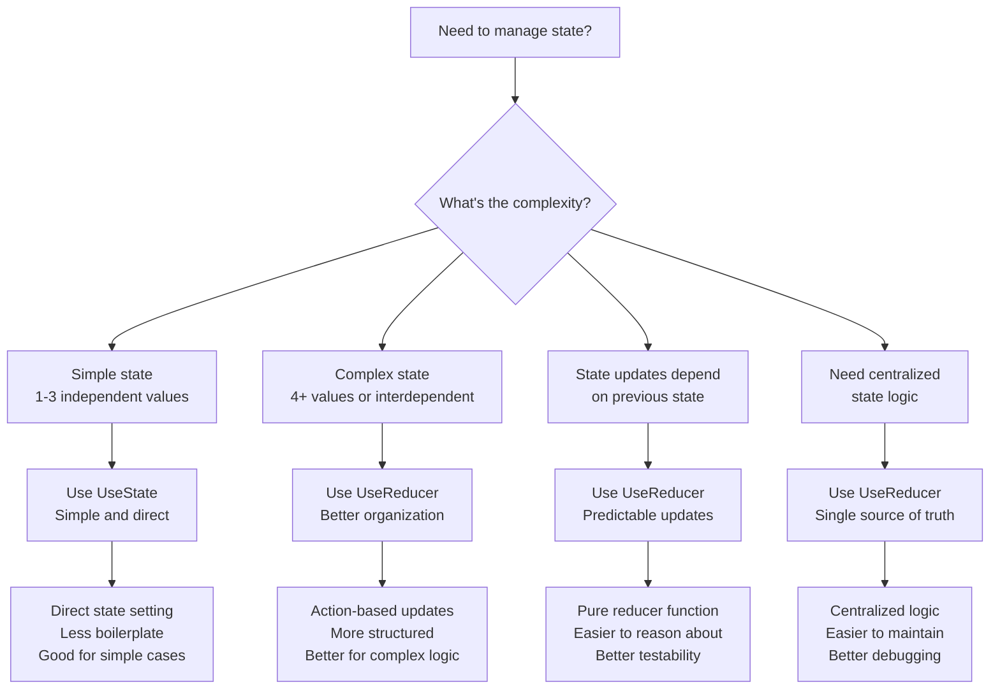
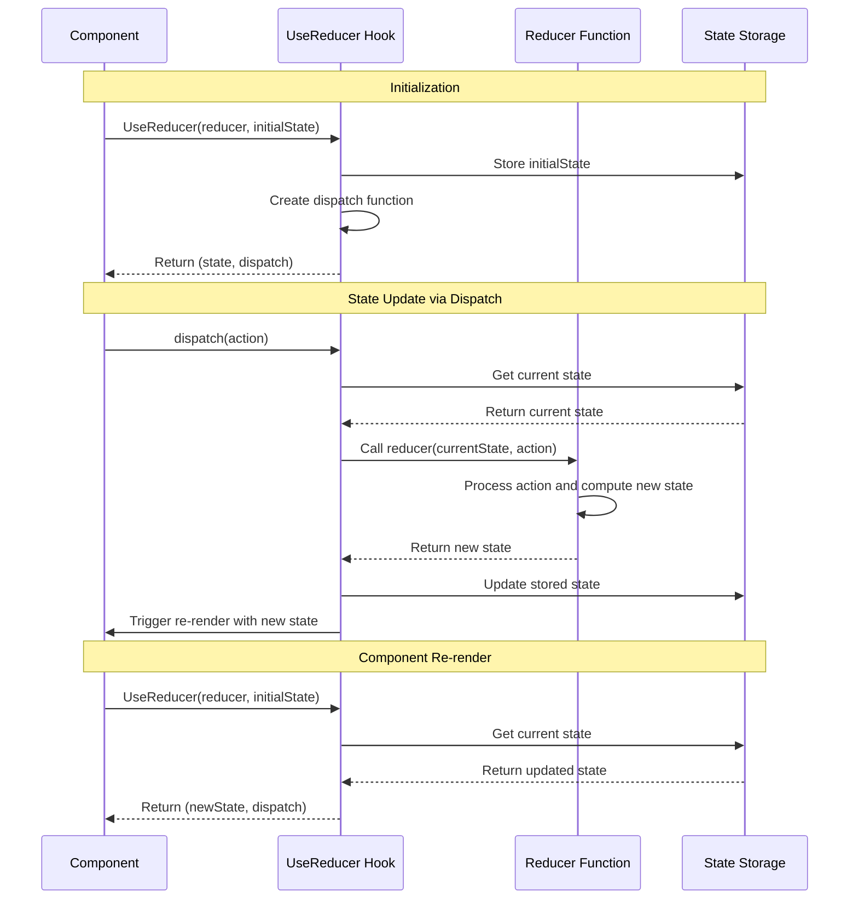

---
searchHints:
  - usereducer
  - reducer
  - state-management
  - complex-state
  - actions
  - hooks
  - state-updates
  - predictable-state
imports:
  - Ivy.Core.Hooks
---

# UseReducer

<Ingress>
Manage complex [state](./03_UseState.md) logic with reducers, providing a predictable state management pattern for [components](../../../01_Onboarding/02_Concepts/02_Views.md) with multiple sub-values or interdependent state updates.
</Ingress>

## Overview

The `UseReducer` [hook](../02_RulesOfHooks.md) is an alternative to [`UseState`](./03_UseState.md) that is better suited for managing complex [state](./03_UseState.md) logic. It follows the reducer pattern where state updates are handled by a pure function.

Key benefits of `UseReducer`:

- **Predictable [State](./03_UseState.md) Updates** - All state changes go through a single reducer function
- **Complex [State](./03_UseState.md) Logic** - Better suited for state with multiple sub-values or interdependent updates
- **Action-Based Updates** - State changes are explicit and traceable through actions
- **Testability** - Pure reducer functions are easy to test in isolation

## Basic Usage

```csharp demo-below
public class BasicReducerDemo : ViewBase
{
    // Reducer function
    private int CounterReducer(int state, string action) => action switch
    {
        "increment" => state + 1,
        "decrement" => state - 1,
        "reset" => 0,
        _ => state
    };
    
    public override object? Build()
    {
        var (count, dispatch) = this.UseReducer(CounterReducer, 0);
        
        return Layout.Vertical(
            Text.H3($"Count: {count}"),
            Layout.Horizontal(
                new Button("-", _ => dispatch("decrement")),
                new Button("Reset", _ => dispatch("reset")),
                new Button("+", _ => dispatch("increment"))
            )
        );
    }
}
```

<Callout type="Tip">
`UseReducer` is ideal when you have complex [state](./03_UseState.md) logic involving multiple sub-values, when the next state depends on the previous one, or when you want to centralize state update logic in one place.
</Callout>

## When to Use UseReducer



<Callout type="Tip">
Reducers should be pure functions - they should not have side effects and should return a new [state](./03_UseState.md) object rather than mutating the existing one. Use [`UseEffect`](./04_UseEffect.md) for side effects.
</Callout>

### How UseReducer Works



### Use Cases

Use `UseReducer` when:

- **Complex [State](./03_UseState.md) Logic** - Managing state with multiple sub-values or interdependent properties
- **State Updates Depend on Previous State** - When the next state depends on the previous state value
- **Action-Based Updates** - When you want explicit, traceable state changes through actions
- **Centralized State Logic** - When you want to centralize all state update logic in one place
- **Better Testability** - When you need to test state logic in isolation

### UseReducer vs [`UseState`](./03_UseState.md)

Choose between `UseReducer` and [`UseState`](./03_UseState.md) based on complexity:

| UseState | UseReducer |
|----------|------------|
| Simple state updates | Complex state logic |
| Independent values | Interdependent values |
| Direct state setting | Action-based updates |
| Less boilerplate | More structured |
| Good for 1-3 values | Good for 4+ values |

### Best Practices

- **Keep Reducers Pure** - Reducers should not have side effects and should return new [state](./03_UseState.md) objects. Use [`UseEffect`](./04_UseEffect.md) for side effects.
- **Use Immutable Updates** - Always return new state objects rather than mutating existing ones
- **Handle All Action Types** - Include a default case to handle unknown actions gracefully
- **Type Safety** - Use strongly-typed actions and [state](./03_UseState.md) for better compile-time safety
- **Extract Complex Logic** - Move complex reducer logic into separate functions for clarity and use [`UseMemo`](./05_UseMemo.md) for expensive computations

## See Also

- [State Management](./03_UseState.md) - Simple state management with UseState
- [Rules of Hooks](../02_RulesOfHooks.md) - Understanding hook rules and best practices
- [Effects](./04_UseEffect.md) - Side effects and async operations
- [Memoization](./05_UseMemo.md) - Performance optimization with UseMemo
- [Callbacks](./06_UseCallback.md) - Memoized callback functions with UseCallback
- [Views](../../../01_Onboarding/02_Concepts/02_Views.md) - Understanding Ivy views and components

### Examples

<Details>
<Summary>
Shopping Cart with Interdependent State
</Summary>
<Body>

This example demonstrates why reducers are powerful - multiple interdependent values (items, subtotal, tax, discount, total) that must stay in sync. With `UseState`, you'd need to update each value separately and risk inconsistencies.

```csharp demo-tabs
public class ShoppingCartDemo : ViewBase
{
    record CartItem(string Name, decimal Price, int Quantity);
    record CartState(List<CartItem> Items, decimal DiscountPercent, decimal Subtotal, decimal Tax, decimal Total);
    
    private CartState CartReducer(CartState state, string action)
    {
        var parts = action.Split('|', 2);
        var actionType = parts[0];
        var actionValue = parts.Length > 1 ? parts[1] : "";
        
        return actionType switch
        {
            "addItem" => CalculateTotals(state with { 
                Items = state.Items.Append(new CartItem(actionValue, 10.00m, 1)).ToList() 
            }),
            "removeItem" => CalculateTotals(state with { 
                Items = state.Items.Where((item, idx) => idx.ToString() != actionValue).ToList() 
            }),
            "setDiscount" => CalculateTotals(state with { 
                DiscountPercent = decimal.TryParse(actionValue, out var discount) ? discount : 0m 
            }),
            _ => state
        };
    }
    
    private CartState CalculateTotals(CartState state)
    {
        var subtotal = state.Items.Sum(item => item.Price * item.Quantity);
        var discountAmount = subtotal * (state.DiscountPercent / 100m);
        var afterDiscount = subtotal - discountAmount;
        var tax = afterDiscount * 0.08m; // 8% tax
        var total = afterDiscount + tax;
        
        return state with 
        { 
            Subtotal = subtotal,
            Tax = tax,
            Total = total
        };
    }
    
    public override object? Build()
    {
        var (cart, dispatch) = this.UseReducer(CartReducer, new CartState(new List<CartItem>(), 0m, 0m, 0m, 0m));
        var newItemName = UseState("");
        
        return Layout.Vertical(
            Text.H3("Shopping Cart"),
            Layout.Horizontal(
                newItemName.ToTextInput().Placeholder("Item name"),
                new Button("Add Item", _ => {
                    if (!string.IsNullOrWhiteSpace(newItemName.Value))
                    {
                        dispatch($"addItem|{newItemName.Value}");
                        newItemName.Set("");
                    }
                })
            ),
            new Separator(),
            cart.Items.Count > 0 
                ? Layout.Vertical(
                    new { 
                        Items = string.Join(", ", cart.Items.Select(item => $"{item.Name} (${item.Price:F2} x {item.Quantity})"))
                    }.ToDetails(),
                    Layout.Horizontal(
                        cart.Items.Select((item, idx) => 
                            new Button($"Remove {item.Name}", _ => dispatch($"removeItem|{idx}"))
                        ).ToArray()
                    )
                )
                : Text.P("No items in cart").Small(),
            new Separator(),
            Layout.Vertical(
                Text.P($"Subtotal: ${cart.Subtotal:F2}"),
                Text.P($"Discount ({cart.DiscountPercent}%): ${cart.Subtotal * (cart.DiscountPercent / 100m):F2}"),
                Text.P($"Tax (8%): ${cart.Tax:F2}"),
                Text.H4($"Total: ${cart.Total:F2}")
            ),
            Layout.Horizontal(
                new Button("10% Off", _ => dispatch("setDiscount|10")),
                new Button("20% Off", _ => dispatch("setDiscount|20")),
                new Button("Clear Discount", _ => dispatch("setDiscount|0"))
            )
        );
    }
}
```

</Body>
</Details>

<Details>
<Summary>
Game State with Multiple Interdependent Values
</Summary>
<Body>

This example shows a game state where actions affect multiple values simultaneously - perfect for demonstrating reducer's centralized state management.

```csharp demo-tabs
public class GameStateDemo : ViewBase
{
    record GameState(int Score, int Level, int Lives, int Multiplier, bool IsGameOver);
    
    private GameState GameReducer(GameState state, string action) => action switch
    {
        "score" => state.IsGameOver ? state : state with { 
            Score = state.Score + (10 * state.Multiplier),
            Level = (state.Score + (10 * state.Multiplier)) / 100 + 1,
            Multiplier = Math.Min(state.Multiplier + 1, 5)
        },
        "miss" => state.IsGameOver ? state : state with { 
            Lives = state.Lives - 1,
            Multiplier = 1,
            IsGameOver = state.Lives <= 1
        },
        "reset" => new GameState(0, 1, 3, 1, false),
        _ => state
    };
    
    public override object? Build()
    {
        var (game, dispatch) = this.UseReducer(GameReducer, new GameState(0, 1, 3, 1, false));
        
        return Layout.Vertical(
            Text.H3("Game State"),
            Layout.Vertical(
                Text.P($"Score: {game.Score}"),
                Text.P($"Level: {game.Level}"),
                Text.P($"Lives: {game.Lives}"),
                Text.P($"Multiplier: {game.Multiplier}x"),
                game.IsGameOver ? Text.Danger("Game Over!") : Text.Success("Playing...")
            ),
            new Separator(),
            Layout.Horizontal(
                new Button("Score!", _ => dispatch("score")).Disabled(game.IsGameOver),
                new Button("Miss", _ => dispatch("miss")).Disabled(game.IsGameOver),
                new Button("Reset", _ => dispatch("reset"))
            ),
            Text.P("Notice how scoring updates level and multiplier, while missing resets multiplier and decreases lives - all in one reducer!").Small()
        );
    }
}
```

</Body>
</Details>
