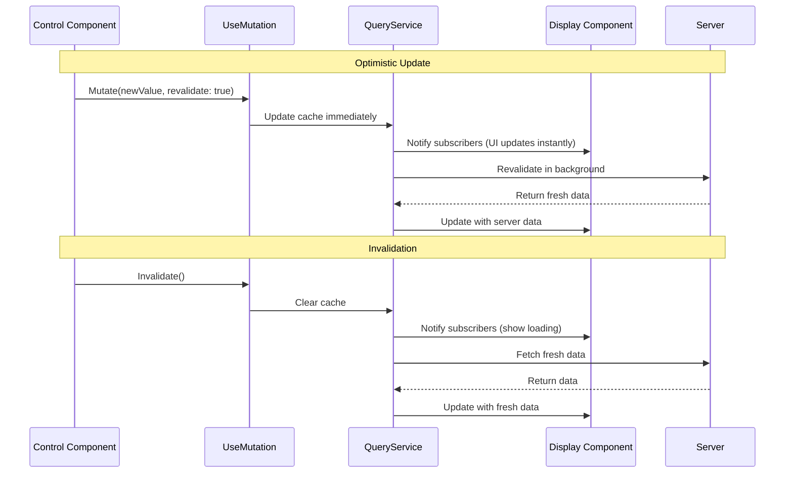

---
searchHints:
  - mutation
  - usemutation
  - query-mutation
  - data-mutation
  - update
  - invalidate
---

# UseMutation

<Ingress>
The `UseMutation` [hook](../02_RulesOfHooks.md) provides a way to control [query](./09_UseQuery.md) caches from different components, enabling optimistic updates, cache invalidation, and cross-component data synchronization.
</Ingress>

## Overview

The `UseMutation` [hook](../02_RulesOfHooks.md) enables you to control [query](./09_UseQuery.md) caches from any component:

- **Cross-Component Control** - Control queries from components that don't use `UseQuery`
- **Optimistic Updates** - Update cache immediately before server confirmation
- **Cache Invalidation** - Clear and refetch cached data
- **Background Revalidation** - Trigger background updates without clearing cache

<Callout type="Tip">
`UseMutation` is perfect for controlling shared queries from action components (like buttons or forms) that are separate from the components displaying the data. It works with the same query keys used in `UseQuery`.
</Callout>

## Basic Usage

### Simple Mutation (Revalidate and Invalidate)

Use `UseMutation` with just a key to get a mutator with `Revalidate()` and `Invalidate()` methods:

```csharp
public class DataDisplayView : ViewBase
{
    public override object? Build()
    {
        var query = UseQuery(
            key: "user-data",
            fetcher: async ct =>
            {
                await Task.Delay(500, ct);
                return new { Name = "Alice", Email = "alice@example.com" };
            });

        return Layout.Vertical(
            Text.Literal(query.Loading ? "Loading..." : query.Value?.Name ?? ""),
            query.Validating ? Text.Muted("Updating...") : null
        );
    }
}

public class DataControlsView : ViewBase
{
    public override object? Build()
    {
        // Control the query from a different component
        var mutator = UseMutation("user-data");

        return Layout.Horizontal(
            new Button("Refresh", _ => mutator.Revalidate())
                .Variant(ButtonVariant.Outline),
            new Button("Clear Cache", _ => mutator.Invalidate())
                .Variant(ButtonVariant.Destructive)
        );
    }
}
```

### Typed Mutation (With Optimistic Updates)

Use the typed overload to get a mutator with `Mutate()` for optimistic updates:

```csharp
public class CounterDisplayView : ViewBase
{
    public override object? Build()
    {
        var query = UseQuery(
            key: "counter",
            fetcher: async ct =>
            {
                await Task.Delay(500, ct);
                return Random.Shared.Next(1, 100);
            });

        return Layout.Vertical(
            Text.Literal($"Value: {query.Value}"),
            query.Validating ? Text.Muted("Syncing...") : null
        );
    }
}

public class CounterControlsView : ViewBase
{
    public override object? Build()
    {
        // Typed mutator allows optimistic updates
        var mutator = UseMutation<int, string>("counter");

        return Layout.Horizontal(
            new Button("+10 (Optimistic)", _ =>
            {
                // Update cache immediately, then revalidate in background
                mutator.Mutate(mutator.Value + 10, revalidate: true);
            }),
            new Button("Set 999", _ =>
            {
                // Update cache without revalidation
                mutator.Mutate(999, revalidate: false);
            }),
            new Button("Refresh", _ => mutator.Revalidate()),
            new Button("Clear", _ => mutator.Invalidate())
        );
    }
}
```

## How Mutation Works

### Mutation Flow



### Query Scopes

`UseMutation` works with the same query scopes as `UseQuery`, except `View` scope:

| Scope | Description | UseMutation Support |
|-------|-------------|---------------------|
| `Server` | Shared across all users | Supported |
| `App` | Shared within app session | Supported |
| `Device` | Shared across apps on same device | Supported |
| `View` | Isolated to component instance | Not supported |

<Callout type="Warning">
`UseMutation` does not support `View` scope queries because view-scoped queries are isolated to a single component instance and cannot be controlled from other components.
</Callout>

## Mutation Methods

### Mutate (Optimistic Update)

Update the cache immediately with a new value:

```csharp
var mutator = UseMutation<int, string>("counter");

// Update cache immediately, then revalidate in background
mutator.Mutate(42, revalidate: true);

// Update cache without revalidation
mutator.Mutate(42, revalidate: false);
```

**Parameters:**

- `newValue` - The new value to set in the cache
- `revalidate` - If `true`, triggers background revalidation after updating

### Revalidate (Background Refresh)

Trigger a background revalidation without clearing the cache:

```csharp
var mutator = UseMutation("user-data");

// Revalidate in background (keeps current cache value visible)
mutator.Revalidate();
```

**Use Cases:**

- Refresh data without showing a loading state
- Update data after a mutation completes
- Periodic background updates

### Invalidate (Clear and Refetch)

Clear the cache and trigger a fresh fetch:

```csharp
var mutator = UseMutation("user-data");

// Clear cache and fetch fresh data
mutator.Invalidate();
```

**Use Cases:**

- Force a complete refresh
- Clear stale data
- Reset after errors

## Examples

### Form Submission with Optimistic Update

```csharp
public class UserFormView : ViewBase
{
    public override object? Build()
    {
        var name = UseState("");
        var email = UseState("");
        var mutator = UseMutation<User, string>("current-user");

        return Layout.Vertical(
            name.ToTextInput("Name"),
            email.ToTextInput("Email"),
            new Button("Save", async _ =>
            {
                // Optimistic update - show new data immediately
                var optimisticUser = new User
                {
                    Name = name.Value,
                    Email = email.Value
                };
                
                mutator.Mutate(optimisticUser, revalidate: true);

                // In real app, you'd also call your API here
                // await apiService.UpdateUser(optimisticUser);
            })
        );
    }
}

public class UserDisplayView : ViewBase
{
    public override object? Build()
    {
        var query = UseQuery(
            key: "current-user",
            fetcher: async ct => await FetchCurrentUser(ct));

        return Layout.Vertical(
            Text.Heading(query.Value?.Name ?? "Loading..."),
            Text.Literal(query.Value?.Email ?? ""),
            query.Validating ? Text.Muted("Updating...") : null
        );
    }

    private Task<User> FetchCurrentUser(CancellationToken ct)
    {
        // Implementation
        return Task.FromResult(new User());
    }
}
```

### Delete with Cache Invalidation

```csharp
public class ProductListView : ViewBase
{
    public override object? Build()
    {
        var query = UseQuery(
            key: "products",
            fetcher: async ct => await FetchProducts(ct));

        return Layout.Vertical(
            query.Value?.Select(product =>
                new ProductItem(product, UseMutation("products"))
            ) ?? []
        );
    }

    private Task<List<Product>> FetchProducts(CancellationToken ct)
    {
        // Implementation
        return Task.FromResult(new List<Product>());
    }
}

public class ProductItem : ViewBase
{
    private readonly Product _product;
    private readonly QueryMutator _mutator;

    public ProductItem(Product product, QueryMutator mutator)
    {
        _product = product;
        _mutator = mutator;
    }

    public override object? Build()
    {
        return Layout.Horizontal(
            Text.Literal(_product.Name),
            new Button("Delete", async _ =>
            {
                await DeleteProduct(_product.Id);
                // Invalidate cache to refetch the list
                _mutator.Invalidate();
            })
                .Variant(ButtonVariant.Destructive)
        );
    }

    private Task DeleteProduct(int id)
    {
        // Implementation
        return Task.CompletedTask;
    }
}
```

### Cross-Component Synchronization

```csharp
public class DashboardView : ViewBase
{
    public override object? Build()
    {
        return Layout.Vertical(
            new StatsPanel(),
            new DataTable(),
            new RefreshControls()
        );
    }
}

public class StatsPanel : ViewBase
{
    public override object? Build()
    {
        var query = UseQuery(
            key: "dashboard-stats",
            fetcher: async ct => await FetchStats(ct));

        return Layout.Vertical(
            Text.Heading("Statistics"),
            Text.Literal($"Total Users: {query.Value?.TotalUsers ?? 0}"),
            Text.Literal($"Active Sessions: {query.Value?.ActiveSessions ?? 0}")
        );
    }

    private Task<Stats> FetchStats(CancellationToken ct)
    {
        // Implementation
        return Task.FromResult(new Stats());
    }
}

public class DataTable : ViewBase
{
    public override object? Build()
    {
        var query = UseQuery(
            key: "dashboard-stats",
            fetcher: async ct => await FetchStats(ct));

        return new Table(query.Value?.RecentActivity ?? []);
    }

    private Task<Stats> FetchStats(CancellationToken ct)
    {
        // Implementation
        return Task.FromResult(new Stats());
    }
}

public class RefreshControls : ViewBase
{
    public override object? Build()
    {
        // Control the shared query from a separate component
        var mutator = UseMutation("dashboard-stats");

        return Layout.Horizontal(
            new Button("Refresh All", _ => mutator.Revalidate())
                .Variant(ButtonVariant.Primary),
            new Button("Force Reload", _ => mutator.Invalidate())
                .Variant(ButtonVariant.Outline)
        );
    }
}
```

### Optimistic Like Button

```csharp
public class PostView : ViewBase
{
    public override object? Build()
    {
        var postId = UseArgs<PostArgs>()?.PostId ?? 0;
        var query = UseQuery(
            key: $"post-{postId}",
            fetcher: async ct => await FetchPost(postId, ct));

        return Layout.Vertical(
            Text.Heading(query.Value?.Title ?? ""),
            Text.Literal(query.Value?.Content ?? ""),
            new LikeButton(postId, UseMutation<Post, string>($"post-{postId}"))
        );
    }

    private Task<Post> FetchPost(int postId, CancellationToken ct)
    {
        // Implementation
        return Task.FromResult(new Post());
    }
}

public class LikeButton : ViewBase
{
    private readonly int _postId;
    private readonly QueryMutator<Post> _mutator;

    public LikeButton(int postId, QueryMutator<Post> mutator)
    {
        _postId = postId;
        _mutator = mutator;
    }

    public override object? Build()
    {
        var query = UseQuery(
            key: $"post-{_postId}",
            fetcher: async ct => await FetchPost(_postId, ct));

        var isLiked = query.Value?.IsLiked ?? false;
        var likeCount = query.Value?.LikeCount ?? 0;

        return new Button(
            $"{likeCount} Likes",
            _ =>
            {
                // Optimistic update - update UI immediately
                var updatedPost = query.Value! with
                {
                    IsLiked = !isLiked,
                    LikeCount = isLiked ? likeCount - 1 : likeCount + 1
                };

                _mutator.Mutate(updatedPost, revalidate: true);

                // Call API in background
                _ = ToggleLike(_postId);
            })
            .Variant(isLiked ? ButtonVariant.Primary : ButtonVariant.Outline);
    }

    private Task ToggleLike(int postId)
    {
        // Implementation
        return Task.CompletedTask;
    }

    private Task<Post> FetchPost(int postId, CancellationToken ct)
    {
        // Implementation
        return Task.FromResult(new Post());
    }
}
```

## Best Practices

### Use Typed Mutations for Optimistic Updates

Use the typed overload when you need optimistic updates:

```csharp
// Good: Typed mutation for optimistic updates
var mutator = UseMutation<User, string>("user");
mutator.Mutate(newUser, revalidate: true);

// Less ideal: Untyped mutation can't do optimistic updates
var mutator = UseMutation("user");
// No Mutate method available
```

### Revalidate After Mutations

Always revalidate after mutations to ensure data consistency:

```csharp
// Good: Revalidate after optimistic update
mutator.Mutate(newValue, revalidate: true);

// Also good: Invalidate to force fresh fetch
mutator.Invalidate();
```

### Use Invalidate for Destructive Operations

Use `Invalidate()` for operations that change data structure:

```csharp
// Good: Invalidate after delete
await DeleteItem(id);
mutator.Invalidate();

// Good: Invalidate after create (list changed)
await CreateItem(item);
mutator.Invalidate();
```

### Use Revalidate for Non-Destructive Updates

Use `Revalidate()` for updates that don't change data structure:

```csharp
// Good: Revalidate after update (same structure)
await UpdateItem(item);
mutator.Revalidate();
```

### Match Query Keys Exactly

Ensure mutation keys match query keys exactly:

```csharp
// Good: Keys match exactly
var query = UseQuery(key: "user-data", ...);
var mutator = UseMutation("user-data");

// Bad: Keys don't match
var query = UseQuery(key: "user-data", ...);
var mutator = UseMutation("userData"); // Won't work!
```

## Common Patterns

### Action Buttons

Control queries from action buttons in separate components:

```csharp
public class ActionBar : ViewBase
{
    public override object? Build()
    {
        var mutator = UseMutation("shared-data");

        return Layout.Horizontal(
            new Button("Refresh", _ => mutator.Revalidate()),
            new Button("Reset", _ => mutator.Invalidate())
        );
    }
}
```

### Form Submission

Update cache optimistically when submitting forms:

```csharp
public class EditForm : ViewBase
{
    public override object? Build()
    {
        var formData = UseState(new FormData());
        var mutator = UseMutation<Data, string>("data");

        return Layout.Vertical(
            // Form fields...
            new Button("Save", _ =>
            {
                // Optimistic update
                mutator.Mutate(formData.Value.ToData(), revalidate: true);
                // Submit to server...
            })
        );
    }
}
```

### Bulk Operations

Invalidate multiple related queries:

```csharp
public class BulkActions : ViewBase
{
    public override object? Build()
    {
        var usersMutator = UseMutation("users");
        var statsMutator = UseMutation("stats");

        return Layout.Horizontal(
            new Button("Refresh All", _ =>
            {
                usersMutator.Revalidate();
                statsMutator.Revalidate();
            }),
            new Button("Clear All", _ =>
            {
                usersMutator.Invalidate();
                statsMutator.Invalidate();
            })
        );
    }
}
```

## Troubleshooting

### Mutation Doesn't Affect Query

If mutations don't affect queries, check:

1. **Query keys match exactly**:

```csharp
// Correct: Keys match
var query = UseQuery(key: "data", ...);
var mutator = UseMutation("data");

// Incorrect: Keys don't match
var query = UseQuery(key: "data", ...);
var mutator = UseMutation("Data"); // Case-sensitive!
```

1. **Query scope is supported**:

```csharp
// Correct: Server scope (supported)
var query = UseQuery(key: "data", ..., options: new QueryOptions { Scope = QueryScope.Server });
var mutator = UseMutation("data");

// Incorrect: View scope (not supported)
var query = UseQuery(key: "data", ..., options: new QueryOptions { Scope = QueryScope.View });
var mutator = UseMutation("data"); // Throws exception!
```

### Optimistic Updates Not Working

If optimistic updates don't work:

1. **Use typed mutation**:

```csharp
// Correct: Typed mutation
var mutator = UseMutation<User, string>("user");
mutator.Mutate(newUser, revalidate: true);

// Incorrect: Untyped mutation
var mutator = UseMutation("user");
// No Mutate method available
```

1. **Ensure value type matches**:

```csharp
// Correct: Types match
var query = UseQuery<User>(key: "user", ...);
var mutator = UseMutation<User, string>("user");

// Incorrect: Types don't match
var query = UseQuery<User>(key: "user", ...);
var mutator = UseMutation<Product, string>("user"); // Wrong type!
```

## See Also

- [Query](./09_UseQuery.md) - Fetching and caching data
- [State](./03_UseState.md) - Component state management
- [Rules of Hooks](../02_RulesOfHooks.md) - Understanding hook rules and best practices
- [Views](../../../01_Onboarding/02_Concepts/02_Views.md) - Understanding Ivy views and components
