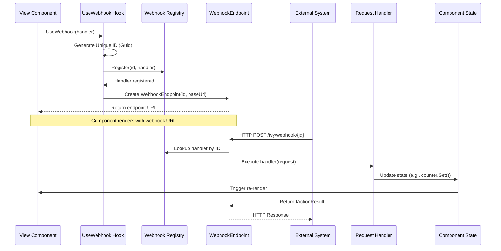

---
searchHints:
  - webhook
  - usewebhook
  - http-endpoint
  - api-endpoint
  - external-callback
  - http-handler
---

# UseWebhook

<Ingress>
The `UseWebhook` [hook](../02_RulesOfHooks.md) creates HTTP endpoints that can be called from external systems, enabling integration with third-party services, webhooks, and external callbacks.
</Ingress>

## Basic Usage

The `UseWebhook` hook takes a request handler and returns a `WebhookEndpoint` containing the URL that external systems can call:

```csharp demo-below
public class BasicWebhookExample : ViewBase
{
    public override object? Build()
    {
        var counter = UseState(0);
        var webhook = UseWebhook(_ =>
        {
            counter.Set(counter.Value + 1);
        });
        
        return Layout.Vertical()
            | Text.P($"Webhook called {counter.Value} times")
            | Text.Code(webhook.GetUri().ToString());
    }
}
```

## How It Works

The `UseWebhook` hook:

1. **Generates a Unique ID**: Creates a unique identifier for the webhook endpoint
2. **Registers the Handler**: Registers your request handler with the webhook registry
3. **Returns Webhook Endpoint**: Provides a `WebhookEndpoint` with the URL that external systems can call



## Handler Types

`UseWebhook` supports multiple handler signatures for different use cases:

### Simple Action Handler

For handlers that don't need to return a response:

```csharp demo-below
public class SimpleActionHandlerExample : ViewBase
{
    public override object? Build()
    {
        var counter = UseState(0);
        var lastCall = UseState<DateTime?>();
        
        var webhook = UseWebhook((Microsoft.AspNetCore.Http.HttpRequest request) =>
        {
            // Process the request - update state, log, etc.
            counter.Set(counter.Value + 1);
            lastCall.Set(DateTime.UtcNow);
        });
        
        return Layout.Vertical()
            | Text.P($"Webhook called {counter.Value} times")
            | (lastCall.Value != null 
                ? Text.P($"Last call: {lastCall.Value:HH:mm:ss}")
                : Text.P("No calls yet"))
            | Text.Code(webhook.GetUri().ToString());
    }
}
```

### Async Handler

For handlers that perform async operations:

```csharp demo-below
public class AsyncWebhookExample : ViewBase
{
    public override object? Build()
    {
        var lastMessage = UseState("No webhook called yet");
        var webhook = UseWebhook(async (Microsoft.AspNetCore.Http.HttpRequest request) =>
        {
            using var reader = new StreamReader(request.Body);
            var body = await reader.ReadToEndAsync();
            lastMessage.Set($"Received: {body}");
        });
        
        return Layout.Vertical()
            | Text.P(lastMessage.Value)
            | Text.Code(webhook.GetUri().ToString());
    }
}
```

### Custom Response Handler

For handlers that need to return custom HTTP responses:

```csharp demo-below
public class CustomResponseHandlerExample : ViewBase
{
    public override object? Build()
    {
        var responseStatus = UseState("No request received");
        var responseCode = UseState(200);
        
        var webhook = UseWebhook((Microsoft.AspNetCore.Http.HttpRequest request) =>
        {
            // Check query parameter to demonstrate different responses
            var action = request.Query["action"].ToString();
            
            if (action == "success")
            {
                responseStatus.Set("Success response sent");
                responseCode.Set(200);
                return new Microsoft.AspNetCore.Mvc.OkObjectResult(new { message = "Success", status = "ok" });
            }
            else if (action == "error")
            {
                responseStatus.Set("Error response sent");
                responseCode.Set(400);
                return new Microsoft.AspNetCore.Mvc.BadRequestObjectResult(new { error = "Invalid request" });
            }
            else
            {
                responseStatus.Set("Default success response");
                responseCode.Set(200);
                return new Microsoft.AspNetCore.Mvc.OkObjectResult(new { message = "Request processed" });
            }
        });
        
        return Layout.Vertical()
            | Text.P($"Response Status: {responseStatus.Value}")
            | Text.P($"HTTP Code: {responseCode.Value}")
            | Text.P("Try adding ?action=success or ?action=error to the URL")
            | Text.Code(webhook.GetUri().ToString());
    }
}
```

## WebhookEndpoint Properties

| Property  | Type     | Description                                    |
| --------- | -------- | ---------------------------------------------- |
| `Id`      | `string` | Unique identifier for the webhook              |
| `BaseUrl` | `string` | Base URL for the webhook endpoint              |

The `WebhookEndpoint` provides a `GetUri()` method to get the full webhook URL:

```csharp
var webhook = UseWebhook(_ => { });
var url = webhook.GetUri(); // Full URL: https://example.com/ivy/webhook/{id}
```

## Best Practices

- **Always handle errors** - Use try-catch blocks and return appropriate error responses
- **Validate request authenticity** - Verify signatures or tokens for sensitive operations
- **Use async handlers for I/O** - Use async when reading bodies or making database calls
- **Return appropriate HTTP responses** - Use proper status codes (OkResult, BadRequestResult, etc.)
- **Update state safely** - State updates from handlers are automatically thread-safe
- **Keep handlers fast** - Complete quickly and queue heavy work for background processing
- **Log important events** - Log calls, results, and errors for debugging and auditing
- **Cleanup is automatic** - Webhooks are automatically unregistered when components unmount

## See Also

- [State Management](./03_UseState.md) - Update state from webhook handlers
- [Effects](./04_UseEffect.md) - Perform side effects in response to webhook calls

## Examples

<Details>
<Summary>
Payment Webhook Handler
</Summary>
<Body>

Handle payment callbacks from a payment processor:

```csharp demo-below
public class PaymentWebhookView : ViewBase
{
    public override object? Build()
    {
        var payments = UseState(ImmutableArray.Create<Payment>());
        var lastPayment = UseState<Payment?>();
        
        var webhook = UseWebhook(async (Microsoft.AspNetCore.Http.HttpRequest request) =>
        {
            try
            {
                Payment? payment = null;
                
                // Check if request has a body
                if (request.ContentLength > 0)
                {
                    using var reader = new StreamReader(request.Body);
                    var json = await reader.ReadToEndAsync();
                    
                    if (!string.IsNullOrWhiteSpace(json))
                    {
                        payment = System.Text.Json.JsonSerializer.Deserialize<Payment>(json);
                    }
                }
                
                // For demo purposes: if no body, create a sample payment
                if (payment == null)
                {
                    payment = new Payment(
                        Amount: new Random().Next(10, 500),
                        Status: "completed",
                        Timestamp: DateTime.UtcNow
                    );
                }
                
                payments.Set(payments.Value.Add(payment));
                lastPayment.Set(payment);
                
                return new Microsoft.AspNetCore.Mvc.OkObjectResult(new { status = "received" });
            }
            catch (Exception ex)
            {
                return new Microsoft.AspNetCore.Mvc.BadRequestObjectResult(new { error = ex.Message });
            }
        });
        
        return Layout.Vertical()
            | Text.H2("Payment Webhook")
            | Text.Code(webhook.GetUri().ToString())
            | Text.H3("Last Payment")
            | (lastPayment.Value != null
                ? Layout.Vertical(
                    Text.P($"Amount: ${lastPayment.Value.Amount:F2}"),
                    Text.P($"Status: {lastPayment.Value.Status}"),
                    Text.P($"Date: {lastPayment.Value.Timestamp}")
                  )
                : Text.P("No payments received yet"))
            | Text.H3("All Payments")
            | payments.Value.ToTable()
                .Builder(e => e.Amount, e => e.Func((decimal x) => $"${x:F2}"));
    }
}

public record Payment(decimal Amount, string Status, DateTime Timestamp);
```

</Body>
</Details>

<Details>
<Summary>
OAuth Callback Handler
</Summary>
<Body>

Handle OAuth authorization callbacks:

```csharp demo-below
public class OAuthCallbackView : ViewBase
{
    public override object? Build()
    {
        var authCode = UseState<string?>();
        var authState = UseState<string?>();
        var isAuthenticated = UseState(false);
        
        var webhook = UseWebhook((Microsoft.AspNetCore.Http.HttpRequest request) =>
        {
            // Extract OAuth callback parameters
            var code = request.Query["code"].ToString();
            var state = request.Query["state"].ToString();
            
            // For demo purposes: if no query params, create sample values
            if (string.IsNullOrEmpty(code) && string.IsNullOrEmpty(state))
            {
                code = "demo_auth_code_12345";
                state = "demo_state_abc";
            }
            
            authCode.Set(code);
            authState.Set(state);
            
            // In a real app, you'd exchange the code for tokens here
            if (!string.IsNullOrEmpty(code))
            {
                isAuthenticated.Set(true);
            }
            
            return new Microsoft.AspNetCore.Mvc.OkObjectResult(new { message = "Authorization received" });
        });
        
        return Layout.Vertical()
            | Text.H2("OAuth Callback")
            | Text.Code(webhook.GetUri().ToString())
            | (isAuthenticated.Value
                ? Layout.Vertical(
                    Text.Success("Authentication successful!"),
                    Text.P($"Code: {authCode.Value}"),
                    Text.P($"State: {authState.Value}")
                  )
                : Text.P("Waiting for OAuth callback..."));
    }
}
```

</Body>
</Details>

<Details>
<Summary>
External API Integration
</Summary>
<Body>

Create a webhook endpoint for external services to send data:

```csharp demo-below
public class ExternalIntegrationView : ViewBase
{
    public override object? Build()
    {
        var events = UseState(ImmutableArray.Create<WebhookEvent>());
        var lastEvent = UseState<WebhookEvent?>();
        
        var webhook = UseWebhook(async (Microsoft.AspNetCore.Http.HttpRequest request) =>
        {
            string body;
            string eventType;
            string signature;
            
            // Read request body if present
            if (request.ContentLength > 0)
            {
                using var reader = new StreamReader(request.Body);
                body = await reader.ReadToEndAsync();
            }
            else
            {
                body = string.Empty;
            }
            
            // Extract custom headers
            eventType = request.Headers["X-Event-Type"].ToString();
            signature = request.Headers["X-Signature"].ToString();
            
            // For demo purposes: if no data, create sample event
            if (string.IsNullOrEmpty(eventType) && string.IsNullOrEmpty(body))
            {
                var eventTypes = new[] { "user.created", "order.completed", "payment.processed", "notification.sent" };
                var random = new Random();
                eventType = eventTypes[random.Next(eventTypes.Length)];
                body = $"{{\"id\": \"{Guid.NewGuid()}\", \"action\": \"{eventType}\", \"timestamp\": \"{DateTime.UtcNow:O}\"}}";
                signature = $"sha256={Convert.ToBase64String(System.Text.Encoding.UTF8.GetBytes(signature + body)).Substring(0, 16)}";
            }
            
            // Validate signature (in production, verify this!)
            var eventData = new WebhookEvent(
                eventType,
                body,
                DateTime.UtcNow,
                signature
            );
            
            events.Set(events.Value.Add(eventData));
            lastEvent.Set(eventData);
            
            return new Microsoft.AspNetCore.Mvc.OkObjectResult(new { received = true });
        });
        
        return Layout.Vertical()
            | Text.H2("External Integration Webhook")
            | Text.Code(webhook.GetUri().ToString())
            | Text.H3("Last Event")
            | (lastEvent.Value != null
                ? Layout.Vertical(
                    Text.P($"Type: {lastEvent.Value.Type}"),
                    Text.P($"Time: {lastEvent.Value.Timestamp:HH:mm:ss}"),
                    Text.P($"Body: {lastEvent.Value.Body}")
                  )
                : Text.P("No events received"))
            | Text.H3("All Events")
            | events.Value.ToTable()
                .Builder(e => e.Timestamp, e => e.Func((DateTime x) => x.ToString("HH:mm:ss")))
                .Remove(e => e.Signature);
    }
}

public record WebhookEvent(string Type, string Body, DateTime Timestamp, string Signature);
```

</Body>
</Details>
