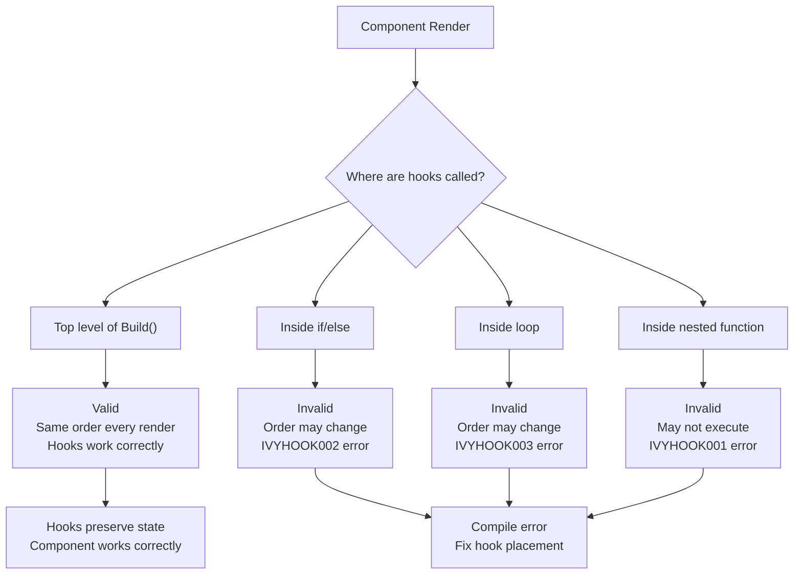
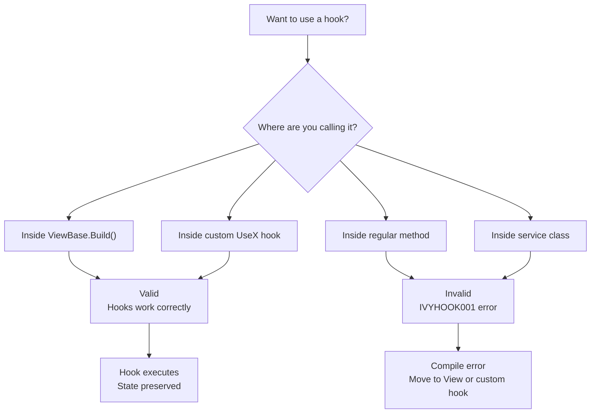
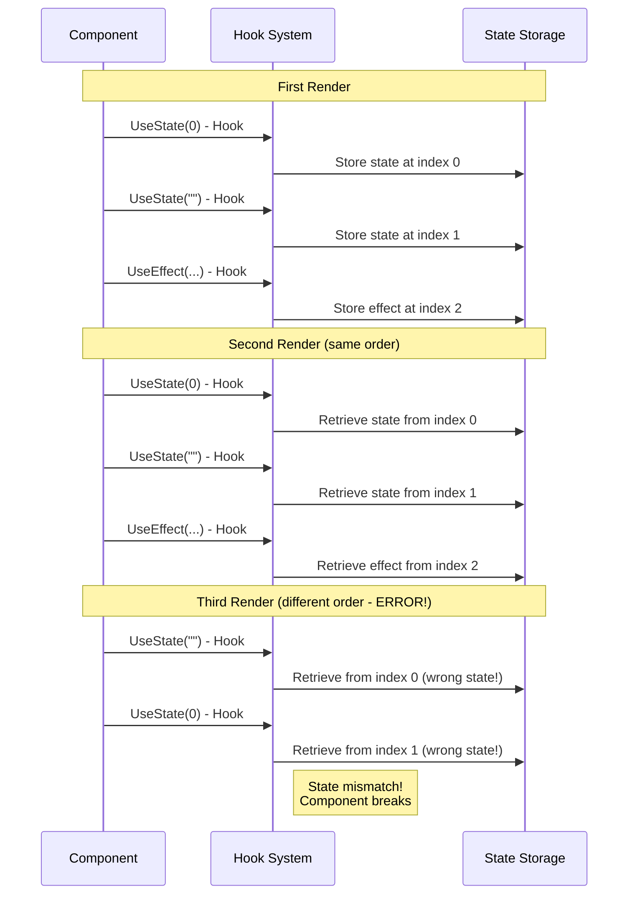
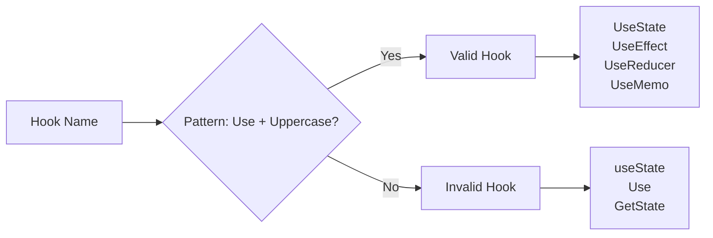
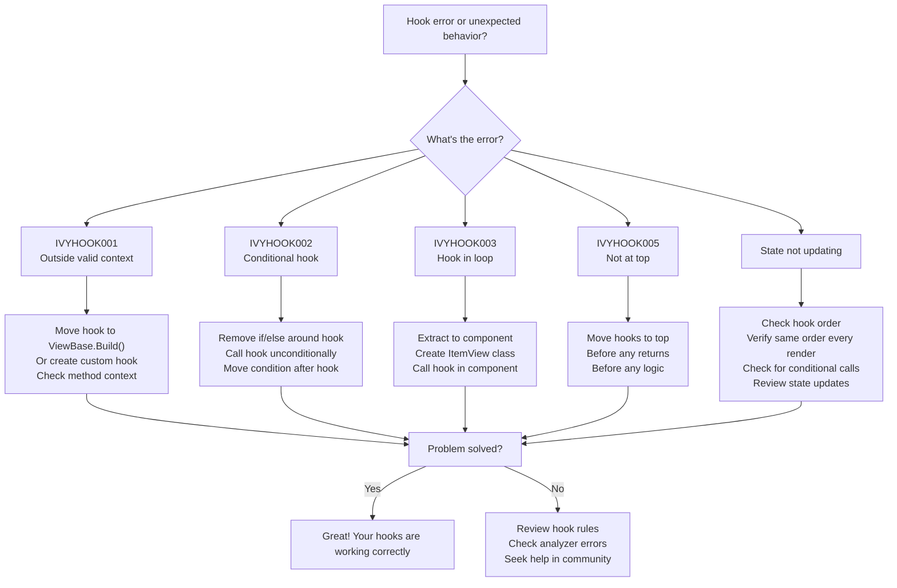
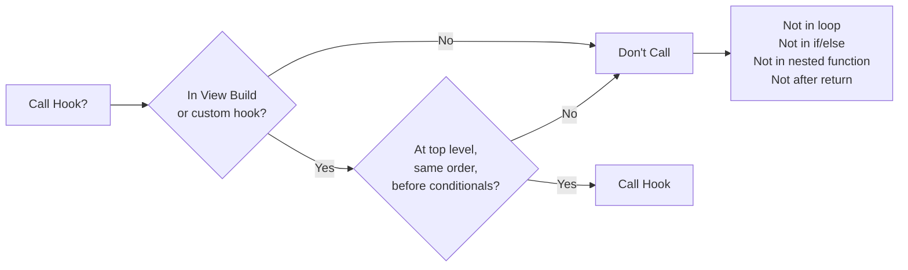

---
searchHints:
  - rules
  - hooks
  - best-practices
  - ivy-analyzer
  - hook-rules
  - conditional-hooks
  - hook-order
  - compile-time-validation
---

# Rules of Hooks

<Ingress>
Ivy hooks (functions starting with `Use...`) are a powerful feature that lets you use [state](./Core/03_UseState.md) and other Ivy features. However, hooks rely on a strict call order to function correctly. Follow these rules to ensure your hooks work as expected.
</Ingress>

## Overview

Ivy hooks provide a way to add stateful logic and side effects to your [Views](../../../01_Onboarding/02_Concepts/02_Views.md). To work correctly, hooks must be called in a consistent order on every render.

Key principles:

- **Consistent Call Order** - Hooks must be called in the same order on every render
- **Top-Level Only** - Hooks can only be called at the top level of your component
- **Valid Context** - Hooks can only be called from Views or other hooks
- **Compile-Time Validation** - The Ivy.Analyser package enforces these rules automatically

<Callout type="Tip">
The Ivy.Analyser package automatically validates hook usage at compile time, catching violations before your code runs. This helps prevent runtime errors and ensures your hooks work correctly.
</Callout>

## The Rules

Ivy hooks follow two fundamental rules that ensure they work correctly:

### 1. Only Call Hooks at the Top Level

**Don't call hooks inside loops, conditions, or nested functions.** Always use hooks at the top level of your component's `Build` method (or custom hook).



### 2. Only Call Hooks from Ivy Views

**Don't call hooks from regular C# functions.** Hooks can only be called from:

- Ivy [Views](../../../01_Onboarding/02_Concepts/02_Views.md) (inside `Build` method)
- Custom hooks (functions starting with `Use...`)



## Why These Rules Matter

Hooks rely on call order to preserve [state](./Core/03_UseState.md) between renders. When hooks are called in the same order every time, Ivy can correctly match each hook call with its stored state.

### How Hook Order Works



## Common Violations and Solutions

### IVYHOOK001: Hook used outside valid context

This error occurs when you try to use a hook outside of a View's `Build` method or another hook.

**Bad**: Hook in Regular Method

```csharp
public class MyService
{
    public void DoSomething()
    {
        var state = UseState(0); // Error! Not inside a View.
    }
}
```

**Good**: Hook in View

```csharp demo-below
public class MyView : ViewBase
{
    public override object Build()
    {
        var state = UseState(0); // OK - inside ViewBase.Build()
        return Layout.Vertical(
            Text.P($"Value: {state.Value}"),
            new Button("Increment", _ => state.Set(state.Value + 1))
        );
    }
}
```

### IVYHOOK002: Conditional Hook Usage

This error occurs if a hook call is wrapped in an `if` statement. Hook calls must be unconditional.

**Bad**: Conditional Hook

```csharp
public override object Build()
{
    if (condition) {
        var state = UseState(0); // Error! Hook might not run.
    }
    return Layout.Vertical();
}
```

**Good**: Unconditional Hook

```csharp demo-below
public class ConditionalStateDemo : ViewBase
{
    public override object Build()
    {
        // Always call the hook, handle logic afterwards
        var state = UseState(0);
        var condition = UseState(true);
        
        return Layout.Vertical(
            Layout.Horizontal(
                new Button("Toggle Condition", _ => condition.Set(!condition.Value)),
                new Button("Increment", _ => state.Set(state.Value + 1))
            ),
            condition.Value 
                ? Text.P($"State value: {state.Value}")
                : Text.P("Condition is false")
        );
    }
}
```

### IVYHOOK003: Hook inside a loop

Hooks cannot be called inside `for`, `foreach`, `while` loops. Each item in a loop needs its own component instance to use hooks correctly.

**Bad**: Hook in Loop

```csharp
public override object Build()
{
    var items = UseState(new List<string> { "Item 1", "Item 2" });
    
    // Error! Hook called multiple times with unpredictable order
    foreach (var item in items.Value) {
        var count = UseState(0); // IVYHOOK003: Hook inside a loop
    }
    return Layout.Vertical();
}
```

**Good**: Component per Item

Each item gets its own component, allowing each to safely use hooks:

```csharp demo-below
public class ItemListDemo : ViewBase
{
    public override object Build()
    {
        var items = UseState(new List<string> { "Apple", "Banana", "Cherry" });
        var newItem = UseState("");
        
        return Layout.Vertical(
            Text.H3("Shopping List"),
            Layout.Horizontal(
                newItem.ToTextInput().Placeholder("Add item..."),
                new Button("Add", _ => {
                    if (!string.IsNullOrWhiteSpace(newItem.Value))
                    {
                        items.Set(items.Value.Append(newItem.Value).ToList());
                        newItem.Set("");
                    }
                })
            ),
            new Separator(),
            Layout.Vertical(items.Value.Select((item, index) => new ShoppingItemView(item).Key($"{item}-{index}")).ToArray())
        );
    }
}

public class ShoppingItemView : ViewBase
{
    private readonly string _itemName;
    
    public ShoppingItemView(string itemName)
    {
        _itemName = itemName;
    }
    
    public override object Build()
    {
        // Hook is called at top level - OK!
        // Each ShoppingItemView instance has its own count state
        var count = UseState(1);
        
        return Layout.Horizontal(
            Text.P($"{_itemName} x {count.Value}"),
            new Button("-", _ => count.Set(Math.Max(1, count.Value - 1))),
            new Button("+", _ => count.Set(count.Value + 1))
        );
    }
}
```

### IVYHOOK005: Hook not at top of method

Hooks must be called before any other statements (like `return`, `throw`, etc) to ensure they always run.

**Bad**: Early Return Before Hook

```csharp
public override object Build()
{
    if (User == null) return Text("Login required");
    
    var state = UseState(0); // Error! This hook might not run.
    return Layout.Vertical();
}
```

**Good**: Hooks First

```csharp demo-below
public class EarlyReturnDemo : ViewBase
{
    public override object Build()
    {
        // Always call hooks first
        var state = UseState(0);
        var user = UseState(() => (string?)null);
        
        // Then handle early returns
        if (user.Value == null) 
            return Text.P("Login required");
        
        return Layout.Vertical(
            Text.P($"Welcome, {user.Value}!"),
            Text.P($"Count: {state.Value}"),
            new Button("Increment", _ => state.Set(state.Value + 1))
        );
    }
}
```

## Hook Detection

The analyzer automatically detects hooks by their naming convention:

| Pattern | Valid | Examples |
|---------|-------|----------|
| Starts with `Use` + uppercase letter | Yes | `UseState`, `UseEffect`, `UseCustomHook`, `UseMyFeature` |
| Starts with `Use` but lowercase | No | `useState`, `useEffect` |
| Doesn't start with `Use` | No | `GetState`, `CreateEffect` |
| `Use` but no uppercase after | No | `Use`, `Useless` |



**Valid Examples:**

- [`UseState`](./Core/03_UseState.md), [`UseEffect`](./Core/04_UseEffect.md), `UseCustomHook`, `UseMyFeature`, [`UseReducer`](./Core/07_UseReducer.md), [`UseMemo`](./Core/05_UseMemo.md)

**Invalid Examples:**

- `useState` (lowercase 's')
- `Use` (no uppercase after 'Use')
- `Useless` (no uppercase after 'Use')
- `GetState` (doesn't start with 'Use')

This means any custom hooks you create following the `UseX` pattern will be automatically validated by the analyzer.

## Troubleshooting Guide



## Quick Reference



**Rules Checklist:**

- In [View](../../../01_Onboarding/02_Concepts/02_Views.md) Build method or custom hook
- At top level of Build method
- Same order every render
- Before all conditional logic
- Not in loops, conditionals, or nested functions

## See Also

- [State Management](./Core/03_UseState.md) - Using UseState hook
- [Effects](./Core/04_UseEffect.md) - Using UseEffect hook
- [Memoization](./Core/05_UseMemo.md) - Using UseMemo and UseCallback
- [Views](../../../01_Onboarding/02_Concepts/02_Views.md) - Understanding Ivy Views
