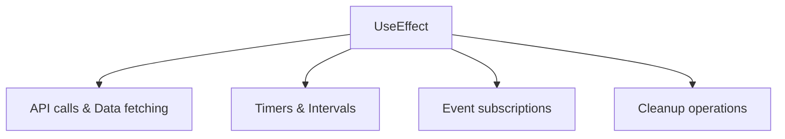
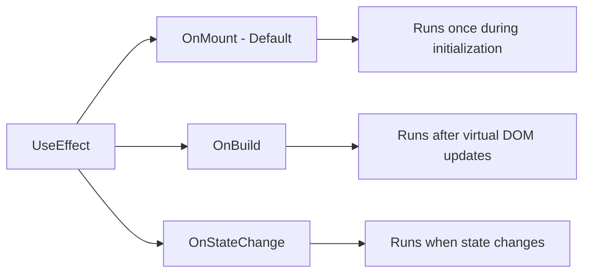
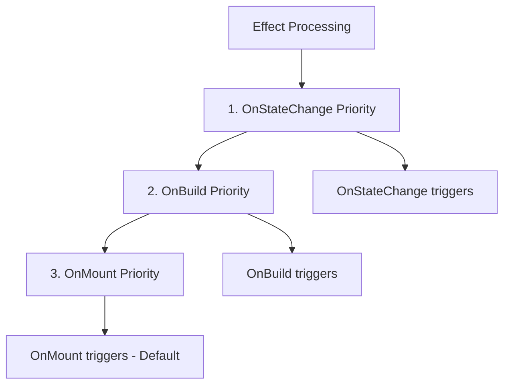

---
searchHints:
  - useeffect
  - lifecycle
  - hooks
  - side-effects
  - async
  - cleanup
---

# Effects

<Ingress>
Perform side effects in your Ivy [views](../../../01_Onboarding/02_Concepts/02_Views.md) with the UseEffect [hook](../02_RulesOfHooks.md), similar to React's useEffect but optimized for server-side architecture.
</Ingress>

The `UseEffect` [hook](../02_RulesOfHooks.md) is a powerful feature in Ivy that allows you to perform side effects in your [views](../../../01_Onboarding/02_Concepts/02_Views.md). It's similar to React's useEffect hook but adapted for Ivy's architecture and patterns.

Effects are essential for handling operations that don't directly relate to rendering, such as working with [state](./03_State.md) updates, [async operations](../../../01_Onboarding/02_Concepts/11_TasksAndObservables.md), and external services:



## Basic Usage

The simplest form of `UseEffect` runs after the component initializes:

```csharp demo-below
public class BasicEffectView : ViewBase
{
    public override object? Build()
    {
        var message = UseState("Loading...");
        
        // Effect runs once after component initializes
        UseEffect(async () =>
        {
            await Task.Delay(2000); // Simulate API call
            message.Set("Data loaded!");
        });
        
        return Text.P(message.Value);
    }
}
```

## Effect Overloads

Ivy provides four different overloads of `UseEffect` to handle various scenarios:

### 1. Action Handler

For simple synchronous operations:

```csharp
UseEffect(() =>
{
    Console.WriteLine("Component initialized");
});
```

### 2. Async Task Handler

For asynchronous operations:

```csharp
UseEffect(async () =>
{
    var data = await ApiService.GetData();
    // Handle data...
});
```

### 3. Disposable Handler

For operations that need cleanup:

```csharp
UseEffect(() =>
{
    var timer = new Timer(callback, null, 0, 1000);
    return timer; // Timer will be disposed when component unmounts
});
```

### 4. Async Disposable Handler

For async operations with cleanup:

```csharp
UseEffect(async () =>
{
    var connection = await ConnectToService();
    return connection; // Connection will be disposed automatically
});
```

## Effect Triggers

Effects can be triggered by different events using trigger parameters:

### State Dependencies

Effects can depend on [state](./03_State.md) changes:

```csharp demo-below
public class DependentEffectView : ViewBase
{
    public override object? Build()
    {
        var count = UseState(0);
        var log = UseState<List<string>>(new List<string>());
        
        // Effect runs when state changes
        UseEffect(() =>
        {
            var currentLog = log.Value;
            var newLog = currentLog.ToList();
            newLog.Add($"Count changed to: {count.Value}");
            if (newLog.Count > 3) newLog = newLog.TakeLast(3).ToList();
            log.Set(newLog);
        }, count); // Dependency on count state
        
        return Layout.Vertical()
            | new Button($"Count: {count.Value}", 
                onClick: _ => count.Set(count.Value + 1))
            | Layout.Vertical(log.Value.Select(Text.Small));
    }
}
```

### Multiple Dependencies

Effects can depend on multiple state variables:

```csharp
UseEffect(() =>
{
    // Runs when either firstName or lastName changes
    var fullName = $"{firstName.Value} {lastName.Value}";
    // Handle full name...
}, firstName, lastName);
```

### Built-in Triggers



```csharp
// OnMount (default) - runs once during initialization
UseEffect(() => { /* ... */ });
UseEffect(() => { /* ... */ }, EffectTrigger.OnMount());

// OnBuild - runs after virtual DOM updates
UseEffect(() => { /* ... */ }, EffectTrigger.OnBuild());

// OnStateChange - runs when state changes
UseEffect(() => { /* ... */ }, EffectTrigger.OnStateChange(myState));
```

### Effect Execution Order



## Common Patterns

### Data Fetching

<Callout type="Info">
You do not need to manually catch exceptions in UseEffect. Ivy has a built-in exception handling pipeline that automatically catches exceptions from effects and displays them to users via error notifications and console logging. The system wraps effect exceptions in `EffectException` and routes them through registered exception handlers.
</Callout>

```csharp demo-tabs
public class DataFetchView : ViewBase
{
    public override object? Build()
    {
        var data = UseState<List<Item>?>();
        var loading = UseState(true);
        
        UseEffect(async () =>
        {
            loading.Set(true);
            
            // Simulate API call - exceptions automatically handled by Ivy
            await Task.Delay(1500);
            var items = new List<Item>
            {
                new("Item 1", "Description 1"),
                new("Item 2", "Description 2"),
                new("Item 3", "Description 3")
            };
            
            data.Set(items);
            loading.Set(false);
        });
        
        if (loading.Value)
            return Text.P("Loading data...");
            
        return Layout.Vertical(
            data.Value?.Select(item => 
                new Card(
                    Layout.Vertical()
                        | Text.H4(item.Name)
                        | Text.P(item.Description)
                )
            ) ?? Enumerable.Empty<Card>()
        );
    }
}

public record Item(string Name, string Description);
```

### Cleanup Operations

```csharp
public class SubscriptionView : ViewBase
{
    public override object? Build()
    {
        var messages = UseState<List<string>>(new List<string>());
        
        UseEffect(() =>
        {
            // Subscribe to external service
            var subscription = MessageService.Subscribe(message =>
            {
                var currentMessages = messages.Value;
                var newMessages = currentMessages.ToList();
                newMessages.Add(message);
                messages.Set(newMessages);
            });
            
            // Return subscription for automatic cleanup
            return subscription;
        });
        
        return Layout.Vertical(
            messages.Value.Select(Text.P)
        );
    }
}
```

### Conditional Effects

```csharp demo-tabs
public class ConditionalEffectView : ViewBase
{
    public override object? Build()
    {
        var isEnabled = UseState(false);
        var data = UseState<string?>();
        
        UseEffect(async () =>
        {
            if (!isEnabled.Value)
            {
                data.Set((string)null);
                return;
            }
            
            // Only fetch when enabled
            var result = await FetchData();
            data.Set(result);
        }, isEnabled);
        
        return Layout.Vertical()
            | new Button($"Fetching: {(isEnabled.Value ? "ON" : "OFF")}", 
                onClick: _ => isEnabled.Set(!isEnabled.Value))
            | (data.Value != null ? Text.P(data.Value) : Text.Muted("No data"));
    }
    
    private async Task<string> FetchData()
    {
        await Task.Delay(1000);
        return $"Data fetched at {DateTime.Now:HH:mm:ss}";
    }
}
```

## Common Pitfalls

### 1. Forgetting Dependencies

```csharp
// Wrong: Missing dependency
var multiplier = UseState(2);
UseEffect(() =>
{
    var result = count.Value * multiplier.Value; // Uses multiplier but not in deps
    // ...
}, count); // Missing multiplier dependency

// Correct: Include all state dependencies
UseEffect(() =>
{
    var result = count.Value * multiplier.Value;
    // ...
}, count, multiplier);
```

### 2. Stale Closures

```csharp
// Wrong: Captures stale state
UseEffect(() =>
{
    var timer = new Timer(_ =>
    {
        // This captures the initial value of count!
        Console.WriteLine(count.Value);
    }, null, 1000, 1000);
    return timer;
}); // No dependencies - effect only runs once

// Correct: Update dependencies or use current state values
UseEffect(() =>
{
    var timer = new Timer(_ =>
    {
        Console.WriteLine(count.Value); // Will see current value
    }, null, 1000, 1000);
    return timer;
}, count); // Re-create timer when state changes
```

### 3. Not Awaiting Async Operations

```csharp
// Wrong: Fire-and-forget async
UseEffect(() =>
{
    DoAsyncWork(); // No await - operation may not complete
});

// Correct: Proper async handling
UseEffect(async () =>
{
    await DoAsyncWork(); // Properly await the operation
});
```

## See Also

- [State Management](./03_State.md) - Managing component state
- [Rules of Hooks](../02_RulesOfHooks.md) - Understanding hook rules and best practices
- [Memoization](./05_Memo.md) - Optimizing performance with memoization
- [UseCallback](./06_Callback.md) - Memoizing callback functions
- [Signals](../../../01_Onboarding/02_Concepts/06_Signals.md) - Reactive state management
- [Views](../../../01_Onboarding/02_Concepts/02_Views.md) - Understanding Ivy views and components
