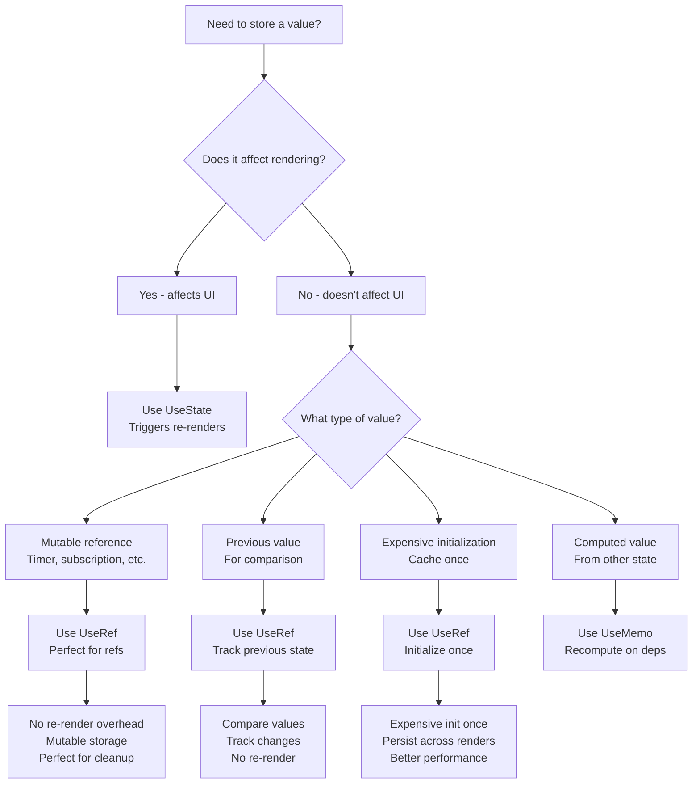
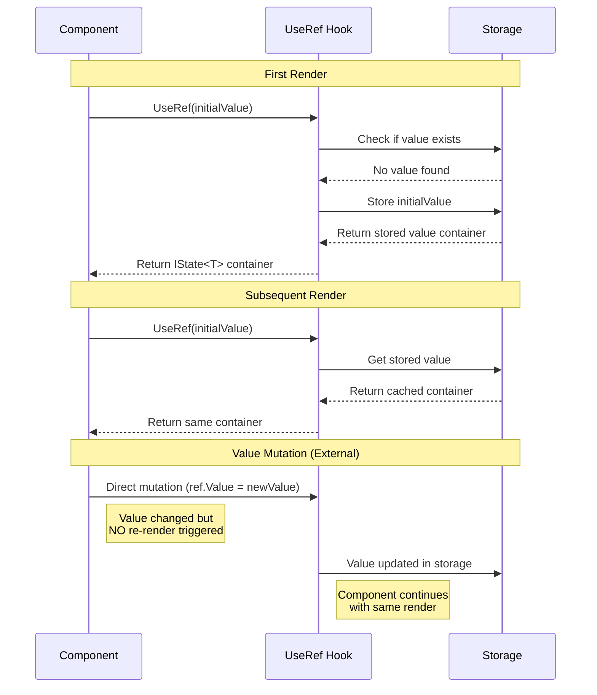
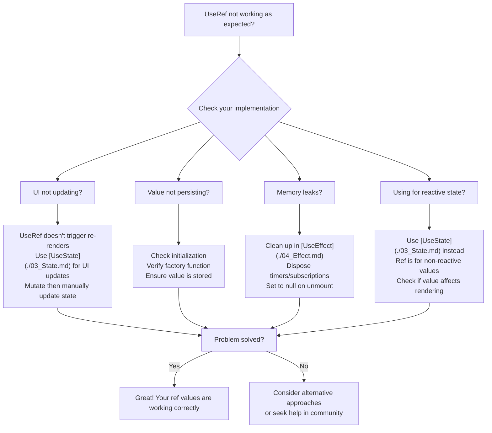

---
searchHints:
  - useref
  - ref
  - static
  - mutable
  - persistence
  - hooks
  - non-reactive
  - timers
  - subscriptions
imports:
  - Ivy.Core.Hooks
---

# Ref

<Ingress>
Store values that persist across re-renders without triggering updates, similar to React's useRef for holding mutable values that don't affect the [view](../../../01_Onboarding/02_Concepts/02_Views.md) lifecycle.
</Ingress>

## Overview

The `UseRef` [hook](../02_RulesOfHooks.md) lets you store a value that is initialized only once and persists across re-renders. Unlike [`UseState`](./03_State.md), changing a ref value does NOT trigger a re-render.

Key characteristics of `UseRef`:

- **Non-Reactive Storage** - Values persist but don't trigger re-renders when changed
- **Mutable References** - Perfect for storing timers, subscriptions, and other mutable objects
- **Performance** - No dependency tracking or re-render overhead
- **Persistence** - Values survive across [component](../../../01_Onboarding/02_Concepts/02_Views.md) re-renders

<Callout type="Tip">
`UseRef` is ideal for storing mutable references that don't affect rendering, such as timers, subscriptions, DOM references, or previous [state](./03_State.md) values for comparison.
</Callout>

## When to Use UseRef



## UseRef Hook

The `UseRef` [hook](../02_RulesOfHooks.md) stores a value that persists across re-renders without triggering updates.

<Callout type="Tip">
`UseRef` values are initialized only once and remain stable across re-renders. Changing the value directly won't cause the [component](../../../01_Onboarding/02_Concepts/02_Views.md) to re-render.
</Callout>

### How UseRef Works



### Basic Usage

```csharp demo-tabs
public class BasicRefDemo : ViewBase
{
    class Counter { public int Value = 0; }
    
    public override object? Build()
    {
        var renderCount = this.UseRef(() => new Counter());
        var forceUpdate = UseState(0);
        
        // Increment without triggering re-render
        renderCount.Value.Value++;
        
        return Layout.Vertical(
            Text.P($"This component has rendered {renderCount.Value.Value} times"),
            Text.Small("(Note: The count increments on each render, but doesn't trigger re-renders)"),
            new Button("Force Re-render", _ => forceUpdate.Set(forceUpdate.Value + 1))
        );
    }
}
```

### Use Cases

Use `UseRef` when:

- **Storing Timers and Intervals** - Keep references to timers for cleanup without triggering re-renders
- **Tracking Previous Values** - Store previous [state](./03_State.md) values for comparison
- **Mutable References** - Store objects that you need to mutate without causing re-renders
- **Expensive Initialization** - Cache expensive objects that only need to be created once
- **Subscriptions and Disposables** - Keep references to subscriptions for cleanup

### Best Practices

- **Use for Non-Reactive Values** - Only use `UseRef` for values that don't affect rendering
- **Clean Up Resources** - Always clean up timers, subscriptions, and other resources in [`UseEffect`](./04_Effect.md)
- **Initialize with Factory Function** - Use factory functions for expensive initialization
- **Avoid for UI [State](./03_State.md)** - Never use `UseRef` for values that should trigger re-renders (use [`UseState`](./03_State.md))
- **Document Mutations** - Clearly document when and why ref values are mutated

### Examples

#### Tracking Previous Values

```csharp demo-tabs
public class PreviousValueDemo : ViewBase
{
    class PreviousValue { public int? Value = null; }
    class Counter { public int Value = 0; }
    
    public override object? Build()
    {
        var count = UseState(0);
        var previousValue = this.UseRef(() => new PreviousValue());
        var renderCount = this.UseRef(() => new Counter());
        
        renderCount.Value.Value++;
        
        // Get the previous value before updating it
        var previous = previousValue.Value.Value;
        var delta = previous.HasValue 
            ? count.Value - previous.Value 
            : 0;
        
        // Update previous value for next render (in real app, use UseEffect)
        previousValue.Value.Value = count.Value;
        
        return Layout.Vertical(
            Text.P($"Current: {count.Value}"),
            Text.P($"Previous: {previous?.ToString() ?? "None"}"),
            Text.P($"Delta: {delta}"),
            Text.Small($"Renders: {renderCount.Value.Value}"),
            Layout.Horizontal(
                new Button("+1", _ => count.Set(count.Value + 1)),
                new Button("+5", _ => count.Set(count.Value + 5)),
                new Button("Reset", _ => {
                    count.Set(0);
                    previousValue.Value.Value = null;
                })
            )
        );
    }
}
```

#### Storing Mutable References

```csharp demo-tabs
public class MutableReferenceDemo : ViewBase
{
    class RenderTracker { public int Count = 0; public DateTime LastRender = DateTime.Now; }
    
    public override object? Build()
    {
        var count = UseState(0);
        var tracker = this.UseRef(() => new RenderTracker());
        
        // Mutate ref value without triggering re-render
        tracker.Value.Count++;
        tracker.Value.LastRender = DateTime.Now;
        
        return Layout.Vertical(
            Text.H3($"Count: {count.Value}"),
            new { 
                RenderCount = tracker.Value.Count.ToString(),
                LastRender = tracker.Value.LastRender.ToString("HH:mm:ss")
            }.ToDetails(),
            Text.Small("Render tracker is stored in UseRef - it persists across re-renders but doesn't trigger them"),
            new Button("Increment", _ => count.Set(count.Value + 1))
        );
    }
}
```

## UseRef vs UseState vs UseMemo

Understanding when to use each hook:

| Hook | Triggers Re-render | Mutable | Use Case |
|------|-------------------|---------|----------|
| [`UseState`](./03_State.md) | True | False | UI [state](./03_State.md) that affects rendering |
| [`UseMemo`](./05_Memo.md) | False | False | Expensive calculations |
| `UseRef` | False | True | Mutable refs, timers, subscriptions |

## Performance Considerations

### Memory and Overhead

- **Minimal Overhead**: `UseRef` has very low overhead - no dependency tracking, no re-render logic
- **Direct Storage**: Values are stored directly without wrappers, making access fast
- **No Cleanup Cost**: Unlike `UseState`, there's no change detection or comparison logic

### Appropriate Use Cases

- Storing mutable references (timers, subscriptions)
- Tracking previous [state](./03_State.md) values for comparison
- Caching expensive initializations
- Managing DOM references
- Storing callback references that don't need to trigger updates

### Inappropriate Use Cases

- Value affects rendering (use [`UseState`](./03_State.md))
- Value is computed from other values (use [`UseMemo`](./05_Memo.md))
- Value is a simple constant (use regular variables)
- Value needs to trigger side effects (use [`UseState`](./03_State.md) with [`UseEffect`](./04_Effect.md))

## Common Pitfalls and Solutions

### Ref Troubleshooting Guide



### 1. Using for Reactive State

**Problem**: Using `UseRef` for values that should trigger re-renders

```csharp
// Wrong: Ref value won't trigger re-render
var count = UseRef(0);
return new Button($"Count: {count.Value}", _ => count.Value++); // UI won't update!
```

**Solution**: Use [`UseState`](./03_State.md) for reactive values

```csharp
// Correct: Use UseState for reactive values
var count = UseState(0);
return new Button($"Count: {count.Value}", _ => count.Set(count.Value + 1));
```

### 2. Forgetting Cleanup

**Problem**: Not cleaning up resources stored in `UseRef`

```csharp
// Wrong: No cleanup, potential memory leak
var timer = UseRef(() => new Timer(_ => { }, null, 0, 1000));
```

**Solution**: Clean up in [`UseEffect`](./04_Effect.md)

```csharp
// Correct: Clean up in effect
var timer = UseRef<Timer?>(null);
UseEffect(() => {
    timer.Value = new Timer(_ => { }, null, 0, 1000);
    return () => timer.Value?.Dispose();
});
```

### 3. Mutating Without Manual Updates

**Problem**: Mutating ref values and expecting UI to update

```csharp
// Wrong: UI won't update automatically
var data = UseRef(() => new List<string>());
data.Value.Add("new item"); // UI doesn't update!
```

**Solution**: Manually trigger update or use [`UseState`](./03_State.md)

```csharp
// Option 1: Use UseState if you need reactivity
var data = UseState(() => new List<string>());
data.Set(data.Value.Append("new item").ToList());

// Option 2: Mutate ref, then update reactive state
var data = UseRef(() => new List<string>());
var updateTrigger = UseState(0);
data.Value.Add("new item");
updateTrigger.Set(updateTrigger.Value + 1); // Force re-render
```

### 4. Using for Simple Constants

**Problem**: Using `UseRef` for values that don't need persistence

```csharp
// Unnecessary: Just use a regular variable
var config = UseRef(new { threshold: 100 });
```

**Solution**: Use regular variables for constants

```csharp
// Better: Regular variable for constants
var config = new { threshold: 100 };
```

### 5. Not Initializing Properly

**Problem**: Not using factory functions for expensive initialization

```csharp
// Less efficient: Creates object on every render check
var expensive = UseRef(new ExpensiveObject());
```

**Solution**: Use factory function for expensive initialization

```csharp
// Better: Factory function only called once
var expensive = UseRef(() => new ExpensiveObject());
```

### 6. Confusing with [`UseMemo`](./05_Memo.md)

**Problem**: Using `UseRef` when [`UseMemo`](./05_Memo.md) is more appropriate

```csharp
// Wrong: UseRef for computed values
var data = UseRef(() => ProcessItems(items.Value));
```

**Solution**: Use [`UseMemo`](./05_Memo.md) for computed values

```csharp
// Correct: UseMemo recomputes when dependencies change
var data = UseMemo(() => ProcessItems(items.Value), items);
```

## See Also

- [State Management](./03_State.md) - Reactive state with UseState
- [Rules of Hooks](../02_RulesOfHooks.md) - Understanding hook rules and best practices
- [Effects](./04_Effect.md) - Side effects and cleanup
- [Memoization](./05_Memo.md) - Performance optimization with UseMemo
- [Callbacks](./06_Callback.md) - Memoized callback functions with UseCallback
- [Views](../../../01_Onboarding/02_Concepts/02_Views.md) - Understanding Ivy views and components
