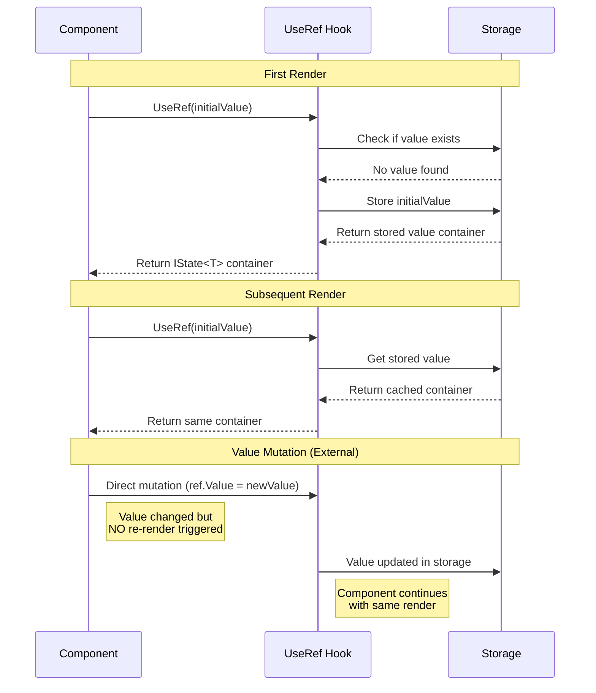
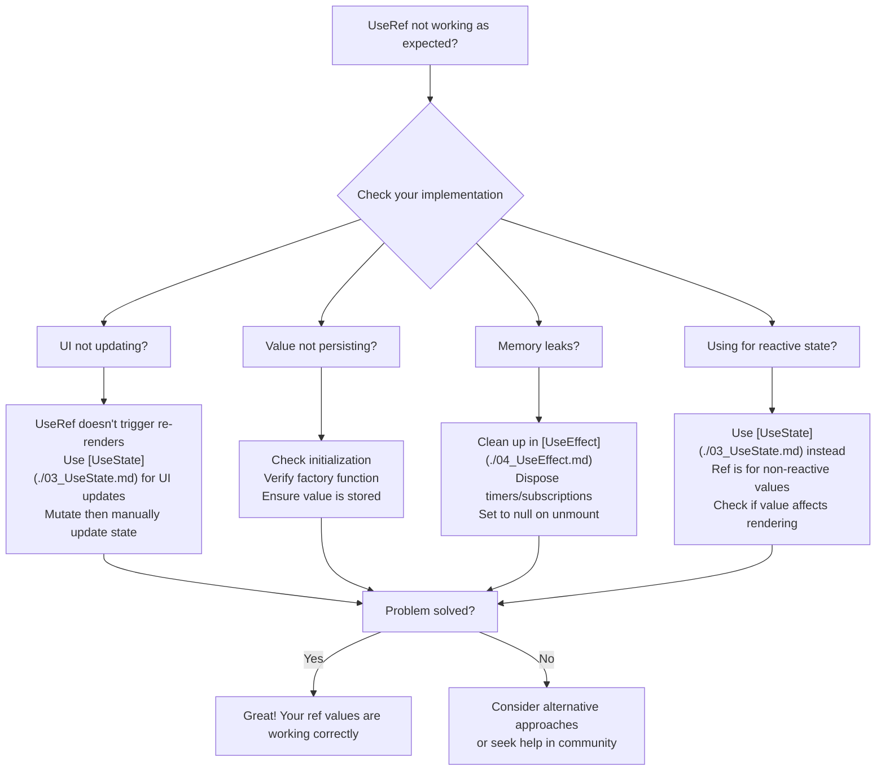

---
searchHints:
  - useref
  - ref
  - static
  - mutable
  - persistence
  - hooks
  - non-reactive
  - timers
  - subscriptions
imports:
  - Ivy.Core.Hooks
---

# UseRef

<Ingress>
Store values that persist across re-renders without triggering updates, similar to React's useRef for holding mutable values that don't affect the [view](../../../01_Onboarding/02_Concepts/02_Views.md) lifecycle.
</Ingress>

## Overview

Key characteristics of `UseRef`:

- **Non-Reactive Storage** - Values persist but don't trigger re-renders when changed
- **Mutable References** - Perfect for storing timers, subscriptions, and other mutable objects
- **Performance** - No dependency tracking or re-render overhead
- **Persistence** - Values survive across [component](../../../01_Onboarding/02_Concepts/02_Views.md) re-renders

<Callout type="Tip">
`UseRef` is ideal for storing mutable references that don't affect rendering, such as timers, subscriptions, DOM references, or previous [state](./03_UseState.md) values for comparison.
</Callout>

## Basic Usage

```csharp demo-tabs
public class BasicRefDemo : ViewBase
{
    class Counter { public int Value = 0; }
    
    public override object? Build()
    {
        var renderCount = this.UseRef(() => new Counter());
        var forceUpdate = UseState(0);
        
        // Increment without triggering re-render
        renderCount.Value.Value++;
        
        return Layout.Vertical(
            Text.P($"This component has rendered {renderCount.Value.Value} times"),
            Text.P("(Note: The count increments on each render, but doesn't trigger re-renders)").Small(),
            new Button("Force Re-render", _ => forceUpdate.Set(forceUpdate.Value + 1))
        );
    }
}
```

## How UseRef Works



## When to Use UseRef

| Use UseRef For | Use Other Hooks Instead |
|----------------|-------------------------|
| Mutable references (timers, subscriptions) | Value affects UI → UseState |
| Tracking previous state values | Computed from other values → UseMemo |
| Caching expensive initializations | Needs to trigger side effects → UseState + UseEffect |
| Storing callback references | Simple constant → regular variable |

### UseRef vs UseState vs UseMemo

| Hook | Triggers Re-render | Mutable | Use Case |
|------|-------------------|---------|----------|
| [`UseState`](./03_UseState.md) | Yes | No | UI state that affects rendering |
| [`UseMemo`](./05_UseMemo.md) | No | No | Expensive calculations |
| `UseRef` | No | Yes | Mutable refs, timers, subscriptions |

## Performance Considerations

```csharp
// Good: Timer reference (no re-render needed)
var timerId = UseRef<Timer?>(null);

// Good: Previous value tracking
var previousCount = UseRef(0);

// Bad: Value affects UI - use UseState instead
var count = UseRef(0); // Won't trigger re-render!

// Bad: Computed value - use UseMemo instead
var total = UseRef(items.Sum()); // Won't update when items change!
```

## Common Pitfalls and Solutions

### Ref Troubleshooting Guide



### Using for Reactive State

**Problem**: Using `UseRef` for values that should trigger re-renders

```csharp
// Wrong: Ref value won't trigger re-render
var count = UseRef(0);
return new Button($"Count: {count.Value}", _ => count.Value++); // UI won't update!
```

**Solution**: Use [`UseState`](./03_UseState.md) for reactive values

```csharp
// Correct: Use UseState for reactive values
var count = UseState(0);
return new Button($"Count: {count.Value}", _ => count.Set(count.Value + 1));
```

### Forgetting Cleanup

**Problem**: Not cleaning up resources stored in `UseRef`

```csharp
// Wrong: No cleanup, potential memory leak
var timer = UseRef(() => new Timer(_ => { }, null, 0, 1000));
```

**Solution**: Clean up in [`UseEffect`](./04_UseEffect.md)

```csharp
// Correct: Clean up in effect
var timer = UseRef<Timer?>(null);
UseEffect(() => {
    timer.Value = new Timer(_ => { }, null, 0, 1000);
    return () => timer.Value?.Dispose();
});
```

### Mutating Without Manual Updates

**Problem**: Mutating ref values and expecting UI to update

```csharp
// Wrong: UI won't update automatically
var data = UseRef(() => new List<string>());
data.Value.Add("new item"); // UI doesn't update!
```

**Solution**: Manually trigger update or use [`UseState`](./03_UseState.md)

```csharp
// Option 1: Use UseState if you need reactivity
var data = UseState(() => new List<string>());
data.Set(data.Value.Append("new item").ToList());

// Option 2: Mutate ref, then update reactive state
var data = UseRef(() => new List<string>());
var updateTrigger = UseState(0);
data.Value.Add("new item");
updateTrigger.Set(updateTrigger.Value + 1); // Force re-render
```

### Not Initializing Properly

**Problem**: Not using factory functions for expensive initialization

```csharp
// Less efficient: Creates object on every render check
var expensive = UseRef(new ExpensiveObject());
```

**Solution**: Use factory function for expensive initialization

```csharp
// Better: Factory function only called once
var expensive = UseRef(() => new ExpensiveObject());
```

### Confusing with [`UseMemo`](./05_UseMemo.md)

**Problem**: Using `UseRef` when [`UseMemo`](./05_UseMemo.md) is more appropriate

```csharp
// Wrong: UseRef for computed values
var data = UseRef(() => ProcessItems(items.Value));
```

**Solution**: Use [`UseMemo`](./05_UseMemo.md) for computed values

```csharp
// Correct: UseMemo recomputes when dependencies change
var data = UseMemo(() => ProcessItems(items.Value), items);
```

## Best Practices

- **Use for Non-Reactive Values** - Only use `UseRef` for values that don't affect rendering
- **Clean Up Resources** - Always clean up timers, subscriptions, and other resources in [`UseEffect`](./04_UseEffect.md)
- **Initialize with Factory Function** - Use factory functions for expensive initialization
- **Avoid for UI [State](./03_UseState.md)** - Never use `UseRef` for values that should trigger re-renders (use [`UseState`](./03_UseState.md))
- **Document Mutations** - Clearly document when and why ref values are mutated

## See Also

- [State Management](./03_UseState.md) - Reactive state with UseState
- [Rules of Hooks](../02_RulesOfHooks.md) - Understanding hook rules and best practices
- [Effects](./04_UseEffect.md) - Side effects and cleanup
- [Memoization](./05_UseMemo.md) - Performance optimization with UseMemo
- [Callbacks](./06_UseCallback.md) - Memoized callback functions with UseCallback
- [Views](../../../01_Onboarding/02_Concepts/02_Views.md) - Understanding Ivy views and components

## Examples

<Details>
<Summary>
Tracking Previous Values
</Summary>
<Body>

```csharp demo-tabs
public class PreviousValueDemo : ViewBase
{
    class PreviousValue { public int? Value = null; }
    class Counter { public int Value = 0; }
    
    public override object? Build()
    {
        var count = UseState(0);
        var previousValue = this.UseRef(() => new PreviousValue());
        var renderCount = this.UseRef(() => new Counter());
        
        renderCount.Value.Value++;
        
        // Get the previous value before updating it
        var previous = previousValue.Value.Value;
        var delta = previous.HasValue 
            ? count.Value - previous.Value 
            : 0;
        
        // Update previous value for next render (in real app, use UseEffect)
        previousValue.Value.Value = count.Value;
        
        return Layout.Vertical(
            Text.P($"Current: {count.Value}"),
            Text.P($"Previous: {previous?.ToString() ?? "None"}"),
            Text.P($"Delta: {delta}"),
            Text.P($"Renders: {renderCount.Value.Value}").Small(),
            Layout.Horizontal(
                new Button("+1", _ => count.Set(count.Value + 1)),
                new Button("+5", _ => count.Set(count.Value + 5)),
                new Button("Reset", _ => {
                    count.Set(0);
                    previousValue.Value.Value = null;
                })
            )
        );
    }
}
```

</Body>
</Details>

<Details>
<Summary>
Storing Mutable References
</Summary>
<Body>

```csharp demo-tabs
public class MutableReferenceDemo : ViewBase
{
    class RenderTracker { public int Count = 0; public DateTime LastRender = DateTime.Now; }
    
    public override object? Build()
    {
        var count = UseState(0);
        var tracker = this.UseRef(() => new RenderTracker());
        
        // Mutate ref value without triggering re-render
        tracker.Value.Count++;
        tracker.Value.LastRender = DateTime.Now;
        
        return Layout.Vertical(
            Text.H3($"Count: {count.Value}"),
            new { 
                RenderCount = tracker.Value.Count.ToString(),
                LastRender = tracker.Value.LastRender.ToString("HH:mm:ss")
            }.ToDetails(),
            Text.P("Render tracker is stored in UseRef - it persists across re-renders but doesn't trigger them").Small(),
            new Button("Increment", _ => count.Set(count.Value + 1))
        );
    }
}
```

</Body>
</Details>
