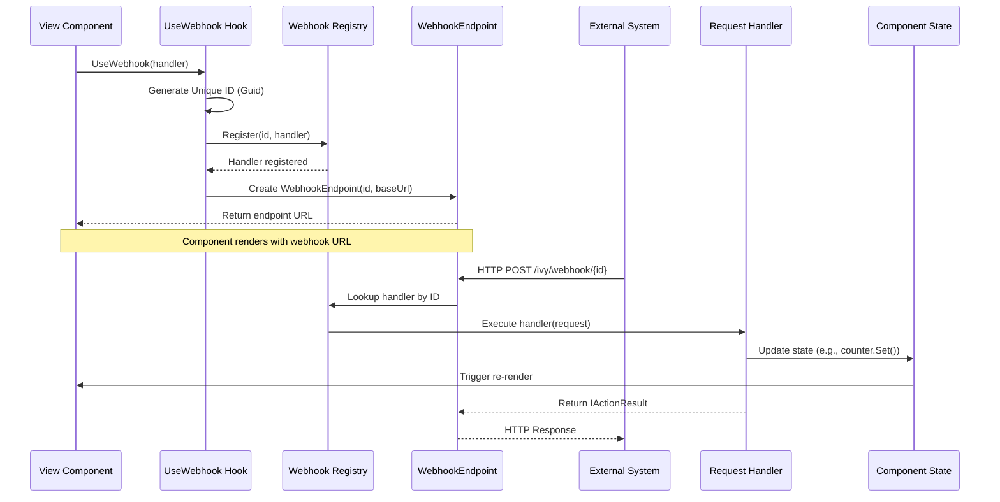

---
searchHints:
  - webhook
  - usewebhook
  - http-endpoint
  - api-endpoint
  - external-callback
  - http-handler
---

# UseWebhook

<Ingress>
The `UseWebhook` [hook](../02_RulesOfHooks.md) creates HTTP endpoints that can be called from external systems, enabling integration with third-party services, webhooks, and external callbacks.
</Ingress>

## Basic Usage

The `UseWebhook` hook takes a request handler and returns a `WebhookEndpoint` containing the URL that external systems can call:

```csharp demo-below
public class BasicWebhookExample : ViewBase
{
    public override object? Build()
    {
        var counter = UseState(0);
        var webhook = UseWebhook(_ =>
        {
            counter.Set(counter.Value + 1);
        });
        
        return Layout.Vertical()
            | Text.P($"Webhook called {counter.Value} times")
            | Text.Code(webhook.GetUri().ToString());
    }
}
```

## How It Works

The `UseWebhook` hook:

1. **Generates a Unique ID**: Creates a unique identifier for the webhook endpoint
2. **Registers the Handler**: Registers your request handler with the webhook registry
3. **Returns Webhook Endpoint**: Provides a `WebhookEndpoint` with the URL that external systems can call



### Flow Explanation

1. **Component Initialization**: When your component calls `UseWebhook`, the hook generates a unique identifier (GUID) for this specific webhook instance.

2. **Handler Registration**: The handler function you provide is registered with the webhook registry service, associating it with the generated ID. This registration happens in a [UseEffect](./04_UseEffect.md) that runs on component mount.

3. **Endpoint Creation**: A `WebhookEndpoint` is created containing:
   - The unique ID
   - The base URL constructed from the current request scheme and host
   - The full URL follows the pattern: `{scheme}://{host}/ivy/webhook/{id}`

4. **External Call**: When an external system makes an HTTP request to the webhook URL, the request is routed to the `WebhookController`.

5. **Handler Execution**: The controller looks up the handler by ID and executes it with the incoming `Microsoft.AspNetCore.Http.HttpRequest`. Your handler can:
   - Read request body, headers, query parameters
   - Update component state
   - Perform async operations
   - Return custom HTTP responses

6. **State Updates**: If your handler updates component state (e.g., `counter.Set()`), the component automatically re-renders to reflect the changes.

7. **Response**: The handler's return value (or default `OkResult` for action handlers) is sent back to the external system as the HTTP response.

8. **Cleanup**: When the component unmounts, the webhook handler is automatically unregistered and cleaned up.

## Handler Types

`UseWebhook` supports multiple handler signatures for different use cases:

### Simple Action Handler

For handlers that don't need to return a response:

```csharp
var webhook = UseWebhook((Microsoft.AspNetCore.Http.HttpRequest request) =>
{
    // Process the request
    // Update state, log, etc.
});
```

### Async Handler

For handlers that perform async operations:

```csharp demo-below
public class AsyncWebhookExample : ViewBase
{
    public override object? Build()
    {
        var lastMessage = UseState("No webhook called yet");
        var webhook = UseWebhook(async (Microsoft.AspNetCore.Http.HttpRequest request) =>
        {
            using var reader = new StreamReader(request.Body);
            var body = await reader.ReadToEndAsync();
            lastMessage.Set($"Received: {body}");
        });
        
        return Layout.Vertical()
            | Text.P(lastMessage.Value)
            | Text.Code(webhook.GetUri().ToString());
    }
}
```

### Custom Response Handler

For handlers that need to return custom HTTP responses:

```csharp
var webhook = UseWebhook((Microsoft.AspNetCore.Http.HttpRequest request) =>
{
    // Process request
    return new Microsoft.AspNetCore.Mvc.OkObjectResult(new { message = "Success" });
    // Or: return new Microsoft.AspNetCore.Mvc.BadRequestResult();
    // Or: return new Microsoft.AspNetCore.Mvc.JsonResult(new { error = "Invalid" });
});
```

## WebhookEndpoint Properties

| Property  | Type     | Description                                    |
| --------- | -------- | ---------------------------------------------- |
| `Id`      | `string` | Unique identifier for the webhook              |
| `BaseUrl` | `string` | Base URL for the webhook endpoint              |

The `WebhookEndpoint` provides a `GetUri()` method to get the full webhook URL:

```csharp
var webhook = UseWebhook(_ => { });
var url = webhook.GetUri(); // Full URL: https://example.com/ivy/webhook/{id}
```

## Examples

### Payment Webhook Handler

Handle payment callbacks from a payment processor:

```csharp demo-below
public class PaymentWebhookView : ViewBase
{
    public override object? Build()
    {
        var payments = UseState(ImmutableArray.Create<Payment>());
        var lastPayment = UseState<Payment?>();
        
        var webhook = UseWebhook(async (Microsoft.AspNetCore.Http.HttpRequest request) =>
        {
            using var reader = new StreamReader(request.Body);
            var json = await reader.ReadToEndAsync();
            
            try
            {
                var payment = System.Text.Json.JsonSerializer.Deserialize<Payment>(json);
                if (payment != null)
                {
                    payments.Set(payments.Value.Add(payment));
                    lastPayment.Set(payment);
                }
                
                return new Microsoft.AspNetCore.Mvc.OkObjectResult(new { status = "received" });
            }
            catch (Exception ex)
            {
                return new Microsoft.AspNetCore.Mvc.BadRequestObjectResult(new { error = ex.Message });
            }
        });
        
        return Layout.Vertical()
            | Text.H2("Payment Webhook")
            | Text.Code(webhook.GetUri().ToString())
            | Text.H3("Last Payment")
            | (lastPayment.Value != null
                ? Layout.Vertical(
                    Text.P($"Amount: ${lastPayment.Value.Amount:F2}"),
                    Text.P($"Status: {lastPayment.Value.Status}"),
                    Text.P($"Date: {lastPayment.Value.Timestamp}")
                  )
                : Text.P("No payments received yet"))
            | Text.H3("All Payments")
            | payments.Value.ToTable()
                .Builder(e => e.Amount, e => e.Func((decimal x) => $"${x:F2}"));
    }
}

public record Payment(decimal Amount, string Status, DateTime Timestamp);
```

### OAuth Callback Handler

Handle OAuth authorization callbacks:

```csharp demo-below
public class OAuthCallbackView : ViewBase
{
    public override object? Build()
    {
        var authCode = UseState<string?>();
        var authState = UseState<string?>();
        var isAuthenticated = UseState(false);
        
        var webhook = UseWebhook((Microsoft.AspNetCore.Http.HttpRequest request) =>
        {
            // Extract OAuth callback parameters
            var code = request.Query["code"].ToString();
            var state = request.Query["state"].ToString();
            
            authCode.Set(code);
            authState.Set(state);
            
            // In a real app, you'd exchange the code for tokens here
            if (!string.IsNullOrEmpty(code))
            {
                isAuthenticated.Set(true);
            }
            
            return new Microsoft.AspNetCore.Mvc.OkObjectResult(new { message = "Authorization received" });
        });
        
        return Layout.Vertical()
            | Text.H2("OAuth Callback")
            | Text.Code(webhook.GetUri().ToString())
            | (isAuthenticated.Value
                ? Layout.Vertical(
                    Text.Success("Authentication successful!"),
                    Text.P($"Code: {authCode.Value}"),
                    Text.P($"State: {authState.Value}")
                  )
                : Text.P("Waiting for OAuth callback..."));
    }
}
```

### External API Integration

Create a webhook endpoint for external services to send data:

```csharp demo-below
public class ExternalIntegrationView : ViewBase
{
    public override object? Build()
    {
        var events = UseState(ImmutableArray.Create<WebhookEvent>());
        var lastEvent = UseState<WebhookEvent?>();
        
        var webhook = UseWebhook(async (Microsoft.AspNetCore.Http.HttpRequest request) =>
        {
            // Read request body
            using var reader = new StreamReader(request.Body);
            var body = await reader.ReadToEndAsync();
            
            // Extract custom headers
            var eventType = request.Headers["X-Event-Type"].ToString();
            var signature = request.Headers["X-Signature"].ToString();
            
            // Validate signature (in production, verify this!)
            var eventData = new WebhookEvent(
                eventType,
                body,
                DateTime.UtcNow,
                signature
            );
            
            events.Set(events.Value.Add(eventData));
            lastEvent.Set(eventData);
            
            return new Microsoft.AspNetCore.Mvc.OkObjectResult(new { received = true });
        });
        
        return Layout.Vertical()
            | Text.H2("External Integration Webhook")
            | Text.Code(webhook.GetUri().ToString())
            | Text.H3("Last Event")
            | (lastEvent.Value != null
                ? Layout.Vertical(
                    Text.P($"Type: {lastEvent.Value.Type}"),
                    Text.P($"Time: {lastEvent.Value.Timestamp:HH:mm:ss}"),
                    Text.P($"Body: {lastEvent.Value.Body}")
                  )
                : Text.P("No events received"))
            | Text.H3("All Events")
            | events.Value.ToTable()
                .Builder(e => e.Timestamp, e => e.Func((DateTime x) => x.ToString("HH:mm:ss")))
                .Remove(e => e.Signature);
    }
}

public record WebhookEvent(string Type, string Body, DateTime Timestamp, string Signature);
```

## Best Practices

### Always Handle Errors

Webhook handlers should always handle exceptions gracefully:

```csharp
// Good: Error handling
var webhook = UseWebhook(async (Microsoft.AspNetCore.Http.HttpRequest request) =>
{
    try
    {
        // Process request
        await ProcessWebhook(request);
        return new Microsoft.AspNetCore.Mvc.OkResult();
    }
    catch (Exception ex)
    {
        // Log error
        Console.WriteLine($"Webhook error: {ex.Message}");
        return new Microsoft.AspNetCore.Mvc.StatusCodeResult(500);
    }
});

// Bad: No error handling
var webhook = UseWebhook(async (Microsoft.AspNetCore.Http.HttpRequest request) =>
{
    await ProcessWebhook(request); // Can throw unhandled exceptions
    return new Microsoft.AspNetCore.Mvc.OkResult();
});
```

### Validate Request Authenticity

For sensitive operations, always verify request authenticity:

```csharp
var webhook = UseWebhook(async (Microsoft.AspNetCore.Http.HttpRequest request) =>
{
    // Verify signature header
    var signature = request.Headers["X-Signature"].ToString();
    var expectedSignature = ComputeSignature(request.Body);
    
    if (signature != expectedSignature)
    {
        return new Microsoft.AspNetCore.Mvc.UnauthorizedResult();
    }
    
    // Process verified request
    await ProcessRequest(request);
    return new Microsoft.AspNetCore.Mvc.OkResult();
});
```

### Use Async Handlers for I/O Operations

Always use async handlers when performing I/O operations:

```csharp
// Good: Async for I/O
var webhook = UseWebhook(async (Microsoft.AspNetCore.Http.HttpRequest request) =>
{
    using var reader = new StreamReader(request.Body);
    var body = await reader.ReadToEndAsync();
    
    // Async database call
    await SaveToDatabase(body);
    
    return new Microsoft.AspNetCore.Mvc.OkResult();
});

// Bad: Blocking I/O
var webhook = UseWebhook((Microsoft.AspNetCore.Http.HttpRequest request) =>
{
    using var reader = new StreamReader(request.Body);
    var body = reader.ReadToEnd(); // Blocks thread
    SaveToDatabase(body).Wait(); // Blocks thread
    
    return new Microsoft.AspNetCore.Mvc.OkResult();
});
```

### Return Appropriate HTTP Responses

Return appropriate HTTP status codes based on the operation result:

```csharp
var webhook = UseWebhook((Microsoft.AspNetCore.Http.HttpRequest request) =>
{
    if (!IsValidRequest(request))
    {
        return new Microsoft.AspNetCore.Mvc.BadRequestObjectResult(
            new { error = "Invalid request" }
        );
    }
    
    if (ProcessRequest(request))
    {
        return new Microsoft.AspNetCore.Mvc.OkObjectResult(
            new { status = "success" }
        );
    }
    
    return new Microsoft.AspNetCore.Mvc.StatusCodeResult(500);
});
```

### Update State Safely

When updating component state from webhook handlers, ensure thread safety:

```csharp
var webhook = UseWebhook((Microsoft.AspNetCore.Http.HttpRequest request) =>
{
    // State updates are automatically thread-safe
    counter.Set(counter.Value + 1);
    lastMessage.Set($"Received: {request.Query["message"]}");
    
    return new Microsoft.AspNetCore.Mvc.OkResult();
});
```

### Keep Handlers Fast

Webhook handlers should complete quickly to avoid timeouts:

```csharp
// Good: Fast handler, defer heavy work
var webhook = UseWebhook(async (Microsoft.AspNetCore.Http.HttpRequest request) =>
{
    // Quick validation
    if (!IsValid(request))
        return new Microsoft.AspNetCore.Mvc.BadRequestResult();
    
    // Queue heavy processing for background task
    _backgroundQueue.Enqueue(() => ProcessHeavyWork(request));
    
    // Return immediately
    return new Microsoft.AspNetCore.Mvc.OkResult();
});

// Bad: Slow handler
var webhook = UseWebhook(async (Microsoft.AspNetCore.Http.HttpRequest request) =>
{
    // Heavy processing blocks response
    await ProcessHeavyWork(request); // Takes 30 seconds
    return new Microsoft.AspNetCore.Mvc.OkResult();
});
```

### Log Important Events

Log webhook calls for debugging and auditing:

```csharp
var webhook = UseWebhook(async (Microsoft.AspNetCore.Http.HttpRequest request) =>
{
    var logger = UseService<ILogger<MyView>>();
    
    logger.LogInformation("Webhook called: {Method} {Path}", 
        request.Method, request.Path);
    
    try
    {
        await ProcessRequest(request);
        logger.LogInformation("Webhook processed successfully");
        return new Microsoft.AspNetCore.Mvc.OkResult();
    }
    catch (Exception ex)
    {
        logger.LogError(ex, "Webhook processing failed");
        return new Microsoft.AspNetCore.Mvc.StatusCodeResult(500);
    }
});
```

### Cleanup is Automatic

Webhooks are automatically cleaned up when components unmount, so you don't need to manually unregister them:

```csharp
// Good: Automatic cleanup
var webhook = UseWebhook(_ => { });
// When component unmounts, webhook is automatically unregistered

// No manual cleanup needed - Ivy handles it!
```

## See Also

- [State Management](./03_UseState.md) - Update state from webhook handlers
- [Effects](./04_UseEffect.md) - Perform side effects in response to webhook calls
