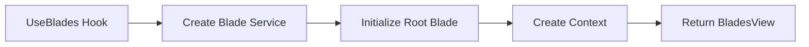

---
searchHints:
  - blades
  - useblades
  - side-panel
  - drawer
  - slide-out
  - panel
---

# UseBlades

<Ingress>
The `UseBlades` [hook](../02_RulesOfHooks.md) creates a blade (side panel) interface, providing a slide-out panel for additional content, navigation, or actions. It's the foundation for the [Blades widget](../../../02_Widgets/03_Common/12_Blades.md).
</Ingress>

## How It Works

The `UseBlades` hook creates a blade service context and initializes a root blade. It returns a `BladesView` that manages the blade stack and provides navigation through the `IBladeService` context.



<Callout Type="info">
In most cases, you'll use `UseBlades()` directly in your views. The hook manages the blade stack and provides `IBladeService` through context for pushing and popping blades.
</Callout>

## Basic Usage

Create a blade container with a root view and use `IBladeService` to push and pop blades.

```csharp demo-tabs
public class BladeNavigationDemo : ViewBase
{
    public override object? Build()
    {
        return UseBlades(() => new NavigationRootView(), "Home");
    }
}

public class NavigationRootView : ViewBase
{
    public override object? Build()
    {
        var blades = UseContext<IBladeService>();
        var index = blades.GetIndex(this);

        return Layout.Horizontal().Height(Size.Units(50))
        | (Layout.Vertical()
            | Text.Block($"This is blade level {index}")
            | new Button($"Push Blade {index + 1}", onClick: _ =>
                blades.Push(this, new NavigationRootView(), $"Level {index + 1}"))
            | new Button($"Push Wide Blade", onClick: _ =>
                blades.Push(this, new NavigationRootView(), $"Wide Level {index + 1}", width: Size.Units(100)))
            | (index > 0 ? new Button("Go Back", onClick: _ => blades.Pop()) : null));
    }
}
```

## See Also

For complete blade documentation, including:

- Blade navigation and stacking
- Pushing and popping blades
- Custom headers and toolbars
- Refresh tokens for parent blade updates
- Error handling
- Advanced blade patterns

See the [Blades Widget](../../../02_Widgets/03_Common/12_Blades.md) documentation.
