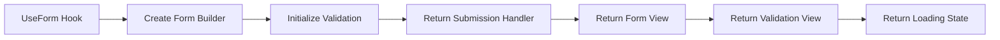

---
searchHints:
  - form
  - useform
  - form-builder
  - validation
  - form-submission
  - form-handling
---

# UseForm

<Ingress>
The `UseForm` [hook](../02_RulesOfHooks.md) provides comprehensive form handling with validation, submission, and state management for complex forms in your [application](../../../01_Onboarding/02_Concepts/15_Apps.md). It's the foundation for advanced form patterns used in dialogs, sheets, and custom form layouts.
</Ingress>

## How It Works

The `UseForm` hook returns a tuple containing form submission handler, form view, validation view, and loading state. It enables manual control over form rendering and submission, which is useful for custom layouts, dialogs, and sheets where the form builder's default layout isn't suitable.



<Callout Type="info">
In most cases, you'll use `.ToForm()` directly on your state objects for automatic form rendering. Use the `UseForm` hook when you need custom layouts, want to place the form in dialogs/sheets, or need manual control over form submission.
</Callout>

## Basic Usage

Use `UseForm` when you need manual control over form rendering and submission, such as in dialogs or sheets.

```csharp demo-tabs
public class UseFormHookExample : ViewBase
{
    public record UserModel(string Name, string Email, int Age);

    public override object? Build()
    {
        var user = UseState(() => new UserModel("", "", 25));
        var (onSubmit, formView, validationView, loading) = UseForm(() => user.ToForm()
            .Required(m => m.Name, m => m.Email));

        async ValueTask HandleSubmit()
        {
            if (await onSubmit())
            {
                // Form is valid, process the submission
                // user.Value contains the validated form data
            }
        }

        return Layout.Vertical()
            | formView
            | Layout.Horizontal()
                | new Button("Save").HandleClick(_ => HandleSubmit())
                    .Loading(loading).Disabled(loading)
                | validationView;
    }
}
```

## See Also

For complete form documentation, including:

- Automatic field generation
- Field configuration and customization
- Form validation strategies
- Form submission handling
- Forms in dialogs and sheets
- Advanced form patterns

See the [Forms](../../../01_Onboarding/02_Concepts/13_Forms.md) documentation.
