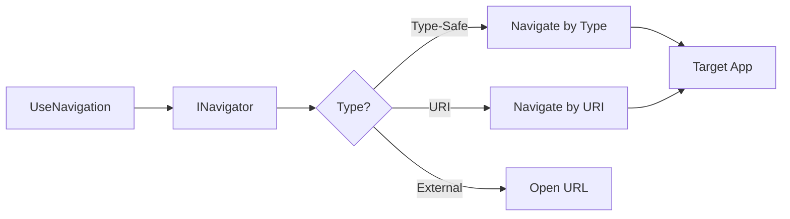

---
searchHints:
  - navigation
  - usenavigation
  - navigate
  - routing
  - route
  - navigation-args
---

# UseNavigation

<Ingress>
The `UseNavigation` [hook](../02_RulesOfHooks.md) provides navigation capabilities, allowing you to programmatically navigate between [apps](../../../01_Onboarding/02_Concepts/15_Apps.md) and routes in your [application](../../../01_Onboarding/02_Concepts/15_Apps.md).
</Ingress>

## Overview

The `UseNavigation` [hook](../02_RulesOfHooks.md) enables programmatic navigation:

- **Type-Safe Navigation** - Navigate to apps using strongly-typed app classes
- **URI-Based Navigation** - Navigate using URI strings for dynamic scenarios
- **Navigation Arguments** - Pass data to target apps during navigation
- **External URL Navigation** - Open external websites and resources

## Basic Usage

```csharp
var navigator = UseNavigation();

// Navigate by URI
navigator.Navigate("app://hooks/core/usestate");

// Navigate by type
navigator.Navigate(typeof(MyApp));

// Navigate with arguments
navigator.Navigate(typeof(MyApp), new MyArgs(123));
```

## How Navigation Works



## Common Patterns

### Navigation with Arguments

Pass data to target apps using strongly-typed arguments:

```csharp
public record UserArgs(int UserId, string Tab = "overview");

// Navigate with arguments
var navigator = UseNavigation();
navigator.Navigate(typeof(TargetApp), new UserArgs(123, "settings"));

// Receive in target app
var args = UseArgs<UserArgs>();
```

### External URL Navigation

Open external websites and resources:

```csharp
var navigator = UseNavigation();

navigator.Navigate("https://docs.ivy.app");
navigator.Navigate("mailto:support@example.com");
``` 

## Troubleshooting

### App Not Found

Ensure your app has the `[App]` attribute:

```csharp
// Solution: Add [App] attribute
[App(icon: Icons.LayoutDashboard)]
public class MyApp : ViewBase { }
```

### Arguments Not Received

Ensure argument types match exactly between source and target:

```csharp
// Source: navigator.Navigate(typeof(TargetApp), new MyArgs("value"));
// Target: var args = UseArgs<MyArgs>(); // Same type
```

## Best Practices

- **Prefer type-safe navigation** - Use `Navigate(typeof(MyApp))` when target is known at compile time
- **Use records for arguments** - Pass data with strongly-typed argument objects
- **Include protocol for external URLs** - Always use `https://` or `mailto:` for external links
- **Ensure apps have [App] attribute** - Target apps must be decorated with `[App]`

## See Also

- [Navigation Concepts](../../../01_Onboarding/02_Concepts/14_Navigation.md) - Complete navigation documentation
- [Chrome Framework](../../../01_Onboarding/02_Concepts/16_Chrome.md) - App lifecycle and routing
- [App Arguments](./13_UseArgs.md) - Receiving navigation arguments
- [State Management](./03_UseState.md) - Managing state during navigation
