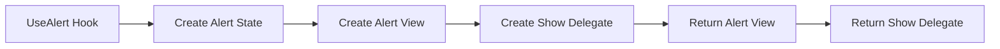

---
searchHints:
  - alert
  - usealert
  - notification
  - toast
  - message
  - show-alert
---

# UseAlert

<Ingress>
The `UseAlert` [hook](../02_RulesOfHooks.md) provides alert and notification functionality, enabling you to display modal dialog alerts for confirmations and user feedback in your [application](../../../01_Onboarding/02_Concepts/15_Apps.md). It's the foundation for alert and notification patterns used throughout Ivy applications.
</Ingress>

## How It Works

The `UseAlert` hook returns a tuple containing an alert view and a show alert delegate. It manages alert state and provides a programmatic way to trigger modal dialog alerts with customizable button sets and callbacks.



<Callout Type="info">
The `UseAlert` hook returns an alert view that should be included in your component's render output, and a delegate function that can be called to show alerts programmatically.
</Callout>

## Basic Usage

Use `UseAlert` to create modal dialog alerts for confirmations and user feedback.

```csharp demo-tabs
public class AlertExample : ViewBase
{
    public override object? Build()
    {
        var (alertView, showAlert) = UseAlert();
        var client = UseService<IClientProvider>();

        return Layout.Vertical()
            | new Button("Show Alert", onClick: _ =>
                showAlert("Are you sure you want to continue?", result =>
                {
                    client.Toast($"You selected: {result}");
                }, "Alert Title"))
            | alertView;
    }
}
```

## See Also

For complete alert documentation, including:

- Dialog alerts and button sets
- Toast notifications
- Alert types and variants
- Form submission with feedback
- Exception handling with alerts

See the [Alerts & Notifications](../../../01_Onboarding/02_Concepts/23_Alerts.md) documentation.
