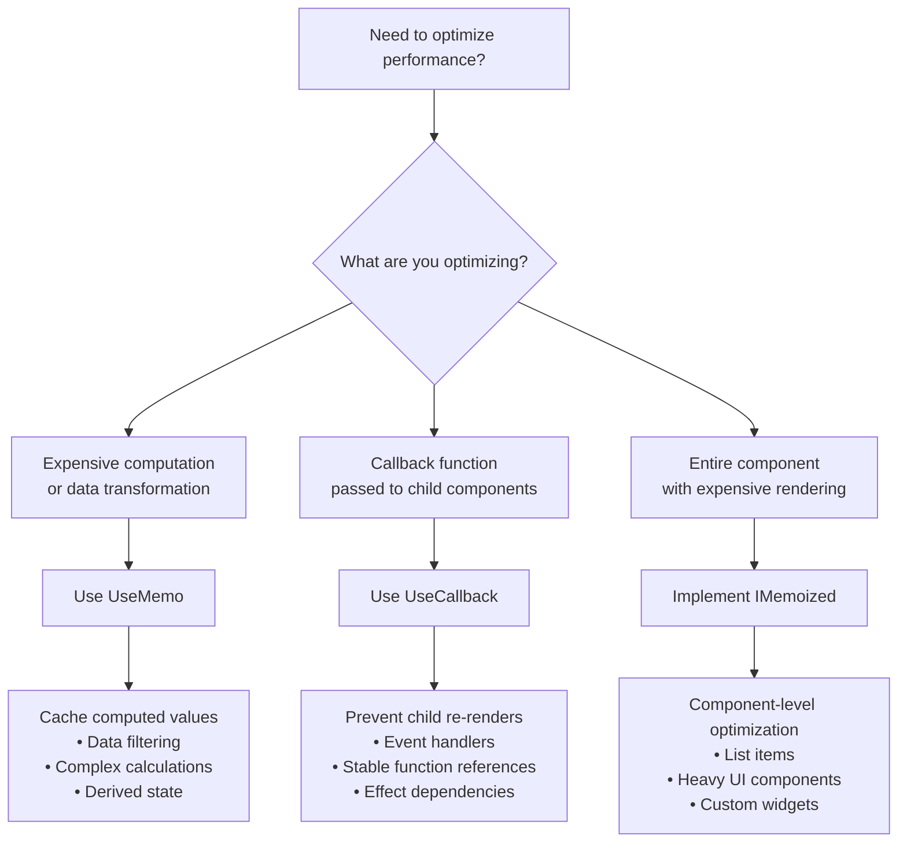
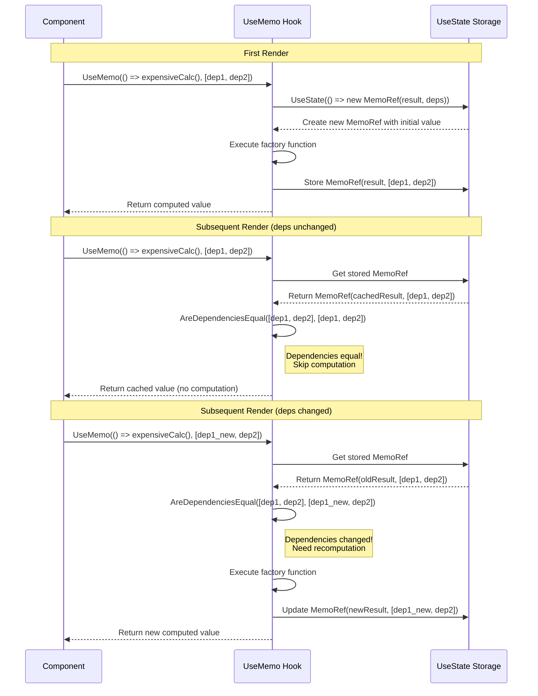
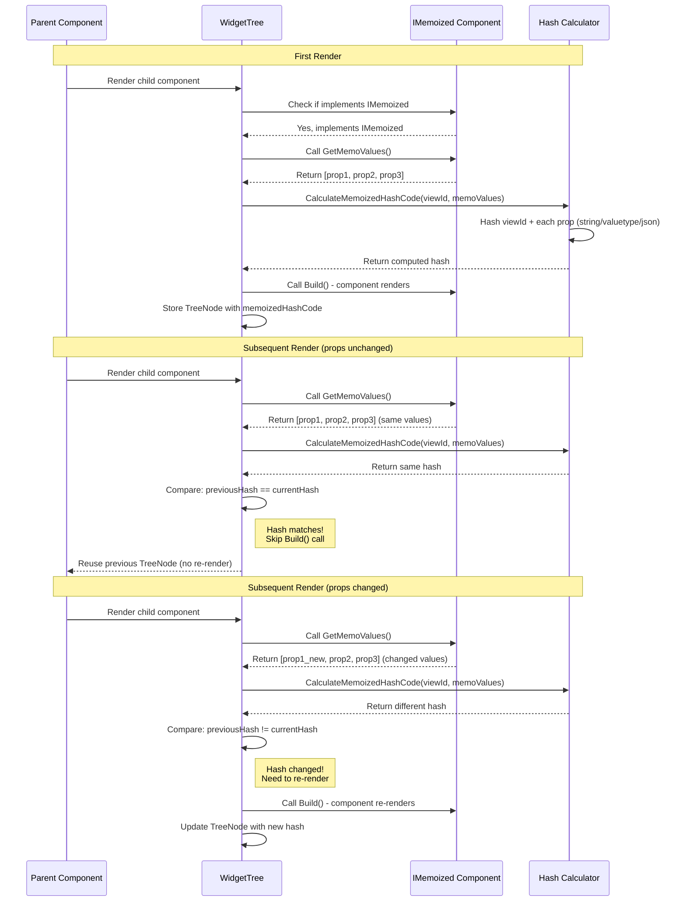
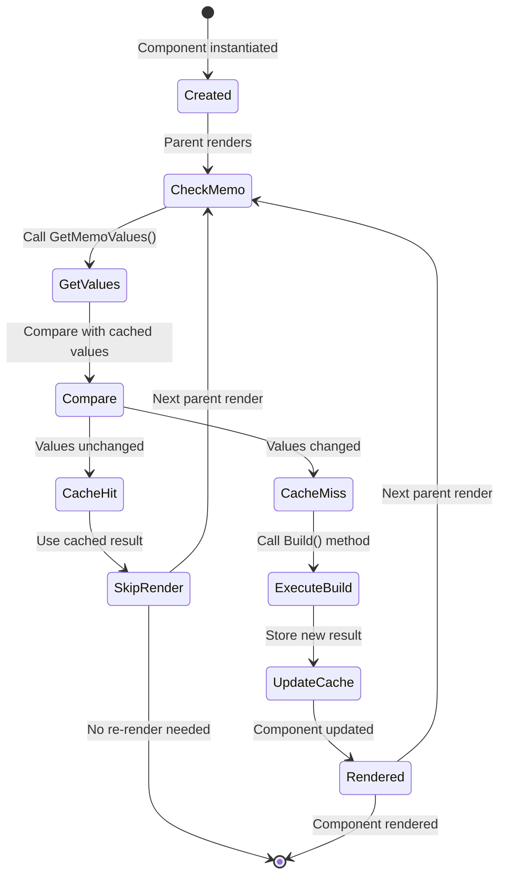

# UseMemo

*Memoization helps Ivy [applications](../../../01_Onboarding/02_Concepts/10_Apps.md) run faster by caching results of expensive computations and preventing unnecessary re-renders in your [views](../../../01_Onboarding/02_Concepts/02_Views.md).*

## Overview

Memoization in Ivy provides several powerful tools to optimize performance:

- **[`UseMemo`](#usememo-hook)** - Caches the result of expensive computations
- **[`UseCallback`](./06_UseCallback.md)** - Memoizes callback functions to prevent unnecessary re-renders.
- **`IMemoized`** - Interface for component-level memoization

These [hooks](../02_RulesOfHooks.md) work similarly to their React counterparts (`useMemo`, `useCallback`) but are designed specifically for Ivy's architecture.

## Basic Usage

```csharp
public class ExpensiveCalculationView : ViewBase
{
    public override object? Build()
    {
        var input = UseState(0);
        
        // Memoize the result of an expensive calculation
        var result = UseMemo(() => 
        {
            return input.Value * input.Value;
        }, input.Value); // Only recompute when input changes
        
        return Layout.Vertical()
            | input.ToNumberInput().Placeholder("Number")
            | Text.P($"Result: {result}");
    }
}
```

## Choosing the Right Memoization Approach



The `UseMemo` [hook](../02_RulesOfHooks.md) caches the result of a computation and only recomputes it when its [state](./03_UseState.md) dependencies change.

> **Tip:** `UseMemo` hook stores only the most recent dependency values for comparison; older values are discarded.

### How UseMemo Works



### When to Use Memoization

Use memoization when:

- You have expensive computations that don't need to be redone on every render
- You want to prevent unnecessary re-renders of [child components](../../../01_Onboarding/02_Concepts/03_Widgets.md)
- You're dealing with complex data transformations that depend on [state](./03_UseState.md) changes
- You need stable function references for [`UseEffect`](./04_UseEffect.md) dependencies

## Component Memoization with IMemoized

The `IMemoized` interface allows entire [components](../../../01_Onboarding/02_Concepts/02_Views.md) to be memoized, preventing re-renders when their props haven't changed. This is useful for optimizing [views](../../../01_Onboarding/02_Concepts/02_Views.md) with expensive rendering logic.

### How IMemoized Works



### IMemoized Basic Usage

```csharp
public class MemoizedDemoView : ViewBase
{
    public override object? Build()
    {
        var count = UseState(0);
        return Layout.Vertical()
            | new ExpensiveMemoComponent("Demo", count.Value)
            | new Button("Increment", onClick: _ => count.Set(count.Value + 1));
    }
}

public class ExpensiveMemoComponent : ViewBase, IMemoized
{
    private readonly string _title;
    private readonly int _value;
    private readonly DateTime _timestamp;

    public ExpensiveMemoComponent(string title, int value, DateTime? timestamp = null)
    {
        _title = title;
        _value = value;
        _timestamp = timestamp ?? DateTime.Now;
    }

    public object[] GetMemoValues() => [_title, _value];

    public override object? Build() =>
        Layout.Vertical()
            | Text.H2(_title)
            | Text.Block($"Value: {_value}")
            | Text.P($"Rendered at: {_timestamp:HH:mm:ss}");
}
```

### IMemoized Component Lifecycle



### Best Practices for IMemoized

- **Include all relevant props** - Any value that affects rendering should be in `GetMemoValues()`
- **Exclude volatile values** - Don't include timestamps or random values unless they affect the UI
- **Use with .Key()** - Always provide a stable key when rendering memoized components in lists
- **Keep it simple** - Only memoize components with expensive rendering logic

## Common Pitfalls and Solutions

### Unstable Dependencies

**Problem**: Creating new objects or arrays in the dependency array

```csharp
// Bad: New array created on every render
var result = UseMemo(() => ProcessData(data.Value), data.Value, new[] { "option1", "option2" });
```

**Solution**: Use stable references with [UseRef](./08_UseRef.md)

```csharp
// Good: Stable dependency
var options = UseRef(new[] { "option1", "option2" });
var result = UseMemo(() => ProcessData(data.Value), data.Value, options);
```

### Callback Dependencies Issues

**Problem**: [UseCallback](./06_UseCallback.md) callbacks that capture too many state variables

```csharp
// Bad: Callback recreated whenever any state changes
var handleClick = UseCallback(() => 
{
    DoSomething(data.Value, filter.Value, sortOrder.Value);
}, data, filter, sortOrder); // Too many dependencies
```

**Solution**: Split into smaller, focused callbacks using [UseCallback](./06_UseCallback.md)

```csharp
// Good: Separate callbacks with minimal dependencies
var handleDataAction = UseCallback(() => DoSomethingWithData(data.Value), data);
var handleFilterAction = UseCallback(() => ApplyFilter(filter.Value), filter);
```

## Best Practices

- **Dependency Array**: Always specify the [state](./03_UseState.md) dependencies that should trigger a recomputation
- **Expensive Operations**: Only memoize truly expensive operations
- **Clean Dependencies**: Keep the dependency array minimal and focused on state values
- **Avoid Side Effects**: Memoized functions should be pure and not have side effects (use [UseEffect](./04_UseEffect.md) for side effects)

## See Also

- [State Management](./03_UseState.md) - Managing component state
- [UseCallback](./06_UseCallback.md) - Memoizing callback functions
- [Effects](./04_UseEffect.md) - Performing side effects with dependencies
- [Rules of Hooks](../02_RulesOfHooks.md) - Understanding hook rules and best practices
- [UseRef](./08_UseRef.md) - Storing stable references
- [Signals](./10_UseSignal.md) - Reactive state management
- [Views](../../../01_Onboarding/02_Concepts/02_Views.md) - Understanding Ivy views and components

## Examples


### Complex Data Filtering

```csharp
public record FilterItem(int Id, string Name);

public class DataFilterDemoView : ViewBase
{
    public override object? Build()
    {
        var data = UseState(new List<FilterItem>
        {
            new(1, "Laptop"),
            new(2, "Mouse"),
            new(3, "Keyboard"),
            new(4, "Monitor"),
            new(5, "Headphones")
        });
        var filter = UseState("");
        var filteredData = UseMemo(() =>
            data.Value
                .Where(item => item.Name.Contains(filter.Value, StringComparison.OrdinalIgnoreCase))
                .ToList(),
            data.Value, filter.Value);

        var items = filteredData.Count == 0
            ? new object[] { Text.P("No matches.").Muted() }
            : filteredData.Select(i => Text.Block(i.Name)).ToArray();

        return Layout.Vertical()
            | filter.ToTextInput().Placeholder("Filter by name")
            | Layout.Vertical(items);
    }
}
```


### Computed Properties

```csharp
public record DemoSale(decimal Amount);

public class StatsDemoView : ViewBase
{
    public override object? Build()
    {
        var sales = UseState(new List<DemoSale> { new(100m), new(250m), new(75m) });
        var stats = UseMemo(() => new
        {
            Total = sales.Value.Sum(s => s.Amount),
            Average = sales.Value.Count > 0 ? sales.Value.Average(s => s.Amount) : 0m,
            Count = sales.Value.Count
        }, sales.Value);

        return Layout.Vertical()
            | Text.P($"Total: ${stats.Total:N2}")
            | Text.P($"Average: ${stats.Average:N2}")
            | Text.P($"Count: {stats.Count}")
            | new Button("Add sale", onClick: _ => sales.Set(sales.Value.Append(new DemoSale((Random.Shared.Next(1, 50) * 10))).ToList()));
    }
}
```


### IMemoized In List Items

```csharp
public record ListProduct(int Id, string Name, decimal Price);

public class ProductListDemoView : ViewBase
{
    public override object? Build()
    {
        var products = UseState(new List<ListProduct>
        {
            new(1, "Laptop", 999m),
            new(2, "Mouse", 29.99m),
            new(3, "Keyboard", 79m),
            new(4, "Monitor", 299m),
            new(5, "Headphones", 149m)
        });
        var sortBy = UseState("name");
        var sortOptions = new IAnyOption[]
        {
            new Option<string>("Name", "name"),
            new Option<string>("Price", "price"),
            new Option<string>("Id", "id")
        };
        var sortedProducts = UseMemo(() =>
            (sortBy.Value switch
            {
                "name" => products.Value.OrderBy(p => p.Name),
                "price" => products.Value.OrderBy(p => p.Price),
                _ => products.Value.OrderBy(p => p.Id)
            }).ToList(),
            products.Value, sortBy.Value);

        var items = sortedProducts.Select((p, i) => new ProductListCard(p, i).Key(p.Id)).ToArray();
        return Layout.Vertical()
            | sortBy.ToSelectInput(sortOptions).Placeholder("Sort by")
            | Layout.Vertical(items);
    }
}

public class ProductListCard : ViewBase, IMemoized
{
    private readonly ListProduct _product;
    private readonly int _index;

    public ProductListCard(ListProduct product, int index)
    {
        _product = product;
        _index = index;
    }

    public object[] GetMemoValues() => [_product.Id, _product.Name, _product.Price, _index];

    public override object? Build() =>
        new Card(
            Layout.Horizontal()
                | new Avatar(_product.Name.Length > 0 ? _product.Name[0].ToString() : "?", null)
                | (Layout.Vertical()
                    | Text.H2(_product.Name)
                    | Text.Block($"${_product.Price:N2}")
                    | Text.P($"Position: {_index + 1}").Small()));
}
```