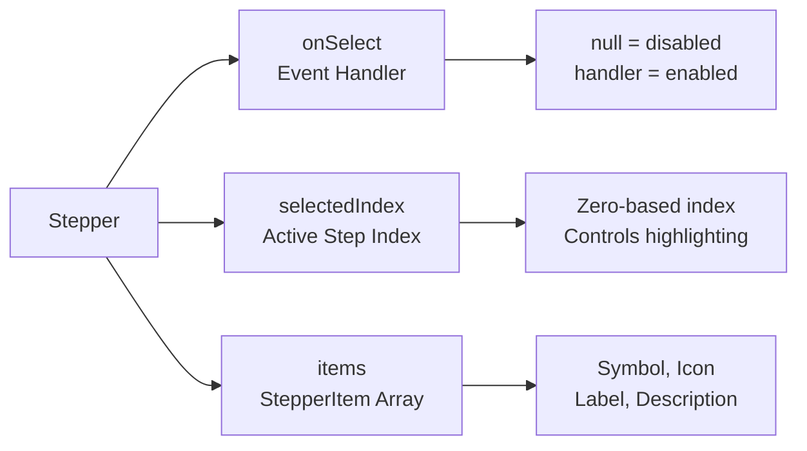

# Stepper

*Display a step-by-step progress indicator with visual feedback. Perfect for wizards, multi-step [forms](../../01_Onboarding/02_Concepts/13_Forms.md), and sequential workflows.*

The `Stepper` [widget](../../01_Onboarding/02_Concepts/03_Widgets.md) displays a horizontal sequence of steps with visual indicators showing the current position, completed steps, and upcoming steps. Each step can have a symbol, icon, label, and description.

## Basic Usage

Create a simple stepper with steps:

```csharp
new Stepper(
    null,
    1,
    new StepperItem("1", null, "Step 1", "First step"),
    new StepperItem("2", null, "Step 2", "Second step"),
    new StepperItem("3", null, "Step 3", "Third step")
)
```

The `Stepper` constructor takes three main parameters:



## Configuration Options

### Allow Forward Selection

Enable `AllowSelectForward` to allow clicking on future steps:

```csharp
public class StepperForwardSelectionDemo : ViewBase
{
    public override object? Build()
    {
        var selectedIndex = UseState(1);
        
        var items = new[]
        {
            new StepperItem("1", null, "Step 1"),
            new StepperItem("2", null, "Step 2"),
            new StepperItem("3", null, "Step 3")
        };
        
        return new Stepper(OnSelect, selectedIndex.Value, items).AllowSelectForward();
        
        ValueTask OnSelect(Event<Stepper, int> e)
        {
            selectedIndex.Set(e.Value);
            return ValueTask.CompletedTask;
        }
    }
}
```

### Dynamic Step States

Update step icons and states based on the current selection:

```csharp
public class StepperDynamicStatesDemo : ViewBase
{
    StepperItem[] GetItems(int selectedIndex) =>
    [
        new("1", selectedIndex > 0 ? Icons.Check : null, "Company", "Setup company"),
        new("2", selectedIndex > 1 ? Icons.Check : null, "Raise", "Raise capital"),
        new("3", null, "Founders", "Add founders"),
    ];
    
    public override object? Build()
    {
        var selectedIndex = UseState(0);
        
        var items = GetItems(selectedIndex.Value);
        
        return Layout.Vertical()
            | new Stepper(OnSelect, selectedIndex.Value, items)
            | (Layout.Horizontal().Gap(0)
                | new Button("Previous").Link().OnClick(() =>
                {
                    selectedIndex.Set(Math.Clamp(selectedIndex.Value - 1, 0, items.Length - 1));
                })
                | new Button("Next").Link().OnClick(() =>
                {
                    selectedIndex.Set(Math.Clamp(selectedIndex.Value + 1, 0, items.Length - 1));
                })
            );
        
        ValueTask OnSelect(Event<Stepper, int> e)
        {
            selectedIndex.Set(e.Value);
            return ValueTask.CompletedTask;
        }
    }
}
```


## API

[View Source: Stepper.cs](https://github.com/Ivy-Interactive/Ivy-Framework/blob/main/src/Ivy/Widgets/Primitives/Stepper.cs)

### Constructors

| Signature |
|-----------|
| `new Stepper(Func<Event<Stepper, int>, ValueTask> onSelect, int? selectedIndex, IEnumerable<StepperItem> items)` |


### Properties

| Name | Type | Setters |
|------|------|---------|
| `AllowSelectForward` | `bool` | `AllowSelectForward` |
| `AspectRatio` | `float?` | - |
| `Density` | `Density?` | - |
| `Height` | `Size` | - |
| `Items` | `StepperItem[]` | - |
| `SelectedIndex` | `int?` | - |
| `Visible` | `bool` | - |
| `Width` | `Size` | - |


### Events

| Name | Type | Handlers |
|------|------|----------|
| `OnSelect` | `EventHandler<Event<Stepper, int>>` | `OnSelect` |