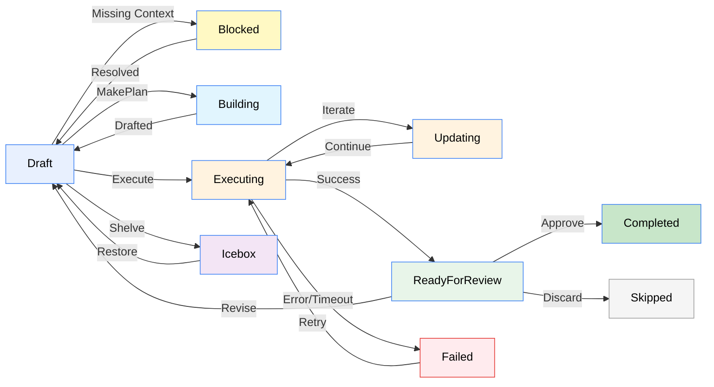

# Plans

<Ingress>
Plans are the core unit of work in Tendril. Each plan moves through a rigorous series of states from creation to completion, representing the lifecycle of an AI development task.
</Ingress>

## Plan States

A plan progresses through the following comprehensive set of states:



| State | Description |
|-------|-------------|
| **Draft** | Initial state. The plan has been created/drafted but execution has not started. |
| **Blocked** | The plan cannot proceed due to missing context, credentials, or user intervention. |
| **Building** | The `MakePlan` or `ExpandPlan` agent is actively drafting the technical details of the plan. |
| **Executing** | The `ExecutePlan` agent is actively implementing the plan in a worktree. |
| **Updating** | The `UpdatePlan` agent is refining an existing, already-executed plan. |
| **ReadyForReview** | Execution is complete, automated verifications passed. Ready for human review. |
| **Failed** | The agent encountered a fatal error during implementation or verifications consistently failed. |
| **Completed** | The plan has been reviewed, approved, and merged/PR'd successfully. |
| **Skipped** | The plan was abandoned, discarded, or deemed unnecessary. |
| **Icebox** | The plan has been shelved for later consideration. |

## Creating a Plan

Plans can be created via multiple pathways:

1. **Dashboard / Drafts** — Write a description manually in the UI to spawn `MakePlan`.
2. **Inbox** — Drop a markdown file into the `Inbox/` folder in `TENDRIL_HOME`.
3. **Recommendations** — Accept a generative recommendation from the system.
4. **Duplicate** — Restore an old or discarded plan from the **Trash**.

Each plan is stored as a folder under `TENDRIL_HOME/Plans/` with a unique numeric ID and descriptive name, e.g. `01234-FixLoginBug/`.

## Plan Structure (Data Format)

A plan folder is fully transparent and resides locally on your disk:

```
01234-FixLoginBug/
├── plan.yaml          # Plan metadata (state, project, title, branch, PRs)
├── revisions/         # Plan revisions with problem, solution, tests (.md files)
├── verification/      # Verification results (build output, formatting logs)
├── artifacts/         # Screenshots, generated assets
├── worktrees/         # Git worktree paths used during execution
├── logs/              # Uncensored execution logs from the agent
└── costs.csv          # Granular Token and cost tracking
```

## Revisions

Each time a plan is drafted or refined, a new **revision** file is safely versioned in the `revisions/` folder. A revision contains:

- **Problem** — What needs to be fixed or built.
- **Solution** — The proposed technical approach mapped out by the AI.
- **Tests** — How to verify correctness.
- **Verification Checklist** — Build, format, and test commands mandated for success.
