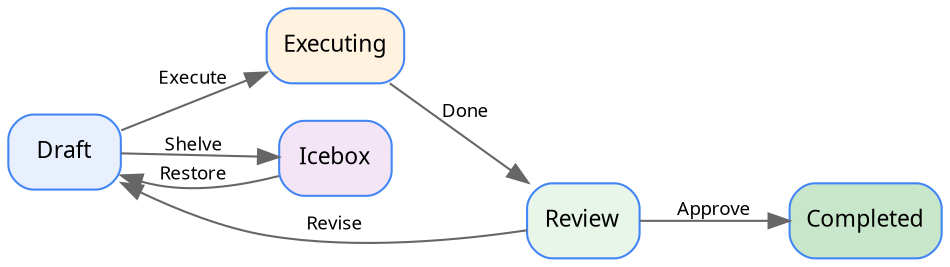

# Plans

<Ingress>
Plans are the core unit of work in Tendril. Each plan moves through a series of states from creation to completion.
</Ingress>

## Plan States

A plan progresses through the following states:



| State | Description |
|-------|-------------|
| **Draft** | Initial state. The plan has been created but not yet executed. |
| **Executing** | An agent is actively implementing the plan in a worktree. |
| **Review** | Execution is complete. The plan is ready for human review. |
| **Completed** | The plan has been reviewed and approved. A PR may have been created. |
| **Icebox** | The plan has been shelved for later consideration. |

## Creating a Plan

Plans can be created in several ways:

1. **New Draft** — Write a description directly in the Tendril UI
2. **Inbox** — Drop a markdown file into the `Inbox/` folder in `TENDRIL_HOME`
3. **Recommendations** — Accept a recommendation generated by the system

Each plan is stored as a folder under `TENDRIL_HOME/Plans/` with a unique numeric ID and descriptive name, e.g. `01234-FixLoginBug/`.

## Plan Structure

A plan folder contains:

```
01234-FixLoginBug/
├── plan.yaml          # Plan metadata (state, project, title, commits, PRs)
├── revisions/         # Plan revisions with problem, solution, tests
├── verification/      # Verification results (build, format, test)
├── artifacts/         # Screenshots and other outputs
├── worktrees/         # Git worktree paths used during execution
├── logs/              # Execution logs
└── costs.csv          # Token and cost tracking
```

## Revisions

Each time a plan is drafted or refined, a new **revision** is created. A revision contains:

- **Problem** — What needs to be fixed or built
- **Solution** — The proposed approach
- **Tests** — How to verify correctness
- **Verification checklist** — Build, format, and test requirements
